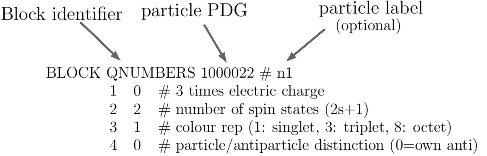

.. index:: Basic Input

.. |element| replace:: :ref:`element <element>`
.. |elements| replace:: :ref:`elements <element>`

.. _basicInput:

Basic Input
===========

Basic Model Input
-----------------

SModelS requires two types of input from the user:

 * the :ref:`particle content <newParticles>` of the BSM model (BSM states and their quantum numbers) and
 * the :ref:`model parameters <modelParameters>`, such as masses, widths, branching ratios and cross-sections.

Below we describe how this information should be provided.

* **Information about the SM and BSM particles, along with their cross-sections is stored in a** `Model object <theory.html#theory.models.Model>`_

.. _newParticles:

Particle Content
^^^^^^^^^^^^^^^^

The definition of the BSM states and their quantum numbers can be
provided in either of the following two formats:

* as a python module, as illustrated in :download:`mssm.py <images/mssm.py>`,
* or as an SLHA file containing :ref:`QNUMBERS blocks <qnumberSLHA>` (see :download:`mssmQNumbers.slha <images/mssmQNumbers.slha>`).

The python module is more flexible and allows the user to define their own particle properties. 
This format is automatically generated by the `micrOMEGAs <https://launchpad.net/mg5amcnlo>`_ interface to SModelS. 
The SLHA file can be automatically generated by tools relying on the `UFO <https://arxiv.org/abs/1108.2040>`_ format, in particular `MadGraph <https://launchpad.net/mg5amcnlo>`_ .
A path to the user's own model file (in either format) can be specified
in the :ref:`parameter file <parameterFile>`, in the *[particles]* section.

.. _modelParameters:

Model Parameters
^^^^^^^^^^^^^^^^

Once the :ref:`particle content <newParticles>` has been specified,
the main input for SModelS is the set of model parameters (masses, widths,...), which can be
given in the two following forms:

* an SLHA (SUSY Les Houches Accord) file containing masses, widths, branching ratios and cross sections for the BSM states
  (see an example file :download:`here <examples/example.slha>`)
* an LHE (Les Houches Event) file containing parton level events
  (see an example file :download:`here <examples/example.lhe>`)

The SLHA format is usually more compact and best suited for supersymmetric models. On the other hand, an LHE file can always
be generated for any BSM model (through the use of your favorite MC generator).\ [#f1]_ In this case, however,
the precision of the results is limited to the MC statistics used to generate the file.
*We also point out that all the decays appearing in the LHE input are assumed to be prompt and
this input format should not be used if the model contains meta-stable particles*.
An example of how to add the width information after reading an LHE input file can be found in `this notebook <lheLLPExample.html>`_ .

*In the case of SLHA input only*, the production cross sections for the BSM states also have to be included
in the SLHA file as SLHA blocks, according to the :ref:`SLHA cross section format <xsecSLHA>`
(see :download:`example file <examples/example.slha>`).
For the MSSM and some of its extensions, they may
be calculated automatically using `Pythia <http://home.thep.lu.se/~torbjorn/Pythia.html>`_
and `NLLfast <http://pauli.uni-muenster.de/~akule_01/nllwiki/index.php/NLL-fast>`_,
as discussed in :ref:`cross section calculator <xsecCalc>`.

*In the case of LHE input*, the total production cross section as well as
the center-of-mass energy should be listed in the <init></init> block, according to the standard LHE format
(see :download:`example file <examples/example.slha>`).
Moreover, all the Z\ :sub:`2`-even :ref:`particles <particleClass>` should be set as stable, since
in SModelS they are effectively considered as final states.
When generating the events it is also important to ensure that no mass smearing is applied, so the mass
values for a given particle are the same throughout the LHE file.

.. _xsecSLHA:

SLHA Format for Cross Sections
""""""""""""""""""""""""""""""

A list of cross section blocks (one for each production process)
must be included in the SLHA file for the SLHA-based decomposition.
The SLHA format for each cross section block is shown below
(see the `Les Houches note <http://phystev.cnrs.fr/wiki/2013:groups:tools:slha>`_):

.. _xsecblock:

.. image:: images/xsecBlock.png
   :width: 100%

The above example shows the cross section for :math:`pp \rightarrow \tilde{u}_L^* + \tilde{g}`
at a center-of-mass energy of 8 TeV and at leading order.
The only information used by SModelS are the center-of-mass energy, the outgoing particle PDGs, the cross section value
and the QCD order. *If the input file contains two cross sections for the same process  but at different QCD orders, only
the highest order will be used.*

* **Reading of cross sections from an input file is
  implemented by the** `getXsecFromSLHAFile <theory.html#theory.crossSection.getXsecFromSLHAFile>`_ **method**

.. _qnumberSLHA:

SLHA Format for Quantum Numbers
"""""""""""""""""""""""""""""""

If the :ref:`particle content <newParticles>` of the input model is specificed through
an SLHA file (instead of a python module), it must contain a QNUMBERS block for each particle 
following the format below:

.. _qnumbersblock:

This specifies the particle PDG, electric charge, color representation and spin.
Furthermore, if the first line contains a comment (after the particle PDG), it will be used
as the particle label, otherwise the particle label will be its PDG number.
The entry number 5 (Z\ :sub:`2` parity) is a SModelS specific line which can be added
to specify the :ref:`particle <particleClass>` parity (even or odd). If this
line is missing the parity will be assumed to be odd.
Finally, if the particle is not its own anti-particle (specified by entry number 4),
a second particle will be added to the model with the opposite electric charge
and minus the PDG number.

.. _lhereader:

LHE-reader
----------

More general models can be input through an LHE event file containing parton-level events, including the production of the primary
mothers and their cascade decays.
The LHE-reader goes through the events and by doing so creates dictionaries mapping the different particles to their masses and
decays which corresponds to the DECAY and MASS blocks of the SLHA file.
The pair production cross sections are obtained by adding up the weights
of all events with a the same pair of mother particles
(see `crossSection.getXsecFromLHEFile <theory.html#theory.crossSection.getXsecFromLHEFile>`_ ).

Notice that, for the LHE decomposition, the |elements| generated are restricted to the events in the input file. Hence,
the uncertainties on the elements weights (and which |elements| are actually generated by the model)
are fully dependent on the Monte Carlo statistics used to generate the LHE file.
Also, when generating the events it is important to ensure that no mass smearing is applied, so the events
always contain the same mass value for a given particle.

**Note that since all decays appearing in an LHE event are assumed to be prompt and the LHE-based
decomposition should not be used for models with meta-stable BSM particles**.

* **The LHE reader is implemented by the** `LHE reader method <theory.html#theory.lheReader.getDictionariesFrom>`_

.. [#f1] SModelS can easily be used for non-SUSY models as long as they present a  Z\ :sub:`2`-type symmetry.
   However, it is the responsibility of the user to make sure that the SMS results
   in the database actually apply to the model under consideration.
