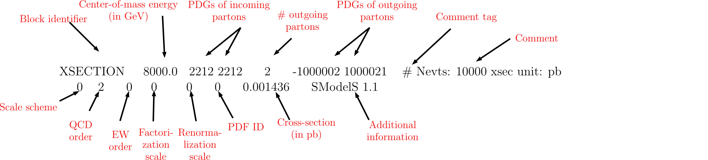

.. index:: Basic Input

.. _basicInput:

Basic Input
===========

Basic Model Input
-----------------
The main input for SModelS is the full model definition, which can be
given in the two following forms:

* a SLHA (SUSY Les Houches Accord) file containing masses, branching ratios and cross sections for the BSM states
  (see an example file :download:`here <examples/example.slha>`)
* a LHE (Les Houches Event) file containing parton level events
  (see an example file :download:`here <examples/example.lhe>`)

The SLHA format is usually more compact and best suited for supersymmetric models. On the other hand, a LHE file can always
be generated for any BSM model (through the use of your favorite MC generator). [*]_ In this case, however,
the precision of the results is limited to the MC statistics used to generate the file.

*In the case of SLHA input only*, the production cross sections for the BSM states also have to be included
in the SLHA file as SLHA blocks, according to the :ref:`SLHA cross section format <xsecSLHA>` 
(see :download:`example file <examples/example.slha>`).
For the MSSM and some of its extensions, they may
be calculated automatically using `Pythia <http://home.thep.lu.se/~torbjorn/Pythia.html>`_ 
and `NLLfast <http://pauli.uni-muenster.de/~akule_01/nllwiki/index.php/NLL-fast>`_, 
as discussed in :ref:`cross section calculator <xsecCalc>`.

*In the case of LHE input*, the total production cross section as well as 
the center-of-mass energy should be listed in the <init></init> block, according to the standard LHE format
(see :download:`example file <examples/example.slha>`).
Moreover, all the Z\ :sub:`2`-even particles (see definition in :ref:`final states <final states>`) should be set as stable, since
in SModelS they are effectively considered as final states.
When generating the events it is also important to ensure that no mass smearing is applied, so the mass
values for a given particle are the same throughout the LHE file.

.. _newParticles:

New Particles
-------------

Besides information about the masses and branching ratios, the user must also define
which particles are Z\ :sub:`2`-odd states (:ref:`Intermediate states <odd states>`) 
and which are Z\ :sub:`2`-even (:ref:`Final states <final states>`).
These definitions must be given in the :download:`particles.py <images/particles.py>` file,
where some default values (for SM and MSSM particles) are already loaded.
To path to the user's own particles.py can be specified in the :ref:`parameter file <parameterFile>`.

If the user wants to check the SLHA input file for possible errors (see :ref:`SLHA Checks <slhaChecks>`), 
it is also necessary to define some of the particle's quantum numbers, as illustrated in
the :download:`particles.py <images/particles.py>` file.

.. _xsecSLHA:

SLHA Format for Cross Sections
------------------------------

A list of cross section blocks (one for each production process)
must be included in the SLHA file for the SLHA-based Decomposition. 
The SLHA format for each cross section block is shown below
(see the `Les Houches note <http://phystev.cnrs.fr/wiki/2013:groups:tools:slha>`_):

.. _xsecblock:

The above example shows the cross section for :math:`pp \rightarrow \tilde{\tau}_1^- + \tilde{\nu}_{\tau}`
at a center-of-mass energy of 8 TeV and at leading order.
The only information used by SModelS are the center-of-mass energy, the outgoing particle PDGs, the cross section value
and the QCD order. *If the input file contains two cross sections for the same process  but at different QCD orders, only 
the highest order will be used.*

* **Reading of cross sections from an input file is
  implemented by the** `getXsecFromSLHAFile <theory.html#theory.crossSection.getXsecFromSLHAFile>`_ **method** 

  
.. [*] SModelS can easily be used for non-SUSY models as long as they present a  Z\ :sub:`2`-type symmetry.
   However, it is the responsibility of the user to make sure that the SMS results
   in the database actually apply to the model under consideration.
