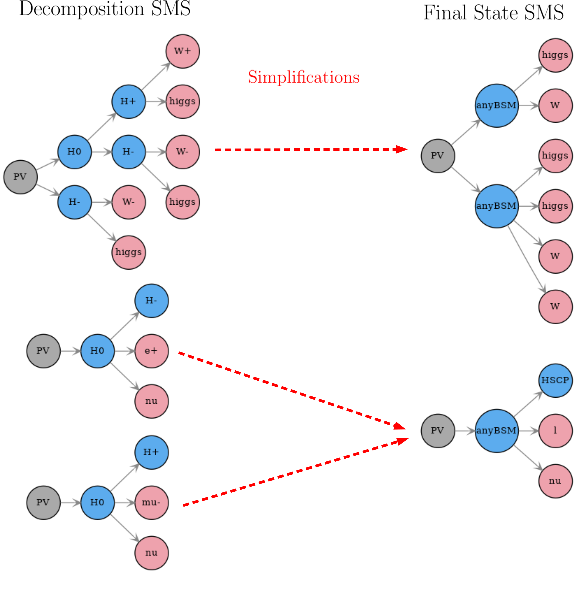

.. index:: Missing Topologies

.. |particle| replace:: :ref:`particle <particleClass>`
.. |particles| replace:: :ref:`particles <particleClass>`
.. |SMS| replace:: :ref:`SMS <SMS>`
.. |SMS topology| replace:: :ref:`SMS topology <SMS>`
.. |SMS topologies| replace:: :ref:`SMS topologies <SMS>`
.. |topology| replace:: :ref:`topology <SMS>`   
.. |topologies| replace:: :ref:`topologies <SMS>`
.. |decomposition| replace:: :doc:`decomposition <Decomposition>`
.. |theory predictions| replace:: :doc:`theory predictions <TheoryPredictions>`
.. |theory prediction| replace:: :doc:`theory prediction <TheoryPredictions>`
.. |constraint| replace:: :ref:`constraint <ULconstraint>`
.. |constraints| replace:: :ref:`constraints <ULconstraint>`
.. |database| replace:: :ref:`database <Database>`
.. |ExpRes| replace:: :ref:`Experimental Result<ExpResult>`
.. |ExpRess| replace:: :ref:`Experimental Results<ExpResult>`
.. |Database| replace:: :ref:`Database <Database>`
.. |Dataset| replace:: :ref:`DataSet<DataSet>`
.. |Datasets| replace:: :ref:`DataSets<DataSet>`
.. |results| replace:: :ref:`experimental results <ExpResult>`
.. |EMrs| replace:: :ref:`EM-type results <EMtype>`
.. |ULrs| replace:: :ref:`UL-type results <ULtype>`

.. _topCoverage:

Simplified Model Coverage
=========================

The constraints provided by SModelS are obviously limited
by the variety of |SMS| interpretations i) provided by the experimental collaborations (or derived through recasting) 
and ii) implemented and validated in the |database|.
Therefore it is interesting to identify classes of "missing topologies", 
which are relevant for a given input model, but are
not constrained by the SModelS |database|. This task is performed
as a last step in SModelS, once the |decomposition| and the |theory predictions|
have been computed.

During the computation of the |theory predictions|, each |SMS topology|
from the |decomposition| which :ref:`matches <matching>` at least one of the simplified
models in the |database| is marked as "covered by" the corresponding type
of |ExpRes|. Currently the |ExpRess| are either of type *prompt*
or *displaced*.\ [#f1]_ If the same |SMS| is *covered* by both types of |ExpRess|,
it will be marked as covered by displaced *and* prompt results.
If, in addition to being covered, the |SMS topology| also has a non-zero efficiency
or upper limit (i.e. its properties fall inside the data grid of any result),
it will be marked as "tested by" the corresponding type of result (*prompt* or *displaced*).
Hence, after the |theory predictions| have been computed, the |SMS topologies| store information
about their experimental coverage and can be classified into :ref:`coverage groups <coverageGroups>`.

* **The coverage tool is implemented by the** `Uncovered class <tools.html#tools.coverage.Uncovered>`_

.. _coverageGroups:

Coverage Groups
---------------

The coverage algorithm groups all the |SMS topologies| into *coverage groups*
which can be easily defined by the user (see the `coverage module <tools.html#tools.coverage.UncoveredGroup>`_).
Each group must define criteria for selecting |topologies| after the |theory predictions|
have been computed.
The default *coverage groups* implemented in SModelS are:

 * *missing (prompt)*: **not** covered by prompt-type results. This group corresponds to all |SMS topologies| which
   did not match any of the simplified models constrained by *prompt* |ExpRess|.
 * *missing (displaced)*: **not** covered by displaced-type results. This group corresponds to all |SMS topologies| which
   did not match any of the simplified models constrained by *displaced* |ExpRess|.
 * *missing (all)*: **not** covered by any type of result. This group corresponds to all |SMS topologies| which
   did not match any of the simplified models constrained by the |database|.
 * *outsideGrid (all)*: covered by at least one type of |ExpRes| and **not** tested by any type of result.
   This group corresponds to all |SMS topologies| which matched at least one
   the simplified models constrained by the |database|, but were not tested
   (e.g. their masses and/or widths fall outside the efficiency or upper limit grids).

:numref:`Fig. %s <coverA>` schematically represents the grouping performed in coverage. Note that the coverage groups
are not mutually exclusive and a give |topology| may fall into more than one group.

.. _coverA:

.. figure:: images/coverageC.png
   :width: 50%
   :align: center

   Schematic representation of how the |SMS topologies| are grouped into different coverage groups.

.. _coverReweight:

Besides defining which |topologies| should be selected,
each coverage group can also specify a reweighting function for the |SMS topology| cross section.
This is useful for the cases where the coverage group aims to represent missing topologies
with prompt (or displaced) decays, so only the fraction of prompt (displaced)
cross section should be extracted.
The reweighting functions defined will be applied
to the selected |SMS| in order to extract the desirable fraction of signal
cross section for the group. For instance, for the default groups listed
above, the following reweighting functions are defined:

* *missing (prompt)*: :math:`\sigma \to \xi \times \sigma,\;\; \xi = \prod_{i=1,N-2} \mathcal{F}_{prompt}^{i} \times \prod_{i=N-2,N} \mathcal{F}_{long}^{i}`
* *missing (displaced)*: :math:`\sigma \to \xi \times \sigma,\;\; \xi = \mathcal{F}_{displaced}(any) \times \prod_{i=N-2,N} \mathcal{F}_{long}^{i}`
* *missing (all)*: :math:`\sigma \to \xi \times \sigma,\;\; \xi = 1`
* *outsideGrid (all)*: :math:`\sigma \to \xi \times \sigma,\;\; \xi = 1`

The definition for the fraction of long-lived (:math:`\mathcal{F}_{long}`) and prompt (:math:`\mathcal{F}_{prompt}`) decays
can be found in :ref:`lifetime reweighting <dbReweighting>`.
The fraction :math:`\mathcal{F}_{displaced}(any)` corresponds to the probability of at least one
displaced decay taking place, where the probability for a
displaced decay is given by :math:`1-\mathcal{F}_{long}-\mathcal{F}_{prompt}`.

If :ref:`mass <massComp>` or :ref:`invisible compression <invComp>` are turned on,
|SMS topologies| generated by :ref:`compression <smsComp>` and their ancestors
(original/uncompressed |SMS|) could both fall into the same coverage group.
Since the total missed cross section in a given group should
equal the total signal cross section not covered or tested by the
corresponding type of |ExpRess|, one has to avoid double counting |topologies|.
In addition, a compressed |SMS| belonging to a given coverage
group could combine cross sections from more than one uncompressed (original) |SMS|.
If one of the original |SMS| do not belong to this coverage group (i.e. it
has been covered and/or tested by the |ExpRess|),
its contribution to the compressed |SMS| cross section should be subtracted.
SModelS deals with the above issues through the following steps:

 * an effective "missing cross section" is computed for each |SMS|, which
   corresponds to the |SMS| weight subtracted of the weight of its ancestors
   which do not belong to the same coverage group. The effective cross section
   also includes the reweighting :ref:`discussed above <coverReweight>`.
 * All |SMS topologies| belonging to the same group which have a common ancestor are removed (only the |SMS| with largest missing cross section is kept).

* **Coverage groups are implemented by the** `UncoveredGroup class <tools.html#tools.coverage.UncoveredGroup>`_

.. _finalStateSMS:

Final State SMS
---------------

Usually the list of |SMS| in each group can be considerably long, due
to distinct intermediate BSM and final SM states. 
In order to make the list more compact, all |SMS topologies|
are simplified to |topologies| where only the primary mothers and the final
state particles are kept (see :numref:`Fig. %s <coverB>`).
In addition, the following SM final states particles are further combined into
inclusive particles:

* :math:`W^+,W^- \to \mbox{W}`
* :math:`\tau^+,\tau^- \to \mbox{ta}`
* :math:`e^+,e^-,\mu^+,\mu^- \to \mbox{l}`
* :math:`t,\bar{t} \to \mbox{t}`
* :math:`u,d,s,c,\bar{u},\bar{d},\bar{s},\bar{c},g,\pi^{+,-,0} \to \mbox{jet}`
* :math:`\nu_{e},\nu_{\mu},\nu_{\tau},\bar{\nu}_{e},\bar{\nu}_{\mu},\bar{\nu}_{\tau} \to \mbox{nu}`

while the BSM particles are grouped by their signature:

* *primary mothers (BSM particles produced at the PV)* :math:`\to \mbox{anyBSM}`
* *color and electrically neutral states* :math:`\to \mbox{MET}`
* *color neutral states with electric charge +-1* :math:`\to \mbox{HSCP}`
* *color triplet states with electric charge +-2/3 or +-1/3* :math:`\to \mbox{RHadronQ}`
* *color octet states with zero electric charge* :math:`\to \mbox{RHadronG}`

After the above simplification, identical simplified |SMS| (called *Final State SMS*) are combined.
This procedure is illustrated in :numref:`Fig. %s <coverB>`.

.. _coverB:

   Schematic representation of how |SMS topologies| are simplified into Final State SMS and 
   how identical Final State SMS are combined.

* **Final State SMS are implemented by the** `FinalStateSMS class <tools.html#tools.coverage.FinalStateSMS>`_

.. [#f1] Prompt results are all those which assumes all decays to be prompt and the last BSM particle to be stable (or decay outside the detector).
         Searches for heavy stable charged particles (HSCPs), for instance, are classified as *prompt*, since the HSCP is assumed to decay
         outside the detector. Displaced results on the other hand require at least one decay to take place inside the detector.
