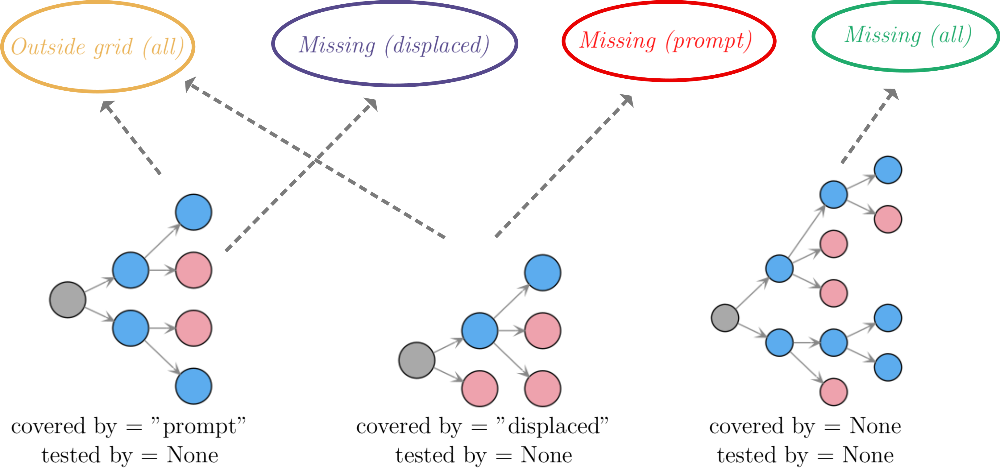
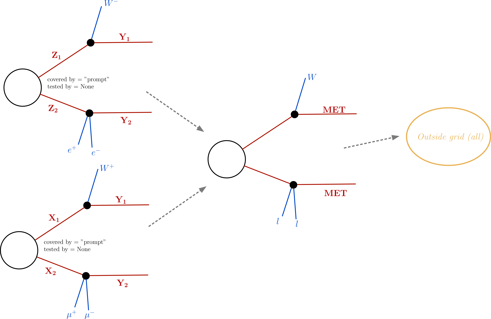
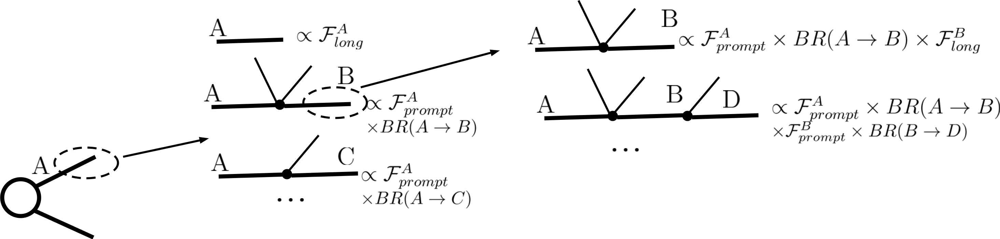

.. index:: Missing Topologies

.. |particle| replace:: :ref:`particle <particleClass>`
.. |particles| replace:: :ref:`particles <particleClass>`
.. |element| replace:: :ref:`element <element>`
.. |elements| replace:: :ref:`elements <element>`
.. |topology| replace:: :ref:`topology <topology>`
.. |topologies| replace:: :ref:`topologies <topology>`
.. |decomposition| replace:: :doc:`decomposition <Decomposition>`
.. |theory predictions| replace:: :doc:`theory predictions <TheoryPredictions>`
.. |theory prediction| replace:: :doc:`theory prediction <TheoryPredictions>`
.. |constraint| replace:: :ref:`constraint <ULconstraint>`
.. |constraints| replace:: :ref:`constraints <ULconstraint>`
.. |intermediate states| replace:: :ref:`intermediate states <odd states>`
.. |final states| replace:: :ref:`final states <final states>`
.. |database| replace:: :ref:`database <Database>`
.. |bracket notation| replace:: :ref:`bracket notation <bracketNotation>`
.. |ExpRes| replace:: :ref:`Experimental Result<ExpResult>`
.. |ExpRess| replace:: :ref:`Experimental Results<ExpResult>`
.. |Database| replace:: :ref:`Database <Database>`
.. |Dataset| replace:: :ref:`DataSet<DataSet>`
.. |Datasets| replace:: :ref:`DataSets<DataSet>`
.. |results| replace:: :ref:`experimental results <ExpResult>`
.. |branches| replace:: :ref:`branches <branch>`
.. |branch| replace:: :ref:`branch <branch>`
.. |EMrs| replace:: :ref:`EM-type results <EMtype>`
.. |ULrs| replace:: :ref:`UL-type results <ULtype>`

.. _topCoverage:

Simplified Model Coverage
=========================

The constraints provided by SModelS are obviously limited
by its |database| and the available set of simplified model interpretations
provided by the experimental collaborations or computed by theory groups.
Therefore it is interesting to identify classes of missing simplified models
(or missing topologies) which are relevant for a given input model, but are
not constrained by the SModelS |database|. This task is performed
as a last step in SModelS, once the |decomposition| and the |theory predictions|
have been computed.

During the computation of the |theory predictions|, each |element| 
from the |decomposition| which matches at least one of the simplified
models in the |database| is marked as "covered by" the corresponding type
of |ExpRes|. Currently the |ExpRess| are either of type *prompt* 
or *displaced*. [#f1]_ If the same |element| is *covered* by both types of |ExpRess|,
it will be marked as covered by displaced *and* prompt results.
If, in addition to being covered, the |element| also has a non-zero efficiency
or upper limit (i.e. its properties fall inside the data grid for any result),
it will be marked as "tested by" the corresponding type of result (*prompt* or *displaced*). 

The coverage algorithm groups all the |elements|
according to their *covered by* and *tested by* tags.
The default groups implemented in SModelS are:

 * *missing (prompt)*: **not** covered by prompt-type results. This group corresponds to all |elements| which
   did not match any of the simplified models contrained by *prompt* |ExpRess|.
 * *missing (displaced)*: **not** covered by displaced-type results. This group corresponds to all |elements| which
   did not match any of the simplified models contrained by *displaced* |ExpRess|.
 * *missing (all)*: **not** covered by any type of result. This group corresponds to all |elements| which
   did not match any of the simplified models contrained by the |database|.
 * *outsideGrid (all)*: covered by at least one type of |ExpRes| and **not** tested by any type of result.
   This group corresponds to all |elements| which matched at least one
   the simplified models constrained by the |database|, but were not tested 
   (e.g. their masses and/or widths fall outside the efficiency or upper limit grids).

The :ref:`figure below <coverA>` schematically represents the grouping performed in coverage:

.. _coverA:

If :ref:`mass <massComp>` or :ref:`invisible compression <invComp>` are turned on,
|elements| generated by :ref:`compression <elementComp>` and their ancestors 
(original/uncompressed |element|) could both fall into the same coverage group.
Since the total :ref:`missed cross section <missXsec>` in a given group should
equal the total signal cross section not covered or tested by the 
corresponding type of |ExpRess|, one has to avoid double counting |elements|. 
This is done in two steps. First, if a given compressed |element| 
is marked as *covered by* or *tested by*,
all its ancestors are also marked in the same way. This is desirable, since
if an |element| has been *covered* or *tested*, it means all its ancestors also
have been.
Second, all |elements| belonging to the same group which have a common ancestor
are removed (only the one with largest weight is kept).

Usually the list of |elements| in each group can be considerably long, due
to distinct intermediate BSM states and final SM states.
In order to make the list more compact, all |elements|
are further combined according to their |topology| and final state |particles| 
(i.e. all properties of intermediate BSM states are ignored).
The BSM final states appearing in the last step of the cascade decay
are also used to group the |elements|.
By default, the SM |particles| are grouped according to the definitions below:

* :math:`W^+,W^- \to \mbox{W}`
* :math:`\tau^+,\tau^- \to \mbox{ta}`
* :math:`e^+,e^-,\mu^+,\mu^- \to \mbox{l}`
* :math:`t,\bar{t} \to \mbox{t}`
* :math:`u,d,s,c,\bar{u},\bar{d},\bar{s},\bar{c},g,pions \to \mbox{jet}`
* :math:`\nu_{e},\nu_{\mu},\nu_{\tau},\bar{\nu}_{e},\bar{\nu}_{\mu},\bar{\nu}_{\tau} \to \mbox{nu}`

while the final ( Z\ :sub:`2`-odd) BSM |particles| are grouped by their signature:

* *color and electrically neutral states* :math:`\to \mbox{MET}`
* *color neutral states with electric charge +-1* :math:`\to \mbox{HSCP}`
* *color triplet states with electric charge +-2/3 or +-1/3* :math:`\to \mbox{RHadronQ}`
* *color octates states with zero electric charge* :math:`\to \mbox{RHadronG}`

The :ref:`figure below <coverB>` schematically represents the combination of elements
according to the grouping of similar final states:

.. _coverB:

.. _missXsec:

Calculation of Missing Cross-sections
^^^^^^^^^^^^^^^^^^^^^^^^^^^^^^^^^^^^^

.. _lifetimeWeightMissing:

Since the lifetime reweighting only takes place when an element is matched to an experimental result, the *missing* or *outsideGrid* elements
have not been reweighted accordingly.
The reweighting done on the database side is analysis dependent and can therefore not be applied to the unmatched elements.

SModelS computes the probability for prompt decay (:math:`\mathcal{F}_{prompt}`), for a displaced decay (:math:`\mathcal{F}_{displaced}`) 
as well as the probability for the particle to decay *outside* the detector (:math:`\mathcal{F}_{long}`). 
The branching fraction rescaled by :math:`\mathcal{F}_{long}` describes the probability of a decay where the daughter BSM state
traverses the detector (thus is considered stable),
while the branching fraction rescaled by :math:`\mathcal{F}_{prompt}` or :math:`\mathcal{F}_{displaced}` corresponds to a prompt or displaced
decay which will be followed by the next step in the cascade decay. This reweighting is illustrated in the figure below:

.. _decomp1b:

 
The precise values of :math:`\mathcal{F}_{prompt}`, :math:`\mathcal{F}_{displaced}` and :math:`\mathcal{F}_{long}` 
depend on the relevant detector size (:math:`L`), particle mass (:math:`M`), boost
(:math:`\beta`) and width (:math:`\Gamma`), thus
requiring a Monte Carlo simulation for each input model. Since these are analysis dependent quantities, we approximate 
the prompt,displaced and long-lived probabilities by:

.. math::
   \mathcal{F}_{long} = \exp(- \frac{\Gamma L_{outer}}{\langle \gamma \beta \rangle}) \mbox{ and } 
   \mathcal{F}_{prompt} = 1 - \exp(- \frac{\Gamma L_{inner}}{\langle \gamma \beta \rangle})
   \mathcal{F}_{displaced} = 1 - \mathcal{F}_{prompt} -\mathcal{F}_{long}
   
where :math:`L_{outer}` is the effective size of the detector (which we take to be 10 m for both ATLAS
and CMS), :math:`L_{inner}` is the effective radius of the inner detector (which we take to be 1 mm for both ATLAS
and CMS). Consequently, we call all decays taking place within :math:`L_{outer}` and outside of :math:`L_{inner}` displaced.

Finally, we take the effective time dilation factor to be  :math:`\langle \gamma \beta \rangle = 1.3` when
computing :math:`\mathcal{F}_{prompt}` and :math:`\langle \gamma \beta \rangle = 1.43` when computing :math:`\mathcal{F}_{long}`.
We point out that the above approximations are irrelevant if :math:`\Gamma` is very large (:math:`\mathcal{F}_{prompt} \simeq 1`
and :math:`\mathcal{F}_{long} \simeq 0`) or close to zero (:math:`\mathcal{F}_{prompt} \simeq 0`
and :math:`\mathcal{F}_{long} \simeq 1`). Only elements containing particles which have a considerable fraction of displaced
decays will be sensitive to the values chosen above.

The topology coverage tool is normally called from within SModelS (e.g. when running :ref:`runSModelS.py <runSModelS>`) by setting **testCoverage=True**
in the :ref:`parameters file <parameterFile>`.
In the output, contributions in each category are ordered by cross section. 
By default only the ones with the ten largest cross sections are shown.

* **The topology coverage tool is implemented by the** `Uncovered class <tools.html#tools.coverage.Uncovered>`_ 

.. [#f1] Prompt results are all those which assumes all decays to be prompt and the last BSM particle to be stable (or decay outside the detector).
         Searches for heavy stable charged particles (HSCPs), for instance, are classified as *prompt*, since the HSCP is assumed to decay
         outside the detector. Displaced results on the other hand require at least one decay to take place inside the detector.

