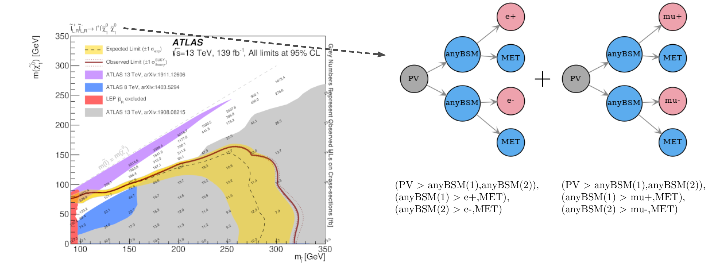
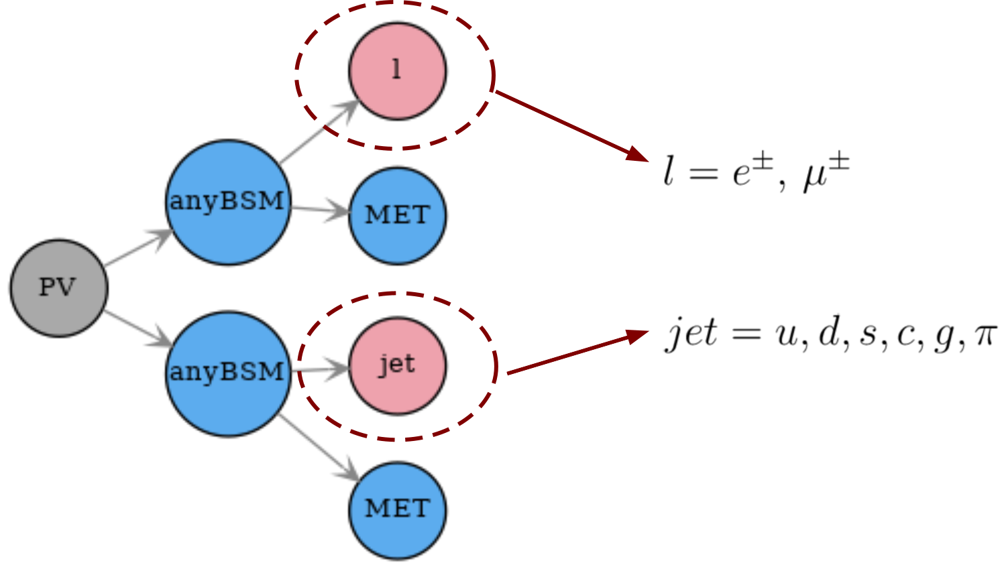
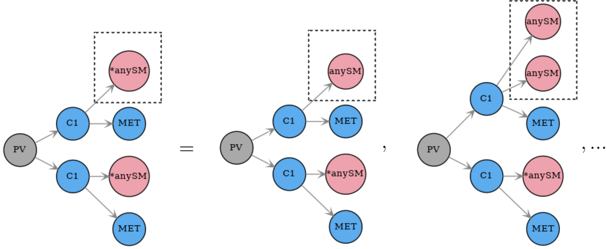
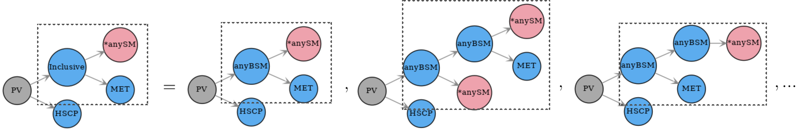

.. index:: Database Definitions

.. |EM| replace:: :ref:`EM-type <EMtype>`
.. |UL| replace:: :ref:`UL-type <ULtype>`
.. |EMr| replace:: :ref:`EM-type result <EMtype>`
.. |ULr| replace:: :ref:`UL-type result <ULtype>`
.. |EMrs| replace:: :ref:`EM-type results <EMtype>`
.. |ULrs| replace:: :ref:`UL-type results <ULtype>`
.. |ExpRes| replace:: :ref:`Experimental Result<ExpResult>`
.. |ExpRess| replace:: :ref:`Experimental Results<ExpResult>`
.. |Dataset| replace:: :ref:`DataSet<DataSet>`
.. |Datasets| replace:: :ref:`DataSets<DataSet>`
.. |dataset| replace:: :ref:`data set<DataSet>`
.. |datasets| replace:: :ref:`data sets<DataSet>`
.. |SMS| replace:: :ref:`SMS <SMS>`
.. |SMS topology| replace:: :ref:`SMS topology <SMS>`
.. |SMS topologies| replace:: :ref:`SMS topologies <SMS>`
.. |particle| replace:: :ref:`particle <particleClass>`
.. |particles| replace:: :ref:`particles <particleClass>`

.. _databaseDefs:

Database Definitions
====================

The so-called `experiment module <experiment.html#experiment>`_ 
contains the basic tools necessary for handling the database of experimental results.
The SModelS database collects experimental
results of searches from both ATLAS and CMS, which are used to compute the
experimental constraints on specific models.
Starting with version 1.1, the SModelS database includes two types of experimental constraints:

*  Upper Limit (UL) constraints: constrains on :math:`\sigma \times BR` of simplified models, provided 
   by the experimental collaborations (see |ULrs|);
*  Efficiency Map (EM) constraints: constrains the total signal (:math:`\sum \sigma \times BR \times \epsilon`) in
   a specific signal region. Here :math:`\epsilon` denotes the acceptance times efficiency.  
   These are either provided by the experimental collaborations or computed through recasting, e.g. with MA5 or Checkmate (see |EMrs|).

Although the two types of constraints above are very distinct,
both the folder structure and the object structure of SModelS are sufficiently flexible to
simultaneously handle both |UL| and |EM| results.
Therefore, for both |UL| and |EM| constraints, the database obeys the following structure:

* :ref:`Database <Database>`: collects a list of |ExpRess|.
  
  * |ExpRes|: each |ExpRes| corresponds to an experimental preliminary result (i.e. a CONF-NOTE or PAS) or publication and contains a list of |Datasets| as well as general information about the result (luminosity, publication reference,...).

      * |Dataset|:
        a single |Dataset| corresponds to one signal region of the experimental
        note or publication.\ [#f1]_ In case of |ULrs| there is a single |Dataset|, usually corresponding to the best signal
        region or a combination of signal regions (for more details see |Dataset|). For |EMrs|, there is one |Dataset| for each signal region.
        Each |Dataset| contains the Upper Limit maps for :ref:`Upper Limit results <ULtype>` *or* the Efficiency maps for :ref:`Efficiency Map results <EMtype>`. 

            * Upper Limit map: contains the upper limit constraints for |ULrs|. Each map contains
              upper limits for the signal cross-section for a single simplified model 
              (or more precisely to a single |SMS topology| or sum of |SMS topologies|)
              as a function of the simplified model parameters.
            * Efficiency map: contains the efficiencies for |EMrs|. Each map contains efficiencies
              for the signal for a single simplified model (or more precisely to a single |SMS topologies| or sum of |SMS topologies|)
              as a function of the simplified model parameters.

A schematic summary of the above structure can be seen below:

.. _databaseScheme:

.. image:: images/databaseScheme.png
   :width: 85%

In the following sections we describe the main concepts and elements which constitute the SModelS database.
More details about the database folder structure and object structure can be found in :ref:`Database of Experimental Results<databaseStruct>`.

.. _Database:

Database
--------

Each publication or conference note can be included in the database 
as an :ref:`Experimental Result<ExpResult>`. Hence, the database is simply a collection of experimental results. 

* **The Database is described by the** `Database Class <experiment.html#experiment.databaseObj.Database>`_

.. _ExpResult:

Experimental Result
-------------------
An experimental result contains all the relevant information corresponding to an
experimental publication or preliminary result. In particular it holds general
information about the experimental analysis, such as the corresponding
luminosity, center of mass energy, publication reference, etc. The current
version allows for two possible types of experimental results: one containing
upper limit maps (|UL|)
and one containing efficiency maps (|EM|).

* **Experimental Results are described by the** `ExpResult Class <experiment.html#experiment.expResultObj.ExpResult>`_

.. _ULtype:

Experimental Result: Upper Limit Type
^^^^^^^^^^^^^^^^^^^^^^^^^^^^^^^^^^^^^

Upper Limit (UL) experimental results contain the experimental constraints on
the cross section times branching ratio
( :math:`\sigma \times BR` ) for Simplified Models from a specific experimental publication or preliminary
result. These constraints are typically given in the format of Upper Limit maps,
which correspond to 95% confidence level (C.L.) upper limit values on :math:`\sigma \times BR`
as a function of the respective parameter space (usually BSM masses
or slices over mass planes). The UL values typically refer to the best signal region
(for a given point in parameter space) or a combination of signal regions.
Hence, for UL results there is a single |Dataset|, containing one
or more UL maps. An example of a UL map is shown in :numref:`Fig.%s <ULplot>` .

.. _ULplot:

.. figure:: images/ULexample.png
   :width: 40%
   :align: center

   Example of an upper limit result and the information stored in the database.

Within SModelS, the above UL map is used to constrain the
simplified model :math:`\tilde{t} + \tilde{t} \to \left(t+\tilde{\chi}_1^0\right) + \left(t+\tilde{\chi}_1^0\right)`.
Using the SModelS :ref:`string representation <notation>` for simplified models, this |SMS| is decribed by: ::

    (PV > anyBSM(1), anyBSM(2)) , (anyBSM(1) > MET(3),t(4)), (anyBSM(2) > MET(5),t(6))

where the integers refer to the node indices and are used internally to uniquely define the particles. Note that in the example in :numref:`Fig. %s <ULplot>` it is assumed that the analysis is insensitive to the spin of the BSM particles and to the quantum numbers of the stop (as long as it decays to a top quark and MET), so the stops are mapped into *generic* BSM |particles| (anyBSM).
A list of the database BSM |particles| can be found in the databaseParticles.py file in the database folder.
Usually a single preliminary result/publication contains several UL maps, hence
each UL-type experimental result contains several UL maps, each one constraining
different simplified
models (|SMS topology| or sum of |SMS topologies|).
*We also point out that the exclusion curve shown in the UL map above is never used by SModelS*.

.. _ULconstraint:

Upper Limit Constraint
~~~~~~~~~~~~~~~~~~~~~~

The upper limit constraint specifies which simplified models
(represented by a single |SMS| or a sum of |SMS topologies|) are being constrained by the respective UL map.
For simple constraints as the one shown in :numref:`Fig. %s <ULplot>`, 
there is a single |SMS| being constrained.
In some cases, however, the constraint corresponds to a sum of |SMS topologies|.
As an example, consider the result from the `ATLAS analysis <https://atlas.web.cern.ch/Atlas/GROUPS/PHYSICS/PAPERS/SUSY-2019-02/>`_ in :numref:`Fig. %s <constraintPlot>` :

.. _constraintPlot:

   Example of upper limits for a sum of simplified model topologies.

As we can see, the upper limits apply to the sum of the cross sections:

.. math::
    \sigma = \sigma_{e^+ e^-} + \sigma_{\mu^+ \mu^-}
    
In this case the UL constraint is simply: ::

      {(PV > anyBSM(1),anyBSM(2)), (anyBSM(1) > e+(3),MET(4)), (anyBSM(2) > e-(5),MET(6))} 
    
    + {(PV > anyBSM(1),anyBSM(2)), (anyBSM(1) > mu+(3),MET(4)), (anyBSM(2) > mu-(5),MET(6))}
    
where it is understood that the sum runs over the weights of the respective |SMS|. Note that curly brackets were introduced in order delimit individual |SMS topologies|.

Note that the sum can be over particle charges, flavors or more complex combinations of simplified models.
However, almost all experimental results sum only over |SMS| sharing a common structure (or common :ref:`canonical name <canonicalName>`).

Finally, in some cases the UL constraint assumes specific contributions from each individual simplified model.
For instance, in :numref:`Fig. %s <constraintPlot>` it is implicitly assumed that
both the electron and muon |SMS| contribute equally to the total cross section.
Hence these conditions must also be specified along with the constraint, as described in :ref:`UL conditions<ULconditions>`.

.. _ULconditions:

Upper Limit Conditions
~~~~~~~~~~~~~~~~~~~~~~

When the analysis :ref:`constraints <ULconstraint>` are non-trivial (refer to a sum of |SMS|), it is often the case
that there are implicit (or explicit) assumptions about the contribution of each simplified model. For instance,
in :numref:`Fig. %s <constraintPlot>`, it is implicitly assumed that each lepton flavor contributes equally
to the summed cross section:

.. math::    
    \sigma_{e^+ e^-} = \sigma_{\mu^+ \mu^-}          \;\;\; \mbox{(condition)}
    

Therefore, when applying these constraints to general models, one must also verify if
these conditions are satisfied. Once again we can express these conditions 
using the :ref:`string representation <notation>` of simplified models: ::

    {(PV > anyBSM(1),anyBSM(2)), (anyBSM(1) > e+(3),MET(4)), (anyBSM(2) > e-(5),MET(6))} 
    = {(PV > anyBSM(1),anyBSM(2)), (anyBSM(1) > mu+(3),MET(4)), (anyBSM(2) > mu-(5),MET(6))}

where it is understood that the condition refers to the weights of the respective simplified models.

In several cases it is desirable to relax the analysis conditions, so the analysis
upper limits can be applied to a broader spectrum of models. Once again, for the example mentioned
above, it might be reasonable to impose instead: ::

    {(PV > anyBSM(1),anyBSM(2)), (anyBSM(1) > e+(3),MET(4)), (anyBSM(2) > e-(5),MET(6))} 
    <= {(PV > anyBSM(1),anyBSM(2)), (anyBSM(1) > mu+(3),MET(4)), (anyBSM(2) > mu-(5),MET(6))}

The *departure* from the exact condition can then be properly quantified and one can decide whether the analysis 
upper limits are applicable or not to the model being considered.
Concretely, SModelS computes for each condition a number between 0 and 1, where
0 means the condition is exactly satisfied and 1 means it is maximally violated.
Allowing for a :math:`20\%` violation of a condition corresponds approximately to 
a ''condition violation value'' (or simply condition value) of 0.2.
The condition values are given as an output of SModelS, so the user can decide what are the
maximum acceptable values (see :ref:`maxcond <parameterFileMaxcond>` in the parameters file).

.. _EMtype:

Experimental Result: Efficiency Map Type
^^^^^^^^^^^^^^^^^^^^^^^^^^^^^^^^^^^^^^^^

Efficiency maps correspond to a grid of simulated acceptance times efficiency 
( :math:`A \times \epsilon` ) values for a specific signal region. In the following we will refer to 
:math:`A \times \epsilon` simply as *efficiency* and denote it by :math:`\epsilon`. 
Furthermore, additional information, such as the luminosity, number of observed and expected events, etc is also
stored in an EM-type result.

Another important difference between |ULrs| and |EMrs| is the existence of several signal regions, which in SModelS
are mapped to |Datasets|.  While |ULrs| contain a single |Dataset| (''signal region''), EM results hold several |Datasets|,
one for each signal region (see the :ref:`database scheme<databaseScheme>` above).
Each |Dataset| contains one or more efficiency maps, one for each |SMS|. 
The efficiency map is usually a function of the BSM masses (or masses and widths) appearing in the element, as shown in :numref:`Fig. %s <EMplot>`:

.. _EMplot:

.. figure:: images/EMexample.png
   :width: 70%

   Example of an |EM| result. Note that only the product :math:`\mathcal{A} \times \epsilon` is used by SModelS.

In order to use a language similar to the one used in |ULrs|, the description of |SMS| for which the efficiencies correspond still is called *constraint*.

Although efficiencies are most useful for |EMrs|, their concept can also be extended to
|ULrs|. For the latter, the efficiency for a given |SMS| is either 1, 
if the simplified model appears in the :ref:`UL constraint <ULconstraint>`, 
or 0, otherwise. Although trivial, this extension
allows for a unified treatment of |EMrs| and |ULrs|
(see :ref:`Theory Predictions <theoryPredictions>` for more details).

.. _DataSet:

Data Sets
---------

Data sets are a way to conveniently group efficiency maps corresponding to the same signal region.
As discussed in |ULrs|, data sets are not necessary for UL-type results, since in this case there is a single ''signal region''.
Nonetheless,  data sets are also present in |ULrs| in order to allow for a similar structure for both |EM|
and |UL| results (see :ref:`database scheme <databaseScheme>`).

For |ULrs| the data set contains the UL maps as well as some basic information, such as the type of |ExpRes| (UL).
On the other hand, for |EMrs|, each data set contains the EM maps for the corresponding signal region
as well as some additional information: the observed and expected number of events in the signal region, the signal upper
limit, etc.
In the folder structure shown in :ref:`database scheme <databaseScheme>`, the upper limit maps and efficiency maps
for each |SMS| (or sum of |SMS|) are stored in files labeled according to the :ref:`TxName convention <TxName>`.

* **Data Sets are described by the** `DataSet Class <experiment.html#experiment.datasetObj.DataSet>`_

   
.. _TxName:

TxName Convention
-----------------

Since using the :ref:`string notation<notation>` 
to describe the simplified models appearing in the
upper limit or efficiency maps can be rather lengthy, it is useful to define a shorthand notation for
the :ref:`constraints <ULconstraint>`. SModelS adopts a notation based on 
the CMS SMS conventions, where each specific :ref:`constraint <ULconstraint>` is
labeled as *T<constraint name>*, which we refer as *TxName*. For instance, the TxName corresponding to 
the constraint in :numref:`Fig. %s <EMplot>` is *T2*.
A complete list of TxNames can be found `here <http://smodels.github.io/docs/SmsDictionary>`_.

* **Upper limit and efficiency maps are described by the** `TxName Class <experiment.html#experiment.txnameObj.TxName>`_

 
*More details about the database folder structure and object
structure can be found in* :ref:`Database of Experimental Results<databaseStruct>`. 

.. _inclusiveSMS:

Inclusive SMS
-------------

The experimental searches are often inclusive over the final states considered, as illustrated by the sum over light lepton flavors in :numref:`Fig. %s <constraintPlot>`. Also, many searches are not strongly sensitive to the quantum numbers of the promptly decaying BSM particles. Finally, some searches are very inclusive over the final states as long as the required target object/particle is present in the signal.
All these different levels of inclusiveness need to be represented by the |SMS topologies| appearing in the constraints and the following objects can be used when describing inclusive :ref:`constraints <ULconstraint>`:

 * *Inclusive particles/labels*: these can be used to describe several particles which are considered equivalent for the experimental search. For instance, jets can be represented by an inclusive particle, which equals any light quark flavor or a gluon (:math:`jet = u,d,s,c,g`). A fully inclusive label can also be used to describe any BSM state (:math:`anyBSM`) or any SM state (:math:`anySM`). Finally any BSM or SM particle is represented by :math:`*`. An example of the use of inclusive labels is shown in :numref:`Fig. %s <incLabel>`.

 * *Inclusive number of SM particles*: some inclusive searches allow for an arbitrary number of SM particles in the final once they satisfy some requirements. The arbitrary number of SM particles is represented by :math:`*anySM`. One example is the search for disappearing tracks, which is insensitive to the the decay of the long-lived particle, as long as the SM states from the decay are soft and the BSM state is invisible, as represented in :numref:`Fig. %s <incSM>`.

 
 * *Inclusive topologies*: in highly inclusive searches even the topology of the |SMS| is arbitrary, as long as the final states satisfy some loose requirements. This case is described by an "inclusive" particle (node), which represents any arbitrary cascade decay. For example, any cascade decay may be allowed as long as there are only SM particles appearing as final states or invisible BSM states. One example is the search for heavy stable charged particles, which is fairly insensitive to the extra activity in the event as long as a heavy particle charged particle is also present, as illustrated in :numref:`Fig. %s <incTopo>`.

.. _incLabel:

   Example of how inclusive labels can be used in |SMS topologies| describing inclusive final states. In the example above :math:`l` represents any light charged lepton (electrons, muons) and :math:`jet` represents any light quark, gluon or pions.

.. _incSM:

   Example of how |SMS topologies| with an arbitrary number of SM final states is represented within SModelS. The particle (node) :math:`*anySM` describes any number of SM final states appearing in the :math:`C1` decay.

.. _incTopo:

   Example of how inclusive topologies are represented within SModelS. The particle (node) :math:`Inclusive` describes arbitrary cascade decays which lead to one BSM invisible final state (:math:`MET`) and an arbitrary number of SM final states (:math:`*anySM`).

.. [#f1] The name *Data Set* is used instead of signal region because its concept is slightly more general. For instance, in some |EMrs| a |Dataset| may not correspond to an aggregated signal region, while for |ULrs| it may correspond to a combination of all signal regions.
 
