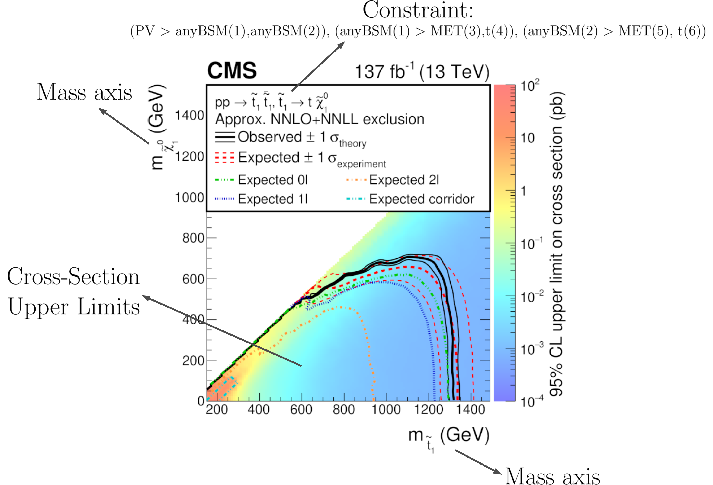

.. index:: Database Definitions

.. |EM| replace:: :ref:`EM-type <EMtype>`
.. |UL| replace:: :ref:`UL-type <ULtype>`
.. |EMr| replace:: :ref:`EM-type result <EMtype>`
.. |ULr| replace:: :ref:`UL-type result <ULtype>`
.. |EMrs| replace:: :ref:`EM-type results <EMtype>`
.. |ULrs| replace:: :ref:`UL-type results <ULtype>`
.. |ExpRes| replace:: :ref:`Experimental Result<ExpResult>`
.. |ExpRess| replace:: :ref:`Experimental Results<ExpResult>`
.. |Dataset| replace:: :ref:`DataSet<DataSet>`
.. |Datasets| replace:: :ref:`DataSets<DataSet>`
.. |dataset| replace:: :ref:`data set<DataSet>`
.. |datasets| replace:: :ref:`data sets<DataSet>`
.. |element| replace:: :ref:`element <element>`
.. |elements| replace:: :ref:`elements <element>`
.. |topology| replace:: :ref:`topology <topology>`
.. |topologies| replace:: :ref:`topologies <topology>`

.. _databaseDefs:

Database Definitions
====================

The so-called `experiment module <experiment.html#experiment>`_ 
contains the basic tools necessary for handling the database of experimental results.
The SModelS database collects experimental
results of SUSY searches from both ATLAS and CMS, which are used to compute the
experimental constraints on specific models.
Starting with version 1.1, the SModelS database includes two types of experimental constraints:

*  Upper Limit (UL) constraints: constrains on :math:`\sigma \times BR` of simplified models, provided 
   by the experimental collaborations (see |ULrs|);
*  Efficiency Map (EM) constraints: constrains the total signal (:math:`\sum \sigma \times BR \times \epsilon`) in
   a specific signal region. Here :math:`\epsilon` denotes the acceptance times efficiency.  
   These are either provided by the experimental collaborations or computed by
   theory groups (see |EMrs|); 

Although the two types of constraints above are very distinct,
both the folder structure and the object structure of SModelS are sufficiently flexible to
simutaneously handle both |UL| and |EM| results.
Therefore, for both |UL| and |EM| constraints, the database obeys the following structure:

* :ref:`Database <Database>`: collects a list of |ExpRess|.
   * |ExpRes|: each |ExpRes| corresponds to an experimental preliminary result (i.e. a CONF-NOTE or PAS) or publication and contains a list of |Datasets| as well as general information about the result (luminosity, publication reference,...).

      * |Dataset|:
        a single |Dataset| corresponds to one signal region of the experimental
        note or publication [*]_. In case of |ULrs| there is a single |Dataset|, usually corresponding to the best signal
        region (for more details see |Dataset|). For |EMrs|, there is one |Dataset| for each signal region.
        Each |Dataset| contains the Upper Limit maps for :ref:`Upper Limit results <ULtype>` *or* the Efficiency maps for :ref:`Efficiency Map results <EMtype>`. 

            * Upper Limit map: contains the upper limit constraints for |ULrs|. Each map refers to a single 
              simplified model (or more precisely to a single |element| or sum of |elements|).
            * Efficiency map: contains the efficiencies for |EMrs|. Each map refers to a single 
              simplified model (or more precisely to a single |element| or sum of |elements|).

A schematic summary of the above structure can be seen below:

.. _databaseScheme:

.. image:: images/databaseScheme.png
   :width: 85%

In the following sections we describe the main concepts and elements which constitute the SModelS database.
More details about the database folder structure and object struture can be found in :ref:`Database of Experimental Results<databaseStruct>`.

.. _Database:

Database
--------

Each publication or conference note can be included in the database 
as an :ref:`Experimental Result<ExpResult>`. Hence, the database is simply a collection of experimental results. 

* **The Database is described by the** `Database Class <experiment.html#experiment.databaseObj.Database>`_

.. _ExpResult:

Experimental Result
-------------------
An experimental result contains all the relevant information corresponding to an
experimental publication or preliminary result. In particular it holds general
information about the experimental analysis, such as the corresponding
luminosity, center of mass energy, publication reference, etc. The current
version allows for two possible types of experimental results: one containing
upper limit maps (|UL|)
and one containing efficiency maps (|EM|).

* **Experimental Results are described by the** `ExpResult Class <experiment.html#experiment.expResultObj.ExpResult>`_

.. _ULtype:

Experimental Result: Upper Limit Type
^^^^^^^^^^^^^^^^^^^^^^^^^^^^^^^^^^^^^

Upper Limit (UL) experimental results contain the experimental constraints on
the cross section times branching ratio
( :math:`\sigma \times BR` ) for Simplified Models from a specific experimental publication or preliminary
result. These constraints are typically given in the format of Upper Limit maps,
which correspond to 95% confidence level (C.L.) upper limit values on :math:`\sigma \times BR`
as a function of the respective parameter space (usually BSM masses
or slices over mass planes). The UL values usually assume the best signal region
(for a given point in parameter space), a combination of signal regions or
more involved limits from other methods.
Hence, for UL results there is a single |Dataset|, containing one
or more UL maps. An example of a UL map is shown below:

.. _ULplot:

Within SModelS, the above UL map is used to constrain the
simplified model :math:`\tilde{q} + \tilde{q} \to \left(jet+\tilde{\chi}_1^0\right) + \left(jet+\tilde{\chi}_1^0\right)`.
Using the SModelS notation this simplified model is mapped to the
:ref:`element<element>` :math:`[[[jet]],[[jet]]]`, using the notation defined in
:ref:`Bracket Notation <notation>`.
In addition to the constraint information, it is also
possible to specificy a final state property for the simplified model,
which corresponds to the BSM final state signature (see :ref:`Final State particles <final stateOdd>`).
If no final state is defined, the :ref:`element<element>`
is assumed to have a :math:`(MET,MET)` final state signature.
Usually a single preliminary result/publication contains several UL maps, hence
each UL-type experimental result contains several UL maps, each one constraining
different simplified
models (|elements| or sum of  |elements|).
*We also point out that the exclusion curve shown in the UL map above is never used by SModelS*.

.. _ULconstraint:

Upper Limit Constraint
~~~~~~~~~~~~~~~~~~~~~~

The upper limit constraint specifies which simplified model
(represented by an |element| or sum of |elements|) is being constrained by the respective UL map.
For simple constraints as the one shown in the :ref:`UL map <ULplot>` above, 
there is a single |element| being constrained (:math:`[[[jet]],[[jet]]]`).
In some cases, however, the constraint corresponds to a sum of :ref:`elements <element>`.
As an example, consider the `ATLAS analysis <https://atlas.web.cern.ch/Atlas/GROUPS/PHYSICS/CONFNOTES/ATLAS-CONF-2013-049/>`_ shown below:

.. _constraintplot:

.. image:: images/constraintExample.png
   :width: 80%

As we can see, the upper limits apply to the sum of the cross sections:

.. math::
    \sigma = \sigma([[[e^+]],[[e^-]]]) + \sigma([[[\mu^+]],[[\mu^-]]])
    
In this case the UL constraint is simply:

.. math::
    [[[e^+]],[[e^-]]] + [[[\mu^+]],[[\mu^-]]]
    
where it is understood that the sum is over the weights of the respective |elements|
and not over the |elements| themselves.    

Note that the sum can be over particle charges, flavors or more complex combinations of elements.
However, almost all experimental results sum only over elements sharing a common |topology|.

Finally, in some cases the UL constraint assumes specific constributions from each |element|.
For instance, in the :ref:`example above <constraintplot>` it is implicitly assumed that
both the electron and muon |elements| contribute equally to the total cross section.
Hence these conditions must also be specified along with the constraint, as described in :ref:`UL conditions<ULconditions>`.

.. _ULconditions:

Upper Limit Conditions
~~~~~~~~~~~~~~~~~~~~~~

When the analysis :ref:`constraints <ULconstraint>` are non-trivial (refer to a sum of elements), it is often the case
that there are implicit (or explicit) assumptions about the contribution of each element. For instance,
in the :ref:`figure above <constraintplot>`, it is implicitly assumed that each lepton flavor contributes equally
to the summed cross section:

.. math::    
    \sigma([[[e^+]],[[e^-]]]) = \sigma([[[\mu^+]],[[\mu^-]]])           \;\;\; \mbox{(condition)}
    

Therefore, when applying these constraints to general models, one must also verify if
these conditions are satisfied. Once again we can express these conditions in 
:ref:`bracket notation <notation>`:

.. math::    
    [[[e^+]],[[e^-]]] = [[[\mu^+]],[[\mu^-]]]           \;\;\; \mbox{(condition)}

where it is understood that the condition refers to the weights of the respective elements
and not to the elements themselves.

In several cases it is desirable to relax the analysis conditions, so the analysis
upper limits can be applied to a broader spectrum of models. Once again, for the example mentioned
above, it might be reasonable to impose instead:

.. math::
    [[[e^+]],[[e^-]]] \simeq [[[\mu^+]],[[\mu^-]]]           \;\;\; \mbox{(fuzzy condition)}

The *departure* from the exact condition can then be properly quantified and one can decide whether the analysis 
upper limits are applicable or not to the model being considered.
Concretely, SModelS computes for each condition a number between 0 and 1, where
0 means the condition is exactly satisfied and 1 means it is maximally violated.
Allowing for a :math:`20\%` violation of a condition corresponds approximately to 
a ''condition violation value'' (or simply condition value) of 0.2.
The condition values  are given as an output of SModelS, so the user can decide what are the
maximum acceptable values.

.. _EMtype:

Experimental Result: Efficiency Map Type
^^^^^^^^^^^^^^^^^^^^^^^^^^^^^^^^^^^^^^^^

Unlike |ULrs|, the main information held by Efficiency Map (EM) results are the efficiencies for simplified
models (represented by an |element| or sum of |elements|).
These may be provided by the experimental collaborations or independently computed by theory groups.
Efficiency maps correspond to a grid of simulated acceptance times efficiency 
( :math:`A \times \epsilon` ) values for a specific signal region. In the following we will refer to 
:math:`A \times \epsilon` simply as *efficiency* and denote it by :math:`\epsilon`. 
Furthermore, additional information, such as the luminosity, number of observed and expected events, etc is also
stored in a EM-type result.

Another important difference between |ULrs| and |EMrs| is the existence of several signal regions, which in SModelS
are mapped to |Datasets|.  While |ULrs| contain a single |Dataset| (''signal region''), EM results hold several |Datasets|,
one for each signal region (see the :ref:`database scheme<databaseScheme>` above).
Each |Dataset| contains one or more efficiency maps, one for each |element| or sum of |elements|. 
The efficiency map is usually a function of the BSM masses appearing in the element, as shown by the example below:

.. _EMplot:

Within SModelS the above EM map is used to compute the efficiency for the
:ref:`element<element>` :math:`[[[jet]],[[jet]]]`, where we are using the
notation defined in :ref:`Bracket Notation <notation>`.
Furthermore, a final state property can also be defined (see :ref:`Final State class <final stateOdd>`).
If no final state is given, the :ref:`element<element>`
is assumed to have a :math:`(MET,MET)` final state signature.
Usually there are several EM maps for a single |dataset|: one for each |element|
or sum of  |elements|. In order to use a language similar to the one used in |ULrs|, the |element| (or |elements|)
for which the efficiencies correspond to are still called *constraint*.

Although efficiencis are most useful for |EMrs|, their concept can also be extended to
|ULrs|. For the latter, the efficiencies for a given element are either 1, if the element
appears in the :ref:`UL constraint <ULconstraint>`, or 0, otherwise. Atlhough trivial, this extension
allows us to treat |EMrs| and |ULrs| in a very similar fashion
(see :ref:`Theory Predictions <theoryPredictions>` for more details).

.. _DataSet:

Data Sets
---------

Data sets are a way to conveniently group efficiency maps corresponding to the same signal region.
As discussed in |ULrs|, data sets are not necessary for UL-type results, since in this case there is a single ''signal region''.
Nonetheless,  data sets are also present in |ULrs| in order to allow for a similar structure for both |EM|
and |UL| results (see :ref:`database scheme <databaseScheme>`).

For |ULrs| the data set contains the UL maps as well as some basic information, such as the type of |ExpRes| (UL).
On the other hand, for |EMrs|, each data set contains the EM maps for the corresponding signal region
as well as some additional information: the observed and expected number of events in the signal region, the signal upper
limit, etc.
In the folder structure shown in :ref:`database scheme <databaseScheme>`, the upper limit maps and efficiency maps
for each |element| (or sum of |elements|) are stored in files labeled accoring to the :ref:`TxName convention <TxName>`.

* **Data Sets are described by the** `DataSet Class <experiment.html#experiment.datasetObj.DataSet>`_

   
.. _TxName:

TxName Convention
-----------------

Since using the :ref:`bracket notation<notation>` 
to describe the simplified models appearing in the
upper limit or efficiency maps can be rather lenghty, it is useful to define a shorthand notation for
the :ref:`constraints <ULconstraint>`. SModelS adopts a notation based on 
the CMS SMS conventions, where each specific :ref:`constraint <ULconstraint>` is
labeled as *T<constraint name>*, which we refer as *TxName*. For instance, the TxName corresponding to 
the constraint in the :ref:`example above <constraintplot>` is *TSlepSlep*.
A complete list of TxNames can be found `here <http://smodels.hephy.at/wiki/SmsDictionary>`_.

* **Upper limit and efficiency maps are described by the** `TxName Class <experiment.html#experiment.txnameObj.TxName>`_

 
*More details about the database folder structure and object
structure can be found in* :ref:`Database of Experimental Results<databaseStruct>`. 

.. [*] The name *Data Set* is used instead of signal region because its concept is slightly more general. For instance,
   in the case of |ULrs|, a |Dataset| may not correspond to a single signal region, but to a combination of signal regions.
 
