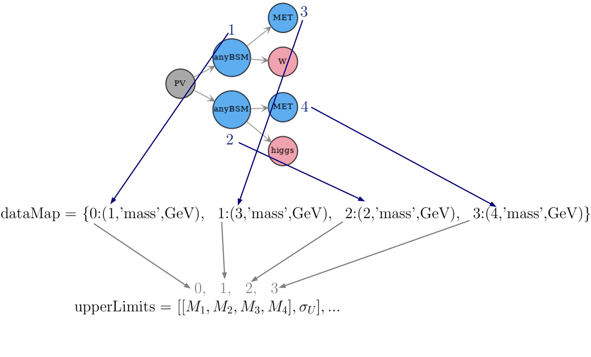
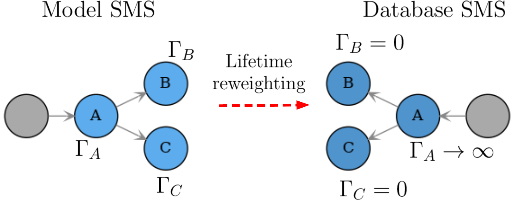
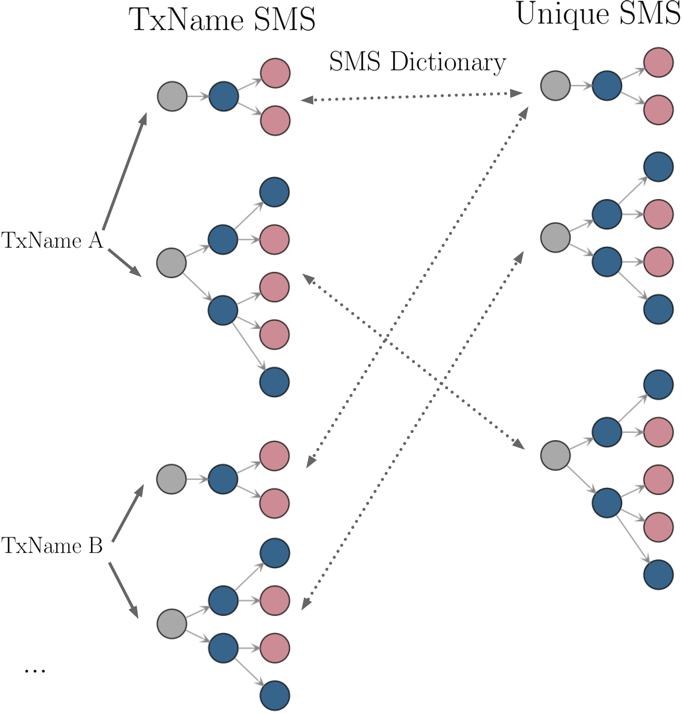
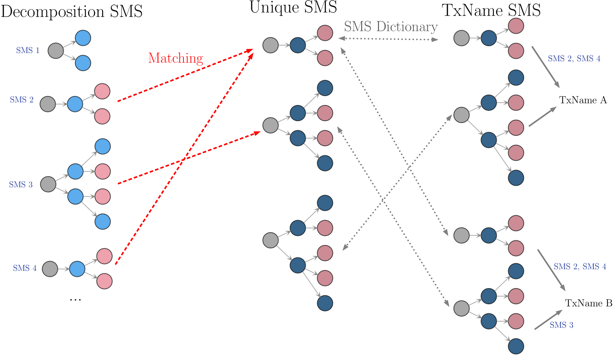

.. index:: Database Structure

.. |constraint| replace:: :ref:`constraint <ULconstraint>`
.. |conditions| replace:: :ref:`conditions <ULconditions>`
.. |fb-1| replace:: :math:`\mathrm{fb}^{-1}`
.. |sqrts| replace:: :math:`\sqrt{s}`
.. |EM| replace:: :ref:`EM-type <EMtype>`
.. |UL| replace:: :ref:`UL-type <ULtype>`
.. |EMr| replace:: :ref:`EM-type result <EMtype>`
.. |ULr| replace:: :ref:`UL-type result <ULtype>`
.. |EMrs| replace:: :ref:`EM-type results <EMtype>`
.. |ULrs| replace:: :ref:`UL-type results <ULtype>`
.. |ExpRes| replace:: :ref:`Experimental Result <ExpResult>`
.. |ExpRess| replace:: :ref:`Experimental Results <ExpResult>`
.. |Dataset| replace:: :ref:`DataSet<DataSet>`
.. |Datasets| replace:: :ref:`DataSets<DataSet>`
.. |Database| replace:: :ref:`Database <Database>`
.. |particles| replace:: :ref:`particles <particleClass>`
.. |particle| replace:: :ref:`particle <particleClass>`
.. |SMS| replace:: :ref:`SMS <SMS>`
.. |SMS topology| replace:: :ref:`SMS topology <SMS>`
.. |SMS topologies| replace:: :ref:`SMS topologies <SMS>`
.. |decomposition| replace:: :ref:`decomposition <decomposition>`   

.. _databaseStruct:

Database of Experimental Results
================================

The information about the experimental results is stored in the SModelS |Database|.
Below we describe both the :ref:`directory <folderStruct>` and :ref:`object <objStruct>` structure of the |Database|
and :ref:`how the stored information is used <interpolationDB>` within SModelS. 

.. _folderStruct:

Database: Directory Structure
-----------------------------

The :ref:`Database <Database>` is organized as files in an ordinary (UNIX)
directory hierarchy, with a thin Python layer serving for the access.  
The overall structure of the directory hierarchy and its contents is
depicted in the scheme below (click to enlarge):

.. image:: images/DatabaseFolders.png
   :width: 80%

The top level directory contains a file called ``version`` with the
version string of the database. At this first level, the database is organised 
by LHC center-of-mass energies, |sqrts|:

* 8 TeV
* 13 TeV

The second level splits the results up between the different experiments:

* 8TeV/CMS/
* 8TeV/ATLAS/

The third level of the directory hierarchy encodes the |ExpRess|:

* 8TeV/CMS/CMS-SUS-12-024
* 8TeV/ATLAS/ATLAS-CONF-2013-047
* ...

* **The Database folder is described by the** `Database Class <experiment.html#experiment.databaseObj.Database>`_

Experimental Result Folder
^^^^^^^^^^^^^^^^^^^^^^^^^^

Each |ExpRes| folder contains:

* a folder for each |Dataset| (e.g. ``data``)
* a ``globalInfo.txt`` file

The ``globalInfo.txt`` file contains the meta information about the |ExpRes|.
It defines the center-of-mass energy |sqrts|, the integrated luminosity, the id
used to identify the result and additional information about the source of the
data. In case a statistical model is given (either a :ref:`simplified likelihood <simplifiedllhd>` or a :ref:`full pyhf likelihood <pyhfllhd>`), it is also referenced here. Here is the content of ATLAS-SUSY-2018-04/globalInfo.txt as an example:

.. literalinclude:: /literals/globalInfo201804.txt
   :lines: 1-20

In this case, the connection of SModelS with the pyhf model is specified as
a dictionary, with the json file name as the keys and a list of analysis region
entries as the values. The region entries match the SModelS names (``smodels``), 
i.e. the dataId's of the relevant efficiency maps, with the pyhf region names (``pyhf``) 
used in the json file; the region type (signal, control, or validation region) is 
specified as ``type`` (default: **SR**). If the pyhf name is omitted, it is assumed to be equal to the 
SModelS name. If the SModelS name is omitted, we assume **None** as value, indicating
that there is no corresponding efficiency map implemented; in this case no signal counts will be patched in this region. This is typically the case for control or validation regions. 
Finally, in case the region names in the pyhf model and in SModelS coincide, a simple name string can be used instead of a dictionary, as is illustrated by the ATLAS-SUSY-2018-14 example:

.. literalinclude:: /literals/globalInfo201814.txt
   :lines: 14

In case of simplified likelihoods, the covariance matrix is supplied in the ``covariance`` field, with the order of the regions specified in a ``datasetOrder`` field, 
shown in the example given by ATLAS-SUSY-2018-41:

.. literalinclude:: /literals/globalInfo201841.txt
   :lines: 12-13

* **Experimental Result folder is described by the** `ExpResult Class <experiment.html#experiment.expResultObj.ExpResult>`_
* **globalInfo files  are descrived by the** `Info Class <experiment.html#experiment.infoObj.Info>`_

Data Set Folder
^^^^^^^^^^^^^^^

Each |Dataset| folder (e.g. ``data``) contains:

* the Upper Limit maps for |ULrs| or Efficiency maps for |EMrs| (``TxName.txt`` files)
* a ``dataInfo.txt`` file containing meta information about the |Dataset|

* **Data Set folders are  described by the** `DataSet Class <experiment.html#experiment.datasetObj.DataSet>`_
* **TxName files are described by the** `TxName Class <experiment.html#experiment.txnameObj.TxName>`_
* **dataInfo files are described by the** `Info Class <experiment.html#experiment.infoObj.Info>`_

.. _datasetUL:

Data Set Folder: Upper Limit Type
~~~~~~~~~~~~~~~~~~~~~~~~~~~~~~~~~

Since |ULrs| have a single dataset (see |Datasets|), the info file only holds
some trivial information, such as the type of |ExpRes| (UL) and the dataset id
(None for UL-type results). Here is the content of CMS-SUS-12-024/data/dataInfo.txt as an
example:

.. literalinclude:: /literals/dataInfo.txt
   :lines: 1-2

Data Set Folder: Efficiency Map Type
~~~~~~~~~~~~~~~~~~~~~~~~~~~~~~~~~~~~

For |EMrs| the ``dataInfo.txt`` contains relevant information, such as an id to
identify the |dataset| (signal region), the number of observed and expected
background events for the corresponding signal region and the respective 
upper limits on the fiducial cross sections.  We take 
CMS-SUS-13-012-eff/3NJet6_1000HT1250_200MHT300/dataInfo.txt as an example:

.. literalinclude:: /literals/dataInfo-eff.txt
   :lines: 1-7

.. _txnameFile:

TxName Files
^^^^^^^^^^^^

Each |DataSet| contains one or more ``TxName.txt`` files storing
the bulk of the experimental result data.
For |ULrs|, the TxName file contains the UL maps for a given simplified model
(|SMS topology| or sum of |SMS topologies|), while for |EMrs| the file contains the simplified model efficiencies.
In addition, the TxName files also store some meta information, such
as the source of the data and the *type* of result (*prompt* or *displaced*).
If not specified, the type will be assumed to be prompt.\ [#f1]_
For instance, the first few lines of ATLAS-SUSY-2019-08/data/TChiWH.txt read [#f2]_:

.. literalinclude:: /literals/TChiWH.txt
   :lines: 1-2,4-11

As seen above, the first block of data in the
file contains information about the simplified model
topology for which the data refers to and some additional information.
The constraint field describes the |SMS topology| in string format 
(see :ref:`SMS Representation <notation>`).

The second block of data in the  ``TxName.txt`` file contains the upper limits or efficiencies
as a function of the relevant simplified model parameters:

.. literalinclude:: /literals/TChiWH.txt
   :lines: 13-15

As seen in the example above the data is stored as arrays of BSM parameters (masses) versus upper limits:

.. math::
   [[M_1,M_2,M_3,M_4],\sigma_{UL}],...

The mapping between the values in the list of data points and
the properties of the BSM particles appearing in the |SMS topology|
is determined by the dataMap field stored in the ``TxName.txt`` file:

.. literalinclude:: /literals/TChiWH.txt
   :lines: 3

The keys in dataMap are the indices of the data array (in the example above, the index goes from 0-3 referring to the four mass values),
while the values are tuples containing the node index of the BSM particle (defined in the constraint string),
the BSM property ('mass' or 'totalwidth') and its unit.
In :numref:`Fig. %s <dataMap>` we illustrate how the mapping works for the example above.

.. _dataMap:

   Schematic representation of how the values in the data are identified to properties of the |SMS topology|
   through the information stored in the dataMap field.

Results for long-lived or meta-stable particles may depend on the BSM widths as well.
In this case the structure above is the same, but widths are included in the data array
and are specified by the dataMap. We show one example below:

.. math::
   [[M_1,M_2,\Gamma_1,\Gamma_2],\sigma_{U}],...

where :math:`\Gamma_i` are the relevant BSM widths. The dataMap would then take the form:

.. math::
   dataMap = \{0:(1,{\rm mass},GeV),\;\; 1:(2,{\rm mass},GeV),\;\; 2:(1,{\rm totalwidth},GeV),\;\; 3:(2,{\rm totalwidth},GeV)\}

In order to make the notation more compact, whenever the width dependence is not included,
the corresponding decay will be assumed to be prompt and an effective :ref:`lifetime reweigthing factor <dbReweighting>`
will be applied to the upper limits.

As discussed before (see :ref:`Inclusive SMS <inclusiveSMS>`), some analysis can be insensitive to
some of the simplified model final states. In this case :ref:`inclusive <inclusiveSMS>` topologies
can be described through the use of the *Inclusive*, *anySM*, *\*anySM* strings.

.. _objStruct:

Database: Object Structure
--------------------------

The :ref:`Database  folder structure <folderStruct>` is mapped to Python
objects in SModelS.
The mapping is almost one-to-one, with a few exceptions.
Below we show the overall object structure  as well as the folders/files the objects
represent (click to enlarge):

.. image:: images/DatabaseObjects.png
   :width: 80%

The type of Python object (Python class, Python list,...) is shown in brackets.
For convenience, below we explicitly list the main database folders/files and
the Python objects they are mapped to:

* |Database| folder :math:`\rightarrow` `Database Class <experiment.html#experiment.databaseObj.Database>`_
* |ExpRes| folder :math:`\rightarrow` `ExpResult Class <experiment.html#experiment.expResultObj.ExpResult>`_
* |Dataset| folder :math:`\rightarrow` `DataSet Class <experiment.html#experiment.datasetObj.DataSet>`_
* ``globalInfo.txt`` file  :math:`\rightarrow` `Info Class <experiment.html#experiment.infoObj.Info>`_
* ``dataInfo.txt`` file  :math:`\rightarrow` `Info Class <experiment.html#experiment.infoObj.Info>`_
* ``Txname.txt`` file  :math:`\rightarrow` `TxName Class <experiment.html#experiment.txnameObj.TxName>`_

.. _databasePickle:

Database: Binary (Pickle) Format
^^^^^^^^^^^^^^^^^^^^^^^^^^^^^^^^

At the first time of instantiating the
`Database <experiment.html#experiment.databaseObj.Database>`_
class, the text files in *<database-path>* are loaded and parsed, and the
corresponding data objects are built. The efficiency and upper limit maps
themselves are subjected to standard preprocessing steps such as a principal
component analysis and Delaunay triangulation (see :ref:`below <interpolationDB>`).
For the sake of efficiency, the entire database -- including the Delaunay
triangulation -- is then serialized into a pickle
file (*<database-path>/database.pcl*), which will be read directly the next time the database is loaded.
If any changes in the database folder structure are detected, the python or the SModelS
version has changed, SModelS will automatically re-build the pickle file. This
action may take a few minutes, but it is again performed only once.
If desired, the pickling process can be skipped using the option *force_load = `txt'*
in the constructor of
`Database <experiment.html#experiment.databaseObj.Database>`_ .

..
 %\caption{Delaunay triangulation of an upper limit map with three mass                                                                        %parameters. The colors show the upper limit values.}

* The pickle file is created by the `createBinaryFile method <experiment.html#experiment.databaseObj.Database.createBinaryFile>`_

.. _interpolationDB:

Database: Data Processing
-------------------------

All the information contained in the :ref:`database files <folderStruct>`
is stored in the :ref:`database objects <objStruct>`.
Within SModelS the information in the |Database| is mostly used for constraining
the simplified models generated by the :ref:`decomposition <decomposition>` of the input model.
Each |SMS topology| generated is compared to the
simplified models constrained by the database and specified by the *constraint* entry
in the  :ref:`TxName files <txnameFile>`.
The comparison allows to identify which results can be used to test the input model.
Once a matching result is found the upper limit or efficiency must be computed
for the given input |SMS topology|. As :ref:`described above <txnameFile>`, the
upper limits or efficiencies are provided as function of masses and widths in the form
of a discrete grid.
In order to compute values for any given input |SMS topology|, the data has to be
processed as described below.

The efficiency and upper limit maps are subjected to a few
standard preprocessing steps.
First, in the case of upper limits, the cross-section units are removed. 
Since the widths can vary over a wide range of values, they are rescaled logarithmically
according to the expression:

.. _dataTransf:

.. math::
   \Gamma_i \to \log(1+\Gamma_i/\Gamma_0)

where :math:`\Gamma_{0} = 10^{-30}` GeV is a rescaling factor to ensure the log is mapped to large
values for the relevant width range.

Finally a principal component analysis and Delaunay triangulation (see :numref:`Fig. %s <delaunay>`)
is applied over the new coordinates (unitless masses and rescaled widths)
The simplices defined during triangulation are then used for linearly interpolating
the transformed data grid, thus allowing SModelS to compute efficiencies or upper limits
for arbitrary mass and width values (as long as they fall inside the data grid).
As seen above,
the width parameters are taken logarithmically before interpolation, which
effectively corresponds to an exponential interpolation.
If the data grid does not explicitly provide a dependence on all the widths, 
the computed upper limit or efficiency is then reweighted imposing the requirement of prompt
decays (see :ref:`lifetime reweighting <dbReweighting>` for more details).
This procedure provides an efficient and numerically robust way of dealing with
generic data grids, including arbitrary parametrizations of the mass parameter
space.

.. _delaunay:

.. figure:: images/delaunay.png
   :width: 50%
   :align: center

   Illustration of the Delaunay triangulation performed over the transformed data grid for
   an upper limit map with three mass parameters. The colors show the upper limit values.

.. _dbReweighting:

Lifetime Reweighting
^^^^^^^^^^^^^^^^^^^^

From v2.0 onwards SModelS allows to include width dependent efficiencies and upper limits.
However most experimental results do not provide upper limits (or efficiencies) as a function
of the BSM particles' widths, since usually all the decays are assumed to be prompt
and the last BSM particle appearing in the cascade decay is assumed to be stable.\ [#f3]_
In order to apply these results to models which may contain meta-stable
particles, it is possible to approximate the dependence on the widths for the case in which
the experimental result requires all BSM decays to be prompt and the last BSM particle to be stable or decay *outside* the detector.
In SModelS this is done through a reweighting factor which corresponds to the fraction
of prompt decays (for intermediate states) and decays *outside* the detector (for final BSM states)
for a given set of widths.

.. _lifetimereweight:

   Representation of the lifetime reweighting applied when the experimental result assumes
   prompt decays of intermediate particles (e.g. :math:`\Gamma_A \to \infty`) and stable 
   final states (e.g. :math:`\Gamma_{B,C} = 0`). 

For instance, if an |EMr| only provides efficiencies (:math:`\epsilon_{prompt}`)
for prompt decays, as illustrated in :numref:`Fig. %s <lifetimereweight>`, 
then, for non-zero and finite widths, an effective efficiency (:math:`\epsilon_{eff}`) can be
approximated by:

.. math::

    \epsilon_{eff} = \xi \times \epsilon_{prompt} \mbox{ , where }\xi = \mathcal{F}_{prompt} \left( \Gamma_{A} \right)  \times \mathcal{F}_{long} \left( \Gamma_{B} \right) \times \mathcal{F}_{long} \left( \Gamma_{C} \right)

In the expression above :math:`\mathcal{F}_{prompt}(\Gamma)` is the probability for the decay to be prompt
given a width :math:`\Gamma` and :math:`\mathcal{F}_{long}(\Gamma)` is the probability for the decay to
take place *outside* the detector.
The precise values of :math:`\mathcal{F}_{prompt}` and :math:`\mathcal{F}_{long}`
depend on the relevant detector size (:math:`L`), particle mass (:math:`M`), boost
(:math:`\beta`) and width (:math:`\Gamma`), thus
requiring a Monte Carlo simulation for each input model. Since this is not
within the spirit of the simplified model approach, we approximate the prompt and
long-lived probabilities by:

.. math::
   \mathcal{F}_{long} = \exp\left(- \frac{\Gamma L_{outer}}{\langle \gamma \beta \rangle}\right) \mbox{ and }
   \mathcal{F}_{prompt} = 1 - \exp\left(- \frac{\Gamma L_{inner}}{\langle \gamma \beta \rangle}\right),

where :math:`L_{outer}` is the approximate size of the detector (which we take to be 10 m for both ATLAS
and CMS), :math:`L_{inner}` is the approximate radius of the inner detector (which we take to be 1 mm for both ATLAS
and CMS). Finally, we take the effective time dilation factor to be  :math:`\langle \gamma \beta \rangle = 1.3` when
computing :math:`\mathcal{F}_{prompt}` and :math:`\langle \gamma \beta \rangle = 1.43` when computing :math:`\mathcal{F}_{long}`.
We point out that the above approximations are irrelevant if :math:`\Gamma` is very large (:math:`\mathcal{F}_{prompt} \simeq 1`
and :math:`\mathcal{F}_{long} \simeq 0`) or close to zero (:math:`\mathcal{F}_{prompt} \simeq 0`
and :math:`\mathcal{F}_{long} \simeq 1`). Only elements containing particles which have a considerable fraction of displaced
decays will be sensitive to the values chosen above.
Also, a precise treatment of lifetimes is possible if the experimental result
(or a theory group) explicitly provides the efficiencies as a function of the widths, as :ref:`discussed above <txnameFile>`.

The above expressions allows the generalization of the efficiencies computed assuming
prompt decays to models with meta-stable particles.
For |ULrs| the same arguments apply with one important distinction.
While efficiencies are reduced for displaced decays (:math:`\xi < 1`), upper limits are enhanced, since they
are roughly inversely proportional to signal efficiencies. Therefore, for |ULrs|, we have:

.. math::

    \sigma_{eff}^{UL} = \sigma_{prompt}^{UL}/\xi

Finally, we point out that for the experimental results which provide
efficiencies or upper limits as a function of some (but not all) BSM widths appearing
in the simplified model (see the :ref:`discussion above <txnameFile>`),
the reweighting factor :math:`\xi` is computed using only the widths not present
in the grid.

.. _smsDictionary:

SMS Dictionary
^^^^^^^^^^^^^^

In order to enhance the performance for the calculation of :ref:`theory predictions <theoryPredictions>` and avoid 
repeated :ref:`comparisons <matching>` between |SMS topologies| generated by the |decomposition| and the topologies found in the database, the matching between the topologies is done in a centralized fashion.
First, all the |SMS topologies| contained in the :ref:`TxName files <txnameFile>` in the database are collected and a unique list of (sorted) |SMS| objects is constructed. Second, a dictionary (mapping) between the unique |SMS| and their equivalent topologies
appearing in the :ref:`TxName files <txnameFile>` is stored, as illustrated in :numref:`Fig. %s <smsUnique>`.

.. _smsUnique:

   Representation of the SMS dictionary holding the mapping between unique |SMS topologies| in the SMS dictionary and 
   the |SMS topologies| described in the :ref:`TxName files <txnameFile>`.

The list of unique database |SMS topologies| is then used when :ref:`matching <matching>` the |SMS topologies| generated by the |decomposition| to the database.
Finally, once the matching |SMS| have been determined, the SMS dictionary is used to translate the computed matching
topologies to the original :ref:`TxName <txnameFile>` topologies, as shown in :numref:`Fig. %s <smsUniqueMatching>`. [#f4]_

.. _smsUniqueMatching:

   Schematic representation of how the :ref:`matching <matching>` between the |SMS topologies| generated by the |decomposition|
   and the |SMS topologies| described in the :ref:`TxName files <txnameFile>` is efficiently done through the use of the SMS Dictionary.

   * **The SMS dictionary is implemented by the** `ExpSMSDict <expemriment.html#experiment.expSMSDict.ExpSMSDict>`_  **class**.

.. [#f1] Prompt results are all those which assumes all decays to be prompt and the last BSM particle to be stable (or decay outside the detector).
       Searches for heavy stable charged particles (HSCPs), for instance, are classified as *prompt*, since the HSCP is assumed to decay
       outside the detector. Displaced results on the other hand require at least one decay to take place inside the detector.

.. [#f2] In this example we show the metadata used for v3 onwards. For the v2 format, refer to the v2 version of this manual.

.. [#f3] An obvious exception are searches for long-lived particles with displaced decays.

.. [#f4] The ordering of nodes appearing in the database |SMS topologies| is relevant and has to be kept, since the data (ULs or EMS) assume a specific node ordering. Therefore the SMS dictionary not only identifies the unique |SMS| to their equivalent TxName topologies, but also how the nodes in the unique |SMS| are mapped to the nodes in the TxName |SMS|, since they could have a different ordering.
