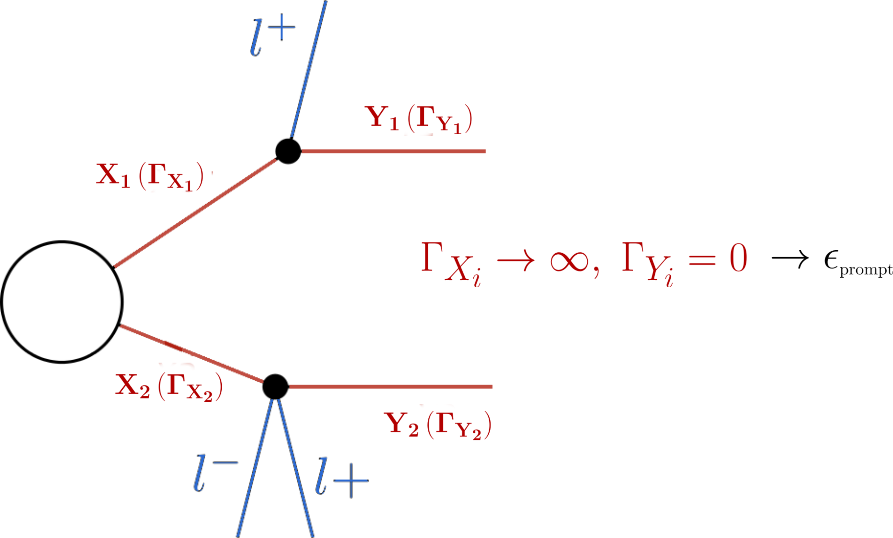

.. index:: Database Structure

.. |constraint| replace:: :ref:`constraint <ULconstraint>`
.. |conditions| replace:: :ref:`conditions <ULconditions>`
.. |fb-1| replace:: :math:`\mathrm{fb}^{-1}`
.. |sqrts| replace:: :math:`\sqrt{s}`
.. |EM| replace:: :ref:`EM-type <EMtype>`
.. |UL| replace:: :ref:`UL-type <ULtype>`
.. |EMr| replace:: :ref:`EM-type result <EMtype>`
.. |ULr| replace:: :ref:`UL-type result <ULtype>`
.. |EMrs| replace:: :ref:`EM-type results <EMtype>`
.. |ULrs| replace:: :ref:`UL-type results <ULtype>`
.. |ExpRes| replace:: :ref:`Experimental Result <ExpResult>`
.. |ExpRess| replace:: :ref:`Experimental Results <ExpResult>`
.. |Dataset| replace:: :ref:`DataSet<DataSet>`
.. |Datasets| replace:: :ref:`DataSets<DataSet>`
.. |Database| replace:: :ref:`Database <Database>`
.. |element| replace:: :ref:`element <element>`
.. |elements| replace:: :ref:`elements <element>`
.. |particles| replace:: :ref:`particles <particleClass>`
.. |particle| replace:: :ref:`particle <particleClass>`
.. |bracket notation| replace:: :ref:`bracket notation <bracketNotation>`

.. _databaseStruct:

Database of Experimental Results
================================

SModelS stores all the information about the experimental results in the
|Database|.
Below we describe both the :ref:`directory <folderStruct>` and :ref:`object <objStruct>` structure of the  |Database|.

.. _folderStruct:

Database: Directory Structure
-----------------------------

The :ref:`Database <Database>` is organized as files in an ordinary (UNIX)
directory hierarchy, with a thin Python layer serving as the access to the
database.  The overall structure of the directory hierarchy and its contents is
depicted in the scheme below (click to enlarge):

.. image:: images/DatabaseFolders.png
   :width: 80%

As seen above, the top level of the SModelS database categorizes the analyses
by LHC center-of-mass energies, |sqrts|:

* 8 TeV
* 13 TeV

Also, the top level directory contains a file called ``version`` with the
version string of the database.
The second level splits the results up between the different experiments:

* 8TeV/CMS/
* 8TeV/ATLAS/

The third level of the directory hierarchy encodes the |ExpRess|:

* 8TeV/CMS/CMS-SUS-12-024
* 8TeV/ATLAS/ATLAS-CONF-2013-047
* ...

* **The Database folder is described by the** `Database Class <experiment.html#experiment.databaseObj.Database>`_

Experimental Result Folder
^^^^^^^^^^^^^^^^^^^^^^^^^^

Each |ExpRes| folder contains:

* a folder for each |Dataset| (e.g. ``data``)
* a ``globalInfo.txt`` file

The ``globalInfo.txt`` file contains the meta information about the |ExpRes|.
It defines the center-of-mass energy |sqrts|, the integrated luminosity, the id
used to identify the result and additional information about the source of the
data.  Here is the content of CMS-SUS-12-024/globalInfo.txt as an example:

.. literalinclude:: /literals/globalInfo.txt
   :lines: 1-11

* **Experimental Result folder is described by the** `ExpResult Class <experiment.html#experiment.expResultObj.ExpResult>`_
* **globalInfo files  are descrived by the** `Info Class <experiment.html#experiment.infoObj.Info>`_

Data Set Folder
^^^^^^^^^^^^^^^

Each |Dataset| folder (e.g. ``data``) contains:

* the Upper Limit maps for |ULrs| or Efficiency maps for |EMrs| (``TxName.txt`` files)
* a ``dataInfo.txt`` file containing meta information about the |Dataset|

* **Data Set folders are  described by the** `DataSet Class <experiment.html#experiment.datasetObj.DataSet>`_
* **TxName files are described by the** `TxName Class <experiment.html#experiment.txnameObj.TxName>`_
* **dataInfo files are described by the** `Info Class <experiment.html#experiment.infoObj.Info>`_

.. _datasetUL:

Data Set Folder: Upper Limit Type
~~~~~~~~~~~~~~~~~~~~~~~~~~~~~~~~~

Since |ULrs| have a single dataset (see |Datasets|), the info file only holds
some trivial information, such as the type of |ExpRes| (UL) and the dataset id
(None for UL-type results). Here is the content of CMS-SUS-12-024/data/dataInfo.txt as an
example:

.. literalinclude:: /literals/dataInfo.txt
   :lines: 1-2

For |ULrs|, each ``TxName.txt`` file contains the UL map for a given simplified model
(|element| or sum of |elements|) as well as some meta information,
including the corresponding |constraint| and |conditions|.  The
first few lines of CMS-SUS-12-024/data/T1tttt.txt read:

.. literalinclude:: /literals/T1tttt.txt
   :lines: 1-8

If the finalState property is not provided, the simplified model is assumed to
contain neutral BSM final states in each branch, leading to a MET signature.
However, if this is not the case, the non-MET final states must be explicitly listed
in the  ``TxName.txt`` file (see |UL| for more details).
An example from the CMS-EXO-12-026/data/THSCPM1b.txt file is shown below:

.. literalinclude:: /literals/THSCPM1b.txt
   :lines: 1,2,7,9,10

The second block of data in the  ``TxName.txt`` file contains the upper limits as a function of the relevant
simplified model parameters:

.. literalinclude:: /literals/T1tttt.txt
   :lines: 9-19
   
.. _widthGrid:   

As we can see, the UL map is given as a Python array with the structure:
:math:`[[\mbox{masses},\mbox{upper limit}], [\mbox{masses},\mbox{upper limit}],...]`.
For prompt analyses, the relevant parameters are usually the BSM masses, since
all decays are assumed to be prompt. On the other hand, results for long-lived
or meta-stable particles may depend on the BSM widths as well.
The width dependence can be easily included through the
following generalization:

.. math::
   [[M_1,M_2...],[M_A,M_B,...]] \to [[(M_1,\Gamma_1),(M_2,\Gamma_2)...],[(M_A,\Gamma_A),(M_B,\Gamma_B),...]]

In order to make the notation more compact, whenever the width dependence is not included,
the corresponding decay will be assumed to be prompt and an effective :ref:`lifetime reweigthing factor <dbReweighting>`
will be applied to the upper limits. For instance, a *mixed type* data grid is also allowed:

.. math::
   [\; [[M_1,(M_2,\Gamma_2)],[M_1,(M_2,\Gamma_2)]],\mbox{UL}\; ],\;\; [\; [[M_1',(M_2',\Gamma_2')],[M_1',(M_2',\Gamma_2')]],\mbox{UL'}\; ], \;\; ...

The example above represents a simplified model where the decay of the mother is prompt,
while the daughter does not have to be stable, hence the dependence on :math:`\Gamma_2`.
In this case, the :ref:`lifetime reweigthing factor <dbReweighting>`
is applied only for the mother decay.

Data Set Folder: Efficiency Map Type
~~~~~~~~~~~~~~~~~~~~~~~~~~~~~~~~~~~~

For |EMrs| the ``dataInfo.txt`` contains relevant information, such as an id to
identify the |dataset| (signal region), the number of observed and expected
background events for the corresponding signal region and the respective signal
upper limits.  Here is the content of
CMS-SUS-13-012-eff/3NJet6_1000HT1250_200MHT300/dataInfo.txt as an example:

.. literalinclude:: /literals/dataInfo-eff.txt
   :lines: 1-7

For |EMrs|, each ``TxName.txt`` file contains the efficiency map for a given
simplified model (|element| or sum of |elements|) as well as some meta
information.
Here is the first few lines of CMS-SUS-13-012-eff/3NJet6_1000HT1250_200MHT300/T2.txt:

.. literalinclude:: /literals/T2.txt
   :lines: 1-8

As seen above, the first block of data in the ``T2.txt`` file contains
information about the |element| (:math:`[[[\mbox{jet}]],[[\mbox{jet}]]]`)
in |bracket notation| for which the
efficiencies refers to as well as reference to the original data source and
some additional information.
As in the Upper Limit case, the simplified
model is assumed to contain neutral BSM final states (MET signature).
For non-MET final states the  finalState field must list
the last BSM |particles| appearing in the cascade decay (see |EM|).
The second block of data contains the efficiencies as a function of the BSM masses:

.. literalinclude:: /literals/T2.txt
   :lines: 9-13

As we can see the efficiency map is given as a Python array with the structure:
:math:`[[\mbox{masses},\mbox{efficiency}], [\mbox{masses},\mbox{efficiency}],...]`.
For non-prompt results the data can also include the dependence on the width
in exactly the same way as for :ref:`upper limit-type results <widthGrid>`.

.. _dbReweighting:

Lifetime Reweighting
~~~~~~~~~~~~~~~~~~~~

From v2.0 onwards SModelS allows to include width dependent efficiencies and upper limits.
However most experimental results do not provide upper limits (or efficiencies) as a function
of the BSM particles' widths, since usually all the decays are assumed to be prompt
and the last BSM particle appearing in the cascade decay is assumed to be stable. [#]_
In order to apply these results to models which may contain meta-stable
particles, it is possible to approximate the dependence on the widths for the case in which
all BSM decays must be prompt and the last BSM particle should decay *outside* the detector.
In SModelS this is done through a reweighting factor which corresponds to the fraction
of prompt decays (for intermediate states) and decays *outside* the detector (for final BSM states)
for a given set of widths.
For instance, asumme an |EMr| only provides efficiencies (:math:`\epsilon_{prompt}`)
for prompt decays:

.. _widthExample:

Then, for other values of the widths, an effective efficiency (:math:`\epsilon_{eff}`) can be
approximated by:

.. math::

    \epsilon_{eff} = \mathcal{r} \times \epsilon_{prompt} \mbox{ , where }\mathcal{r} = \mathcal{F}_{prompt} \left( \Gamma_{X_1} \right) \times \mathcal{F}_{prompt} \left( \Gamma_{X_2} \right) \times \mathcal{F}_{long} \left( \Gamma_{Y_1} \right) \times \mathcal{F}_{long} \left( \Gamma_{Y_2} \right)

In the expression above :math:`\mathcal{F}_{prompt}(\Gamma)` is the probability for the decay to be prompt 
given a width :math:`\Gamma` and :math:`\mathcal{F}_{long}(\Gamma)` is the probability for the decay to
take place *outside* the detector.
The precise values of :math:`\mathcal{F}_{prompt}` and :math:`\mathcal{F}_{long}` 
depend on the relevant detector size (:math:`L`), particle mass (:math:`M`), boost
(:math:`\beta`) and width (:math:`\Gamma`), thus
requiring a Monte Carlo simulation for each input model. Since this is not
within the spirit of the simplified model approach, we approximate the prompt and
long-lived probabilities by:

.. math::
   \mathcal{F}_{long} = \exp\left(- \frac{\Gamma L_{outer}}{\langle \gamma \beta \rangle}\right) \mbox{ and } 
   \mathcal{F}_{prompt} = 1 - \exp\left(- \frac{\Gamma L_{inner}}{\langle \gamma \beta \rangle}\right),

where :math:`L_{outer}` is the effective size of the detector (which we take to be 10 m for both ATLAS
and CMS), :math:`L_{inner}` is the effective radius of the inner detector (which we take to be 1 mm for both ATLAS
and CMS). Finally, we take the effective time dilation factor to be  :math:`\langle \gamma \beta \rangle = 1.3` when
computing :math:`\mathcal{F}_{prompt}` and :math:`\langle \gamma \beta \rangle = 1.43` when computing :math:`\mathcal{F}_{long}`.
We point out that the above approximations are irrelevant if :math:`\Gamma` is very large (:math:`\mathcal{F}_{prompt} \simeq 1`
and :math:`\mathcal{F}_{long} \simeq 0`) or close to zero (:math:`\mathcal{F}_{prompt} \simeq 0`
and :math:`\mathcal{F}_{long} \simeq 1`). Only elements containing particles which have a considerable fraction of displaced
decays will be sensitive to the values chosen above.
Also, a precise treatment of lifetimes is possible if the experimental result
(or a theory group) explicitly provides the efficiencies as a function of the widths, as :ref:`discussed above <widthGrid>`.

The above expressions allows the generalization of the efficiencies computed assuming
prompt decays to models with meta-stable particles. 
For |ULrs| the same arguments apply with one important distinction.
While efficiencies are reduced for displaced decays (:math:`\mathcal{r} < 1`), upper limits are enhanced, since they
are roughly inversely proportional to signal efficiencies. Therefore, for |ULrs|, we have:

.. math::

    \sigma_{eff}^{UL} = \sigma_{prompt}^{UL}/\mathcal{r}

Finally, we point out that for the experimental results which provide 
efficiencies or upper limits as a function of some (but not all) BSM widths appearing
in the simplified model (see the :ref:`discussion above <widthGrid>`), 
the reweighting factor :math:`\mathcal{r}` is computed using only the widths not present
in the grid.

.. _inclusiveSMS:

Inclusive Simplified Models
~~~~~~~~~~~~~~~~~~~~~~~~~~~

If the analysis signal efficiencies are insensitive to
some of the simplified model final states, it might be convenient to define
*inclusive* simplified models. A typical case are some of the heavy stable charged
particle searches, which only rely on the presence of a non-relativistic charged
particle, which leads to  an anomalous charged track signature.
In this case the signal efficiencies are highly insensitive to the remaining event
activity and the corresponding simplified models can be very inclusive.
In order to handle this inclusive cases in the database we allow for wildcards
when specifying the constraints.
For instance, the constraint for the CMS-EXO-13-006 eff/c000/THSCPM3.txt
reads:

.. literalinclude:: /literals/THSCPM3.txt
   :lines: 1-2

and represents the (inclusive) simplified model:

.. image:: images/elementInclusive.png
   :width: 35%

Note that although the final state represented by "\*" is any Z\ :sub:`2`-even |particle|,
it must still correspond to a single particle, since the topology specifies a 2-body
decay for the initially produced BSM particle.
Finally, it might be useful to define even more inclusive simplified models, such
as the one in  CMS-EXO-13-006 eff/c000/THSCPM4.txt:

.. literalinclude:: /literals/THSCPM4.txt
   :lines: 1-2,11

In the above case the simplified model corresponds to an HSCP being initially produced
in association with any BSM particle which leads to a MET signature.
Notice that the notation "[\*]" corresponds to *any `branch*, while ["\*"] means *any particle*:

.. image:: images/elementInclusive2.png
   :width: 35%

In such cases the mass array for the arbitrary branch must also be specified as
using wildcards:

.. literalinclude:: /literals/THSCPM4.txt
   :lines: 12-14

.. _objStruct:

Database: Object Structure
--------------------------

The :ref:`Database  folder structure <folderStruct>` is mapped to Python
objects in SModelS.
The mapping is almost one-to-one, except for a few exceptions.
Below we show the overall object structure  as well as the folders/files the objects
represent (click to enlarge):

.. image:: images/DatabaseObjects.png
   :width: 80%

The type of Python object (Python class, Python list,...) is shown in brackets.
For convenience, below we explicitly list the main database folders/files and
the Python objects they are mapped to:

* |Database| folder :math:`\rightarrow` `Database Class <experiment.html#experiment.databaseObj.Database>`_
* |ExpRes| folder :math:`\rightarrow` `ExpResult Class <experiment.html#experiment.expResultObj.ExpResult>`_
* |Dataset| folder :math:`\rightarrow` `DataSet Class <experiment.html#experiment.datasetObj.DataSet>`_
* ``globalInfo.txt`` file  :math:`\rightarrow` `Info Class <experiment.html#experiment.infoObj.Info>`_
* ``dataInfo.txt`` file  :math:`\rightarrow` `Info Class <experiment.html#experiment.infoObj.Info>`_
* ``Txname.txt`` file  :math:`\rightarrow` `TxName Class <experiment.html#experiment.txnameObj.TxName>`_

.. _databasePickle:

Database: Binary (Pickle) Format
--------------------------------

At the first time of instantiating the
`Database <experiment.html#experiment.databaseObj.Database>`_
class, the text files in *<database-path>* are loaded and parsed, and the
corresponding data objects are built. The efficiency and upper limit maps
themselves are subjected to standard preprocessing steps such as a principal
component analysis and Delaunay triangulation (see Figure below).  The
simplices defined during triangulation are then used for linearly interpolating
the data grid, thus allowing SModelS to compute efficiencies or upper limits
for arbitrary mass values (as long as they fall inside the data grid).
Width parameters are taken logarithmically before linearly interpolating, which
effectively corresponds to an exponential interpolation in the widths.
This procedure provides an efficient and numerically robust way of dealing with
generic data grids, including arbitrary parametrizations of the mass parameter
space, irregular data grids and asymmetric branches.

.. image:: images/delaunay.png

..
 %\caption{Delaunay triangulation of an upper limit map with three mass                                                                        %parameters. The colors show the upper limit values.}

For the sake of efficiency, the entire database -- including the Delaunay
triangulation -- is then serialized into a pickle
file (*<database-path>/database.pcl*), which will be read directly the next time the database is loaded.
If any changes in the database folder structure are detected, the python or the SModelS
version has changed, SModelS will automatically re-build the pickle file. This
action may take a few minutes, but it is again performed only once.
If desired, the pickling process can be skipped using the option *force_load = `txt'*
in the constructor of
`Database <experiment.html#experiment.databaseObj.Database>`_ .

..
 Due to the large number of experimental results contained in the SModelS
 |Database|, parsing the :ref:`database folders <folderStruct>` and building the
 corresponding :ref:`database objects <objStruct>` may require a non-negligible
 CPU time. In some cases this may be the most time consuming task when
 testing a single input file.  Furthermore this procedure does not have to be
 repeated every time SModelS is run.
 In order to avoid these issues, SModelS serializes the
 `database object <experiment.html#experiment.databaseObj.Database>`_
 into a pickle file (*<database-path>/database.pcl*), which can then be read
 directly when loading the database.
 Since reading the pickle file is much faster than parsing the :ref:`database folders <folderStruct>`,
 there is a considerable speed improvement when using the pickle file.
 If any changes in the :ref:`database folder structure <folderStruct>`
 are detected or the SModelS version has changed,
 SModelS will automatically re-build the pickle file.
 This action may take a few minutes, but it is only performed once.
 SModelS automatically builds (if necessary) and loads the binary database when a
 `Database object <experiment.html#experiment.databaseObj.Database>`_
 is created. Nonetheless, the user can enforce loading (parsing) the *text
 database* using the option *force_load = 'txt'* in the constructor of
 `Database <experiment.html#experiment.databaseObj.Database>`_ .

* The pickle file is created by the `createBinaryFile method <experiment.html#experiment.databaseObj.Database.createBinaryFile>`_

.. [#] An obvious exception are searches for long-lived particles with displaced decays.