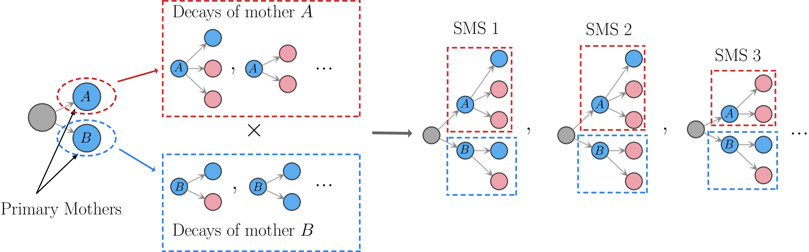
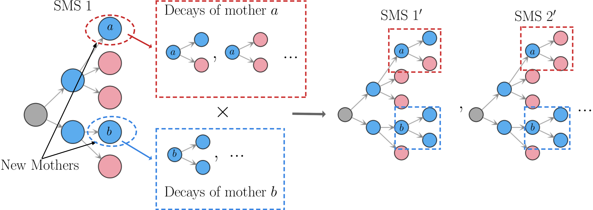
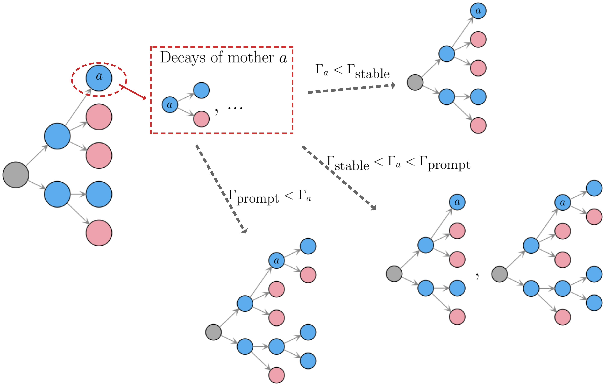
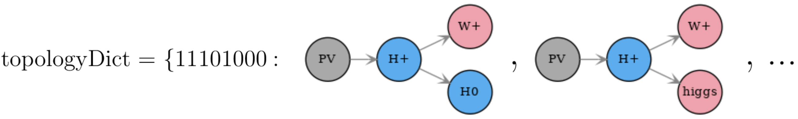
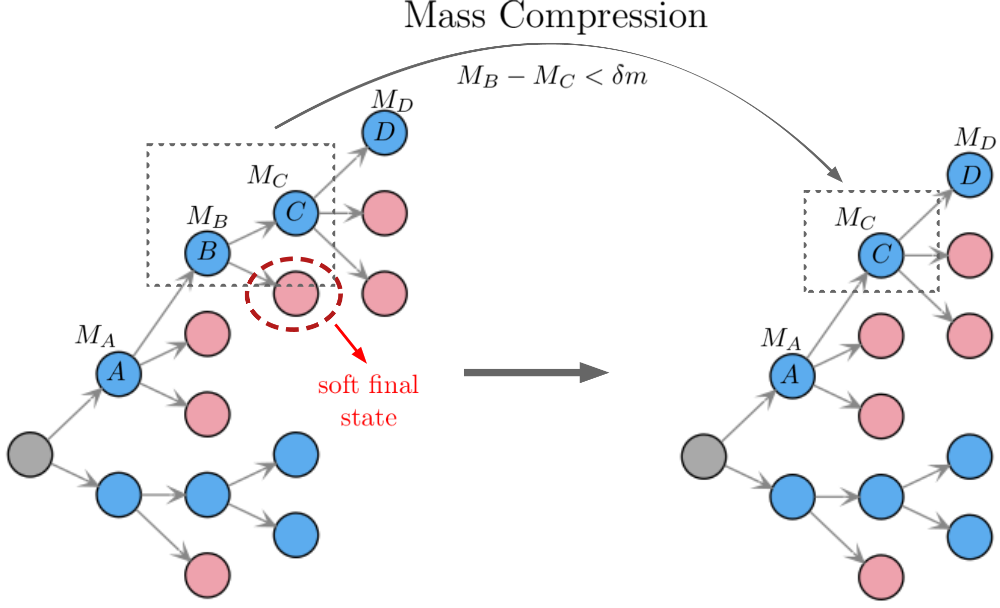
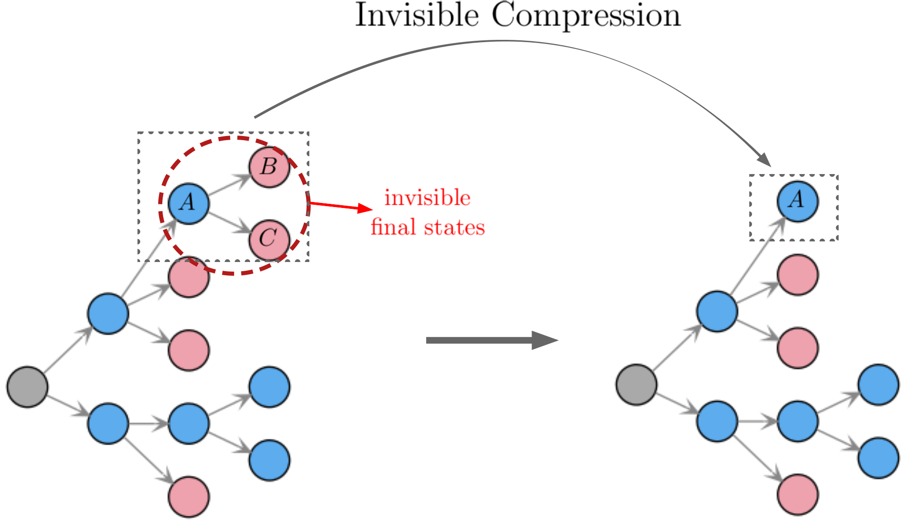
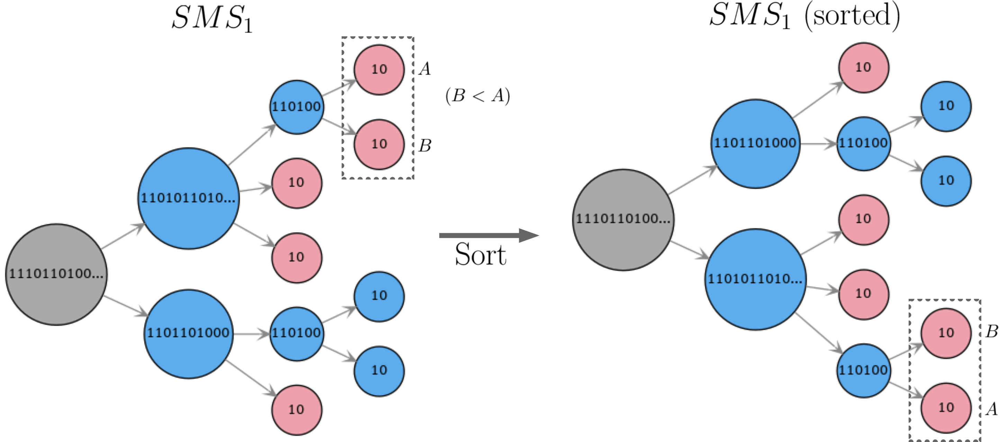

.. index:: Decomposition into Simplified Models

.. |invisible compression| replace:: :ref:`invisible compression <invComp>`
.. |mass compression| replace:: :ref:`mass compression <massComp>`
.. |SMS| replace:: :ref:`SMS <SMS>`
.. |SMS topology| replace:: :ref:`SMS topology <SMS>`
.. |SMS topologies| replace:: :ref:`SMS topologies <SMS>`
.. |topology| replace:: :ref:`topology <SMS>`   
.. |topologies| replace:: :ref:`topologies <SMS>`
.. |decomposition| replace:: :doc:`decomposition <Decomposition>`
.. |theory predictions| replace:: :doc:`theory predictions <TheoryPredictions>`
.. |theory prediction| replace:: :doc:`theory prediction <TheoryPredictions>`
.. |constraint| replace:: :ref:`constraint <ULconstraint>`
.. |constraints| replace:: :ref:`constraints <ULconstraint>`
.. |particle| replace:: :ref:`particle <particleClass>`
.. |particles| replace:: :ref:`particles <particleClass>`

.. _decomposition:

Decomposition into Simplified Models
====================================

Given an input model (see :doc:`Basic Input <BasicInput>`), the first task of SModelS is to decompose
the full model into a sum of Simplified Models (|SMS|).

.. _decomp:

Decomposition
-------------

The input model stores information about  the masses of all
the BSM states as well as their production cross sections, decay branching ratios and total widths.
All the cross sections for the *BSM particles* serve as the initial step for the decomposition.
Starting from these primary mothers ("A" and "B" in :numref:`Fig. %s <decomp1>`), all the possible decays are generated
according to the decay information for each mother particle. This procedure is represented in :numref:`Fig. %s <decomp1>`.

.. _decomp1:

   First step of decomposition. The BSM particles produced in the hard scattering (primary vertex) and their decays are used as the initial step for constructing the |SMS topologies|.

If the final states appearing at the end of the decays are stable, the decomposition stops and the graphs shown in :numref:`Fig. %s <decomp1>` represent the final  |SMS| topologies. On the other hand, if the BSM particles appearing at the end of the cascade decays are *unstable*, they are defined as the "new mothers" and new |SMS topologies| are generated using their decays, as illustrated in :numref:`Fig. %s <decomp2>`. 

.. _decomp2:

   Schematic representation of the subsequent decomposition steps used to build the final |SMS topologies|.

This procedure is repeated until all unstable (promptly decaying and meta-stable) BSM particles appearing in the |SMS| have decayed. 

The definition of promptly decaying, meta-stable (displaced decays) and stable particles is relevant in particular for |SMS topologies| describing long-lived final states (such as in searches for heavy stable charged particles), since they must include meta-stable BSM particles as final states. 
The distinct decay regimes are controlled by the user and defined by the stableWidth (:math:`\Gamma_{\mbox{stable}}`) and promptWidth (:math:`\Gamma_{\mbox{prompt}}`) parameters in the :ref:`parameters file <parameterFileModel>`. According to the values for these parameters we have:
 
 * prompt decays: :math:`\Gamma_{\mbox{prompt}} < \Gamma_{\mbox{BSM}}`. In this case the BSM particle width is set to infinity and we assume its decays can always be considered as prompt for all experimental purposes. These particles will *never* appear as final states.
 * displaced decays: :math:`\Gamma_{\mbox{stable}} < \Gamma_{\mbox{BSM}} < \Gamma_{\mbox{prompt}}`. In this case the BSM particle  width is not modified and the particle can appear in topologies both as an intermediate (decayed) state and as a final (undecayed) state.
 * stable: :math:`\Gamma_{\mbox{BSM}} < \Gamma_{\mbox{stable}}`. In this case the BSM particle width is set to zero and we assume it can be considered as stable for all experimental purposes. These particles will *always* appear as final states.

The three possibilities above are illustrated in :numref:`Fig. %s <metastable>`.

.. _metastable:

   Example of how the decomposition procedure handles the decays of BSM particles with different lifetimes.

The output of the decomposition procedure consists in a set of |SMS topologies| grouped according to their structure (or :ref:`canonical name <canonicalName>`). 
A topology dictionary is constructed mapping the canonical names to a list of |SMS| sharing a common graph structure, as represented below:

.. _topoDict:

   
   Example of how the |SMS| are grouped in the topology dictionary after decomposition.

* **The decomposition is implemented by the** `decompose method <decomposition.html#decomposition.decomposer.decompose>`_.

* **Topology dictionaries are described by the** `TopologyDict Class <decomposition.html#decomposition.topologyDict.TopologyDict>`_

.. _minweight:

Minimum Decomposition Weight
^^^^^^^^^^^^^^^^^^^^^^^^^^^^

During the decomposition, a *weight* is assigned to each |SMS|, which corresponds to its hard scattering cross section times the branching ratios appearing in the |SMS|:

.. math::
   w = \sigma \times \prod_{i} \mbox{BR}_i 

Some models may contain a large number of new states and each may have a large number of possible decays.
In this case, long cascade decays are possible and the number of |SMS| generated by the decomposition process
may become too large, resulting in too long a computing time.
For most practical purposes, however, |SMS| with extremely small cross sections (or cross sections times BRs) can be discarded, since they will fall well below the experimental limits. Therefore, during the decomposition, whenever an |SMS|  is generated with a weight below some minimum value, this element (and all elements derived from it) is ignored. 
The minimum weight to be considered is set by the :ref:`sigmacut <parameterFileSigmacut>` parameter in the :ref:`parameters file <parameterFileModel>`.

Note that, when computing the signal cross sections for inclusive searches, the weight of several |SMS| can be combined together. Hence it is recommended to set the value of :ref:`sigmacut <parameterFileSigmacut>`
about an order of magnitude below the minimum signal cross sections the experimental data can constrain.

.. _smsComp:

Compression of Topologies
-------------------------

During the decomposition process it is possible to perform simplifications to the |SMS| generated, which we call 
:ref:`Mass Compression <massComp>` and :ref:`Invisible Compression <invComp>`. 
They result in shorter |SMS| (with fewer cascade decay steps), which usually are more likely to be constrained by experimental results. The details behind the compression methods are as follows:

.. _massComp:

Mass Compression
^^^^^^^^^^^^^^^^

In case of small mass differences, the *prompt* decay [#]_ of a BSM |particle| to a nearly degenerate
one will often produce soft final states, which cannot be experimentally detected.
Consequently, it is a good approximation to neglect the soft final states and *compress* the respective
decay. After the compression, only the lighter of the two near-degenerate particles is kept in the |topology|, as illustrated in :numref:`Fig. %s <massCompfig>`.

.. _massCompfig:

   Example of the mass compression simplification applied to an |SMS topology|. In this example, particles :math:`B` and :math:`C` are assumed to be nearly degenerate in mass.

The main parameter which controls the compression is :ref:`minmassgap <parameterFileMinmassgap>` (:math:`\delta m`). The following conditions must be satisfied for the decay in order for a compression to take place:

  1. The decay must be of the type :math:`X \to Y + a + b + c ...`, where :math:`X` and :math:`Y` are BSM particles and :math:`a,b,c...` are SM particles.
  2. The decay must be *prompt* (:math:`X` must be an unstable particle, see :ref:`above <decomp>`).
  3. :math:`M_X - M_Y < \delta m`, where :math:`\delta m` is defined by the :ref:`minmassgap parameter <parameterFileMinmassgap>`.

Note that the compression is an approximation, since the final
states, depending on the boost of the parent state, may not always be soft.
It is recommended to choose values of :ref:`minmassgap <parameterFileMinmassgap>`
between 1-10 GeV; the default value is 5 GeV.

* **Mass compression is implemented by the** `massCompress <decomposition.html#decomposition.theorySMS.TheorySMS.massCompress>`_ **method**.

.. _invComp:

Invisible Compression
^^^^^^^^^^^^^^^^^^^^^

Another type of compression is possible when the last BSM decay appearing in a |topology| is invisible.
A simple example is

.. math::
   A \rightarrow \nu + \nu

as the last step of the decay chain, where :math:`\nu` is a SM neutrino and :math:`A` is a *neutral particle*.
Since the neutrinos are invisible, for all experimental purposes, the effective MET object is :math:`A = \nu + \nu`.
Hence it is possible to omit the last step in the cascade decay, resulting in a compressed |topology| as illustrated in :numref:`Fig. %s <massInvfig>`.
In order for a decay to be invisibly compressed, it must satisfy the following conditions:

  1. The decay must be of the type :math:`A \to B + C ...`, where :math:`B,C,...` are all invisible final states.
  2. The decay must be *prompt* (:math:`A` must be an unstable particle, see :ref:`above <decomp>`) **or** :math:`A` must also be invisible.

Note that this compression can be applied consecutively to several steps of the cascade decay if all of them
contain only invisible final states.

.. _massInvfig:

   Example of the invisible compression simplification applied to an |SMS topology|. In this example, particles :math:`B` and :math:`C` are assumed to be invisible for all collider purposes.

After the compression, the last BSM state appearing in the compressed |SMS| is
replaced by an effective |particle| with no electric or color charge, with label "inv" and with the mass of the parent
(:math:`A` in the example above). Furthermore, since one of the original final states (:math:`B,C`) can in principle be meta-stable, the new effective "inv" particle inherits the largest of their widths.

* **Invisible compression is implemented by the** `invisibleCompress <decomposition.html#decomposition.theorySMS.SMS.invisibleCompress>`_ **method**.

SMS Sorting
-----------

In order to improve the code performance, |SMS topologies| created during |decomposition| are sorted.
Since the |topologies| correspond to a rooted tree graph (see :ref:`SMS Definitions <SMSDefs>`), the |particles| (nodes) appearing in the tree can be sorted to a standard ordering. Two |particles| belonging to the same mother can be compared according to their :ref:`canonical names <canonicalname>` and their |particle| properties.

In :numref:`Fig. %s <sortfig>` we illustrate the sorting procedure for a given |SMS|. First, the nodes are sorted according to their :ref:`canonical names <canonicalname>` (nodes at the top have smaller canonical names), so the order of the two primary particles generated in the hard scattering is reversed. Second, nodes (|particles|) with the same :ref:`canonical names <canonicalname>` are compared according to their properties:
   
   1. BSM particle or SM particle
   2. Spin 
   3. Color representation
   4. Electric charged
   5. Mass
   6. Total width

In the example shown in :numref:`Fig. %s <sortfig>` particle :math:`A` is assumed to be "larger" than :math:`B`, so their order is reversed (:math:`B` appears at the top and :math:`A` at the bottom).

.. _sortfig:

   Example of sorting of the nodes of a given |SMS|; particle :math:`A` is assumed to be "larger" than particle :math:`B` (according to their properties).

Finally, after being sorted, two distinct |SMS| can be directly compared according to the same criteria. First, if their :ref:`canonical names <canonicalname>` (name of the root node) differ, they can ordered using this property. If the :ref:`canonical names <canonicalname>` are identical, it means they have the exact same structure and, since they have been sorted, they can be compared node by node.
 
 

* **SMS sorting is implemented by the** `sort <base.html#base.genericSMS.GenericSMS.sort>`_ **method**.

.. [#] Decays of meta-stable BSM particles should not be compressed, even if soft, since they might result in
       distinct signatures depending on the quantum numbers of the decaying particle. Particles are assumed
       to be meta-stable if their width is below the value set by the :ref:`promptWidth parameter <parameterFileModel>`.
