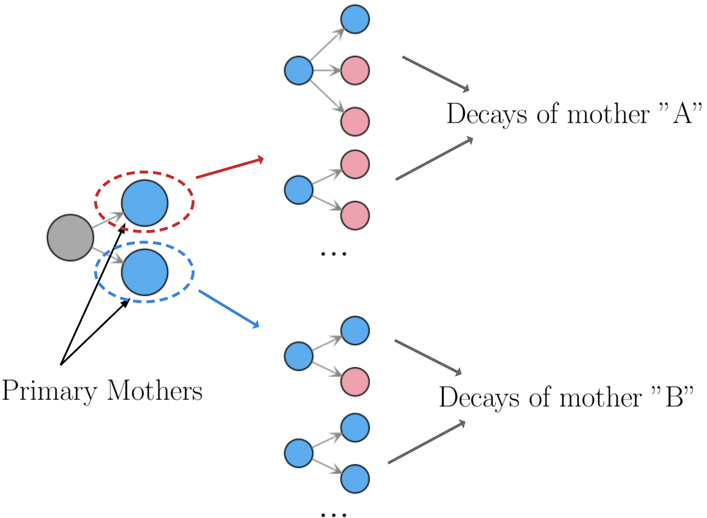
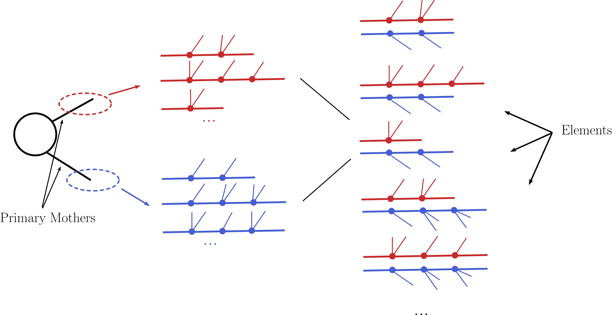
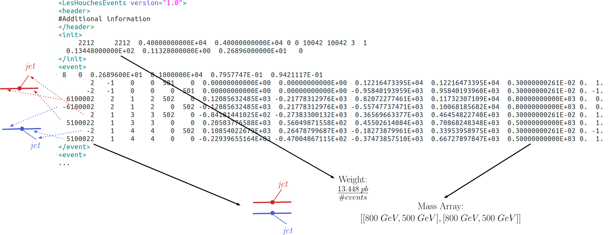
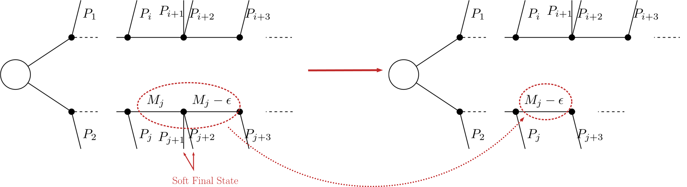
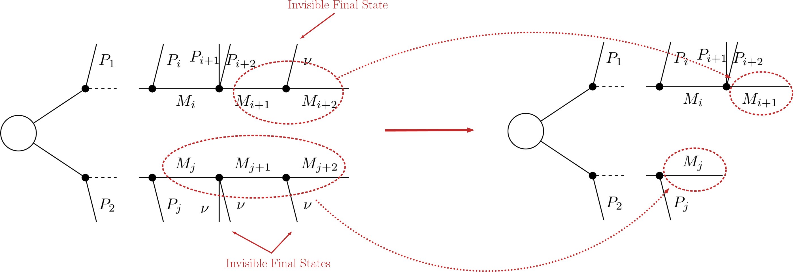
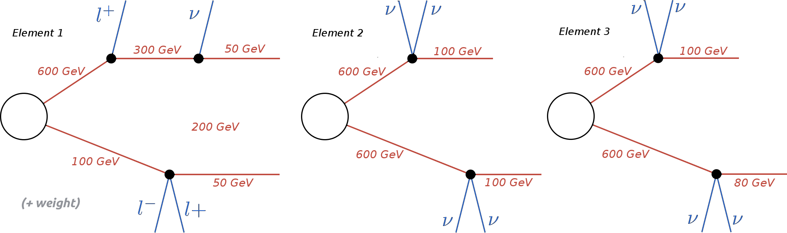

.. index:: Decomposition into Simplified Models

.. |invisible compression| replace:: :ref:`invisible compression <invComp>`
.. |mass compression| replace:: :ref:`mass compression <massComp>`
.. |element| replace:: :ref:`element <element>`
.. |elements| replace:: :ref:`elements <element>`
.. |topology| replace:: :ref:`topology <topology>`
.. |topologies| replace:: :ref:`topologies <topology>`
.. |decomposition| replace:: :doc:`decomposition <Decomposition>`
.. |theory predictions| replace:: :doc:`theory predictions <TheoryPredictions>`
.. |theory prediction| replace:: :doc:`theory prediction <TheoryPredictions>`
.. |constraint| replace:: :ref:`constraint <ULconstraint>`
.. |constraints| replace:: :ref:`constraints <ULconstraint>`

.. _decomposition:

Decomposition into Simplified Models
====================================

Given an input model, the first task of SModelS is to decompose
the full model into a sum of Simplified Models (or :ref:`elements <element>` in SModelS language).
Based on the input format, which can be

* a SLHA file or
* a LHE file

(see :doc:`Basic Input <BasicInput>`),
two distinct (but similar) decomposition methods are applied:
the :ref:`SLHA-based <slhaDecomp>` or the :ref:`LHE-based <lheDecomp>` decomposition.

.. _slhaDecomp:

SLHA-based Decomposition
------------------------

The SLHA file describing the input model is required to contain the masses of all
the BSM states as well as their production cross sections, decay widths and branching ratios.
All the above information must follow the guidelines of the SLHA format. In particular, the cross sections also have to be included
as SLHA blocks according to the :ref:`SLHA cross section format <xsecSLHA>`.

Once the production cross sections are read from the input file, all the cross sections for *production
of two* Z\ :sub:`2`-odd *states* are stored and serve as the initial step for the decomposition. (All the other cross sections
with a different number of Z\ :sub:`2`-odd states are ignored.)
Starting from these primary mothers, all the possible decays are generated
according to the information contained in the DECAY blocks. This procedure is represented in the figure below:

.. _decomp1:

Within SModelS all the decays are assumed to be prompt and the last BSM particle appearing
in the cascade decay decay is assumed to be stable (in detector scales).
However, if a given BSM particle has a small (non-zero) width, its decay
should not be considered prompt. Furthermore, it might have a non-negligible probability
of decaying outside the detector.
In order to deal with these cases, during decomposition each decay step is reweighted
by the probability for the decay to be prompt (:math:`\mathcal{F}_{prompt}`). Also,
for particles with small or zero width, an element where the particle does not decay
is also included and reweight by the probability for the particle to decay *outside*
the detector (:math:`\mathcal{F}_{long}`).  
This reweighting is illustrated in the figure below:

.. _decomp1b:

.. image:: images/decompScheme1.png
   :width: 90%
 
The precise values of :math:`\mathcal{F}_{prompt}` and :math:`\mathcal{F}_{long}` 
depend on the relevant detector size (:math:`L`), particle mass (:math:`M`), boost
(:math:`\beta`) and width (:math:`\Gamma`), thus
requiring a Monte Carlo simulation for each input model. Since this is not
within the spirit of the simplified model approach, we approximate the prompt and
long-lived probabilities by:

.. math::
   \mathcal{F}_{long} = \exp(- \frac{\Gamma L_{outer}}{\langle \gamma \beta \rangle}) \mbox{ and } 
   \mathcal{F}_{prompt} = 1 - \exp(- \frac{\Gamma L_{inner}}{\langle \gamma \beta \rangle}),

where :math:`L_{outer}` is the effective size of the detector (which we take to be 10 m for both ATLAS
and CMS), :math:`L_{inner}` is the effective radius of the inner detector (which we take to be 1 mm for both ATLAS
and CMS). Finally, we take the effective time dilation factor to be  :math:`\langle \gamma \beta \rangle = 1.3`.
We point out that the above approximations are irrelevant if :math:`\Gamma` is very large (:math:`\mathcal{F}_{prompt} \simeq 1`
and :math:`\mathcal{F}_{long} \simeq 0`) or close to zero (:math:`\mathcal{F}_{prompt} \simeq 0`
and :math:`\mathcal{F}_{long} \simeq 1`). Only elements containing particles which have a considerable fraction of displaced
decays will be sensitive to the values chosen above. 

Following the above procedure it is possible to construct
all cascade decay possibilities (including the stable case)
for a given initial mother particle.
Within the SModelS language each of the possible cascade decays corresponds to a :ref:`branch <branch>`.
In order to finally generate :ref:`elements <element>`, all the branches are combined in pairs according to the production cross sections,
as shown below:

.. _decomp2:

For instance, assume [b1,b2,b3] and [B1,B2] represent all possible branches (or cascade decays)
for the primary mothers A and B, respectively. Then, if a production cross section for :math:`pp \rightarrow A+B` is given in the input file, the following elements will be generated:

   [b1,B1], [b1,B2], [b2,B1], [b2,B2], [b3,B1] and [b3,B2]

Each of the :ref:`elements <element>` generated according to the procedure just described will also
store its weight, which equals its production cross section times all the branching ratios appearing in it.
In order to avoid a too large number of elements, only those satisfying a :ref:`minimum weight <minweight>` requirement are kept.
Furthermore, the elements are grouped according to their :ref:`topologies <topology>`. The final output of the
SLHA decomposition is a list of such topologies, where each topology contains a list of the elements generated during the decomposition.

* **The SLHA decomposition is implemented by the** `SLHA decompose method <theory.html#theory.slhaDecomposer.decompose>`_

.. _minweight:

Minimum Decomposition Weight
^^^^^^^^^^^^^^^^^^^^^^^^^^^^

Some models may contain a large number of new states and each may have a large number of possible decays.
As a result, long cascade decays are possible and the number of elements generated by the decomposition process
may become too large, and the computing time too long.
For most practical purposes, however, elements with extremely small weights (cross section times BRs times the width rescaling)
can be discarded, since they will fall well below the experimental limits. Therefore, during the SLHA decomposition,
whenever an element is generated with a weight below some minimum value, this element (and all elements derived from it) is ignored.
The minimum weight to be considered is given by the `sigcut <theory.html#theory.slhaDecomposer.decompose>`_ parameter
and is easily adjustable
(see `slhaDecomposer.decompose <theory.html#theory.slhaDecomposer.decompose>`_).

Note that, when computing the |theory predictions|, the weight of several |elements| can be combined together. Hence
it is recommended to set the value of `sigcut <theory.html#theory.slhaDecomposer.decompose>`_
approximately one order of magnitude below the minimum signal cross sections the experimental data can constrain.

.. _lheDecomp:

LHE-based Decomposition
-----------------------

More general models can be input through an LHE event file containing parton-level events, including the production of the primary
mothers and their cascade decays. Each event can then be directly mapped to an :ref:`element <element>` with the element weight
corresponding to the event weight.
Finally, identical elements can be combined together (adding their weights). The procedure is represented in the example below:

.. _event:

Notice that, for the LHE decomposition, the :ref:`elements <element>` generated are restricted to the events in the input file. Hence,
the uncertainties on the elements weights (and which elements are actually generated by the model)
are fully dependent on the Monte Carlo statistics used to generate the LHE file.
Also, when generating the events it is important to ensure that no mass smearing is applied, so the events
always contain the same mass value for a given particle.

**Note that since all decays appearing in an LHE event are assumed to be prompt, the LHE-based
decomposition should not be used for models with meta-stable BSM particles**.

* **The LHE decomposition is implemented by the** `LHE decompose method <theory.html#theory.lheDecomposer.decompose>`_

.. _elementComp:

Compression of Elements
-----------------------

During the decomposition process it is possible to perform several simplifications on
the :ref:`elements <element>` generated. In both the :ref:`LHE <lheDecomp>` and :ref:`SLHA <slhaDecomp>`-based decompositions, two useful
simplifications are possible: :ref:`Mass Compression <massComp>` and :ref:`Invisible Compression <invComp>`.
The main advantage of performing these compressions is that the simplified :ref:`element <element>` is
always shorter (has fewer cascade decay steps), which makes it more likely to be constrained by experimental
results. The details behind the compression methods are as follows:

.. _massComp:

Mass Compression
^^^^^^^^^^^^^^^^

In case of small mass differences, the decay of an :ref:`intermediate state <odd states>` to a nearly degenerate
one will in most cases produce soft :ref:`final states <final statesEven>`, which can not be experimentally detected.
Consequently, it is a good approximation to neglect the soft :ref:`final states <final statesEven>` and *compress* the respective
decay, as shown below:

.. _massCompfig:

After the compression, only the lightest of the two near-degenerate masses are kept in the element, as shown :ref:`above <massCompfig>`.
The main parameter which controls the compression is `minmassgap <theory.html#theory.element.Element.massCompress>`_,
which corresponds to the maximum value of :math:`\epsilon`
in the :ref:`figure above <massCompfig>` to which the compression is performed:

.. math::
   & \mbox{if } |M_j - M_{j+1}| < minmassgap \rightarrow \mbox{the decay is compressed}\\
   & \mbox{if } |M_j - M_{j+1}| > minmassgap \rightarrow \mbox{the decay is NOT compressed}\\

Note that the compression is an approximation since the final
states, depending on the boost of the parent state, may not always be soft.
It is recommended to choose values of `minmassgap <theory.html#theory.element.Element.massCompress>`_
between 1-10 GeV; the default value is 5 GeV.

* **Mass compression is implemented by the** `massCompress <theory.html#theory.element.Element.massCompress>`_ **method** and can be easily turned on/off by the flag *doCompress* in the :ref:`SLHA <slhaDecomp>` or :ref:`LHE <lheDecomp>` decompositions.

.. _invComp:

Invisible Compression
^^^^^^^^^^^^^^^^^^^^^

Another type of compression is possible when
the :ref:`final states <final statesEven>` of the last decay are invisible.
The most common example is

.. math::
   A \rightarrow \nu + B

as the last step of the decay chain, where :math:`B` is an insivible particle leading to a MET signature
(see :ref:`final state class <final stateOdd>`).
Since both the neutrino and
:math:`B` are invisible, for all experimental purposes the effective MET object is :math:`B + \nu = A`.
Hence it is possible to omit the last step in the cascade decay, resulting in a compressed element.
Note that this compression can be applied consecutively to several steps of the cascade decay if all of them
contain only invisible final states:

.. _massInvpfig:

* **Invisible compression is implemented by the** `invisibleCompress <theory.html#theory.element.Element.invisibleCompress>`_ **method** and can be easily turned on/off by the flag *doInvisible* in the :ref:`SLHA <slhaDecomp>` or :ref:`LHE <lheDecomp>` decompositions.

Element Sorting
---------------

In order to improve the code performance, |elements| created during |decomposition| and
sharing a commong |topology| are sorted.
Sorting allows for an easy ordering of the elements belonging to a topology and
faster element comparison.
Elements are sorted according to their branches. Branches are compared according to
the following properties:

* Number of :ref:`vertices <vertex>`
* Number of :ref:`final states <final statesEven>` in each vertex
* :ref:`Final state  <final statesEven>` (Z\ :sub:`2`-even) particles (particles belonging to the same vertex are alphabetically sorted)
* :ref:`Mass array <notation>`
* :ref:`Final state signature <final stateOdd>`

As an example, consider the three elements below:

.. _elementsorting:

The correct ordering of the above elements is:

Element 3 < Element 2 < Element 1

Element 1 is 'larger' than the other two since it has a larger number of vertices.
Elements 2 and 3  are identical, except for their masses. Since the mass array of
Element 3 is smaller than the one in Element 2, the former is 'smaller' than the latter.
Finally if all the branch features listed above are identical for both branches, the
elements being compared are considered to be equal.
Futhermore, the branches belonging to the same element are also sorted. Hence, if an element
has two branches:

.. math::
   element = [branch1, branch2],

it implies

.. math::
   branch1 < branch2.

* **Branch sorting is implemented by the** `sortBranches <theory.html#theory.element.Element.sortBranches>`_ **method**

