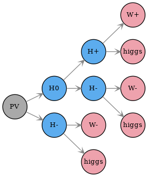
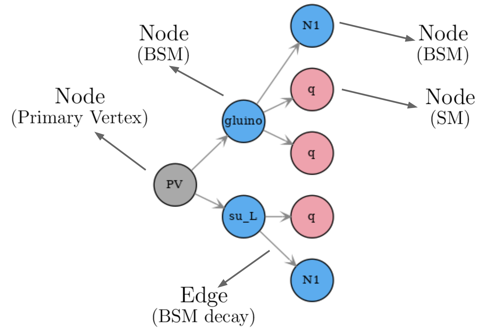
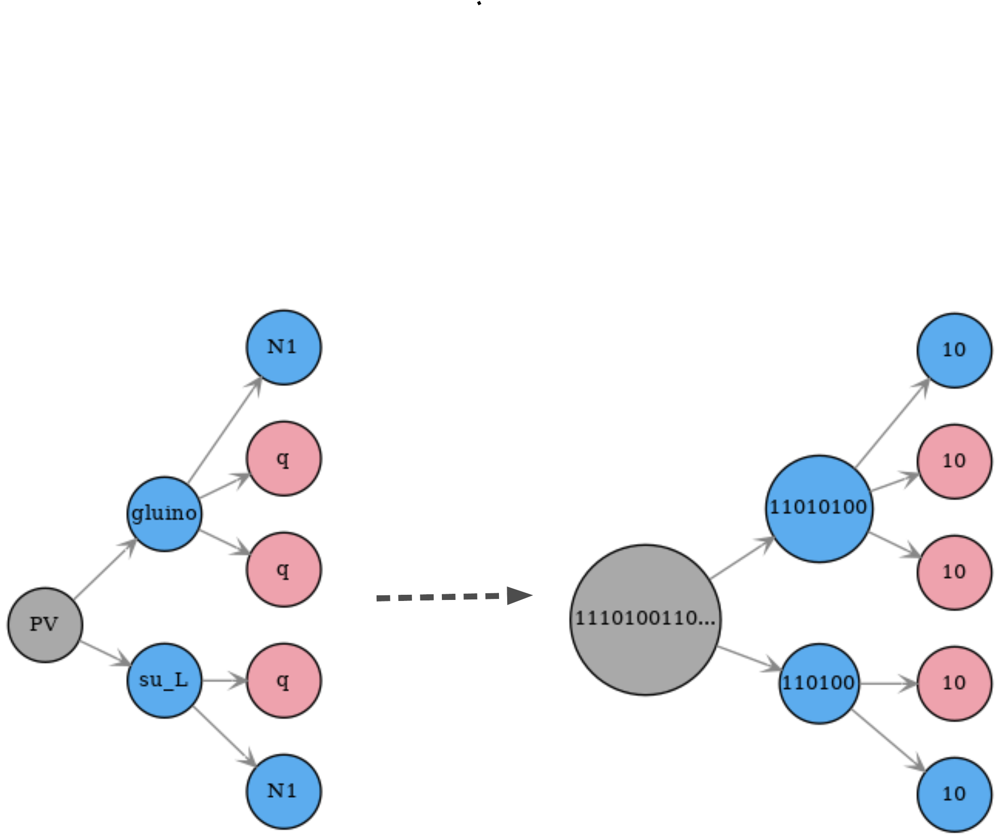

.. index:: Theory Definitions

.. |particle| replace:: :ref:`particle <particleClass>`
.. |particles| replace:: :ref:`particles <particleClass>`
.. |SMS| replace:: :ref:`SMS <SMS>`
.. |SMS topology| replace:: :ref:`SMS topology <SMS>`
.. |SMS topologies| replace:: :ref:`SMS topologies <SMS>`
.. |parameters| replace:: :ref:`parameters file <parameterFile>`

.. _SMSDefs:

Simplified Model Definitions
============================

The so-called `base module <base.html#base>`_ contains the basic tools necessary for creating and describing simplified model topologies (|SMS|).
Below we describe the basic concepts and language used in SModelS
to describe |SMS|.

.. _SMS:

Simplified Model Spectrum (SMS)
-------------------------------

The specific sequence of production and decays of BSM states is called an SMS (or SMS topology) in the SModelS language.
A graph representation of an SMS is shown in :numref:`Fig. %s <smsExample>`:

.. _smsExample:

   
   Graph representation of an SMS.

Each node (circle) represents a particle and the edges (connecting arrows) represents the particle decays. The first node ('PV') represents the primary vertex and its "daughters" are the BSM states produced in the hard scattering process. Note that the decays of SM states are not specified within the SMS, since these are assumed to be given by the SM values.

A SMS may also hold information about its corresponding
weight (cross section times branching ratio times efficiency).\ [#f1]_
The overall properties of an SMS are illustrated in :numref:`Fig. %s <smsScheme>`:

.. _smsScheme:

   
   Illustration of the elements of an SMS graph: root node, SM and BSM nodes, edges and node indices.

SModelS works under the inherent assumption that, for collider purposes,
all the essential properties of a BSM model can be encapsulated by its
SMS topologies.
Such an assumption is extremely helpful to cast the theoretical predictions of a
specific BSM model in a model-independent framework, which can then be compared
against the corresponding experimental limits.
From v3.0 onwards these topologies are described by the graph structure above, with its nodes representing |particles|.

* **SMS are described by the** `GenericSMS Class <base.html#base.genericSMS.GenericSMS>`_ 
* **Particle node are described by the** `ParticleNode Class <base.html#base.particleNode.ParticleNode>`_ 

.. _particleClass:

Particles
^^^^^^^^^

The basic building block of a |SMS| are particles,
which can be both SM (e.g. :math:`W^+,higgs`  in :numref:`Fig. %s <smsScheme>`)
or BSM states (e.g. :math:`H^0,H^+,H^-` in :numref:`Fig. %s <smsScheme>`). The particles
are mapped to nodes, which make up the SMS graph structure.
The BSM particles are defined by the input model (see :ref:`model <parameterFileModel>` in |parameters|),
while the SM particles are defined in `SMparticles.py <share.html#share.models.SMparticles>`_ .
The BSM particles are identified by their attribute ``isSM = False``
and they can have a flexible number of properties, such as mass, spin, electric charge, etc.
Two particles are considered equal if all their shared properties
are equal.

*Generic* particles are introduced by leaving one or more of their properties undefined. For instance, a particle with electric charge = -1,  isSM = False, but undefined spin and mass can represent charged BSM fermions and scalars (such as charginos and charged higgses). 
This is useful when defining simplified models used for describing experimental results in the :ref:`Database <databaseDefs>` which are not sensitive to the particle's spin. Some examples of *generic* particles are:

 - 'anyBSM': represents any BSM state (only has isSM=False defined)
 - 'anySM': represents any SM state (only has isSM=True defined)
 - 'MET': represents any neutral BSM state (has isSM=False, electric charge = 0 and is a color singlet)

In addition, *inclusive* particles can also be created, which holds 
a list of particles. These can be used to described results which are inclusive over some specific set of particles. Examples are:

 - 'l' for electrons, and muons,
 - 'L' for electrons, muons, and taus,
 - 'q' for u-, d-, and s-quarks,
 - 'jet' for u-, d-, s-, c-quarks and gluons
 
All *generic* and *inclusive* particles used by the :ref:`Database <databaseDefs>` are separately defined in the databaseParticles.py file stored in the database folder or, if not found, are loaded from
`defaultFinalStates.py <experiment.html#experiment.defaultFinalStates>`_ .

* **Particles are described by the** `Particle Class <base.html#base.particle.Particle>`_
* **Inclusive Particles are described by the** `MultiParticle Class <base.html#base.particle.MultiParticle>`_

.. _notation:

SMS Representation
^^^^^^^^^^^^^^^^^^

A given |SMS| can be represented in string format using a sequence of decay patterns of the type: ::

   X(i) > A(j),B(k),C(l)

where :math:`X` represents a BSM particle, which decays to :math:`A,B` and :math:`C`. The indices :math:`i,j,k,l` refer to the node indices for the unstable particles in the |SMS| graph (see :numref:`Fig. %s <smsScheme>`)  and are needed in order to avoid ambiguities. For instance, the SMS from :numref:`Fig. %s <smsScheme>` is represented by the string: ::

   (PV > gluino(1),su_L(2)), (gluino(1) > N1(3),q(4),q(5)), (su_L(2) > q(6),N1(7))

In order to make the output simpler, by default only the indices of decayed BSM are shown: ::

   (PV > gluino(1),su_L(2)), (gluino(1) > N1,q,q), (su_L(2) > q,N1)

* **The string representation is implemented by the** `treeToString Method <base.html#base.genericSMS.GenericSMS.treeToString>`_

.. _canonicalName:

Canonical Name
^^^^^^^^^^^^^^

It is often desirable to be able to describe the structure of a |SMS topology|
without having to specify its particle contents. This can be extremely useful when checking if distinct |SMS| are equal, since if their structure differs is not needed to compare their particle nodes.
This can be achieved using the canonical name (or canonical labeling) convention for rooted graphs, which assigns to each node a label according to the following rules:

 * each undecayed (final node) receives the label "10" 
 * each decayed node receives the label "1<sorted labels of daughter nodes>0"

where "<sorted labels of daughter nodes>" is the joint string of the daughter nodes labels, sorted by their size. Finally the label associated to the 'PV' node (root node) uniquely describes the graph structure. An example is shown in :numref:`Fig. %s <canonfig>` .

.. _canonfig:

   
   Example of how the canonical name is defined for each node. The |SMS| canonical name corresponds to the label of the primary vertex node.

.. [#f1] In order to treat the UL and EM map results on the same footing,
   SModelS applies a trivial binary efficiency to |SMS| for UL-type
   results as will be explained in detail later.
