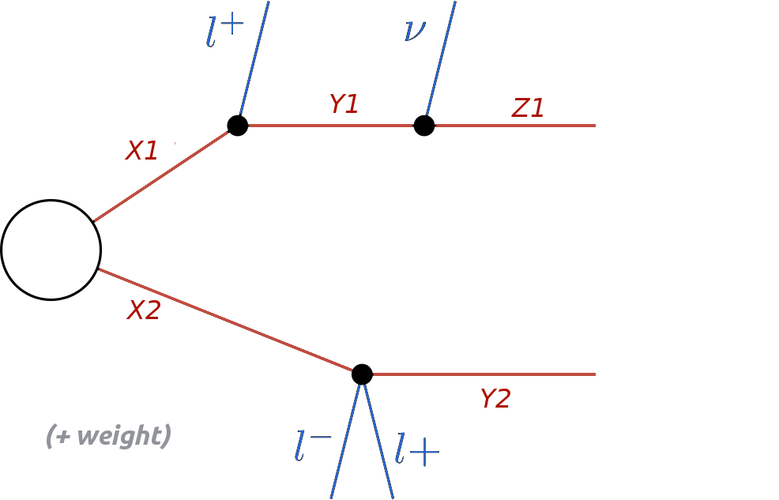
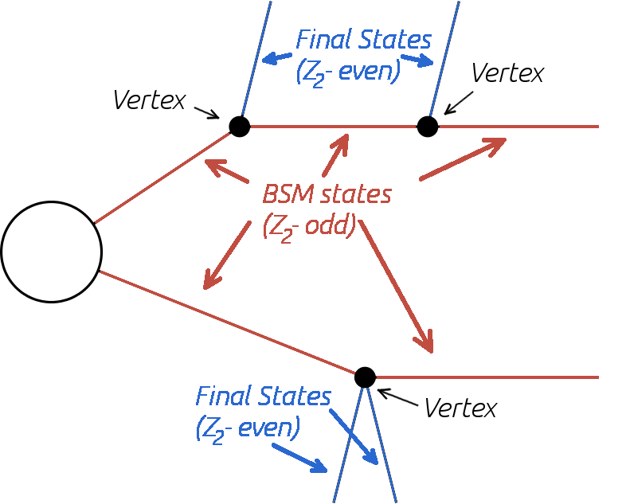
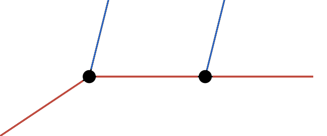
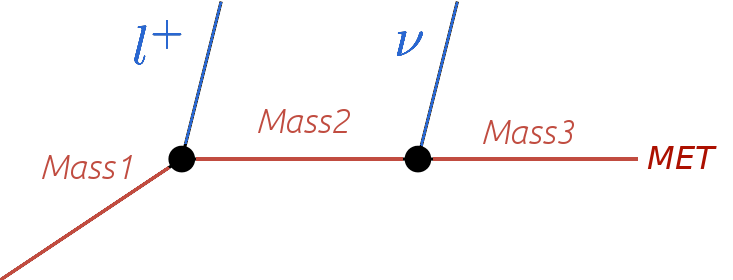
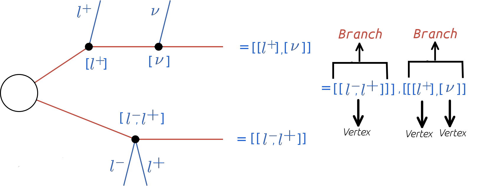
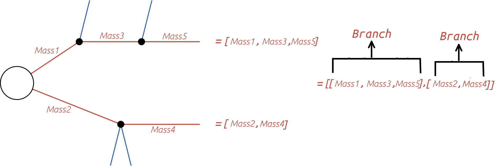
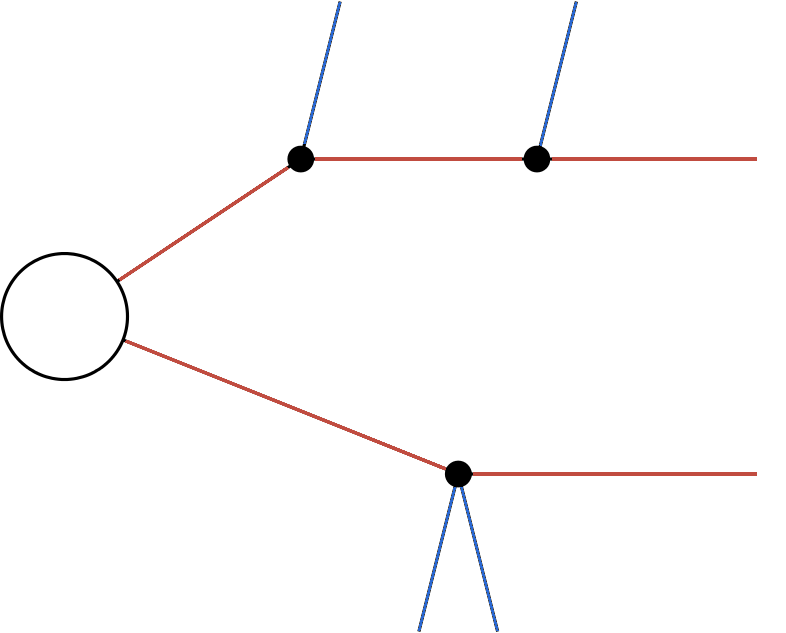

.. index:: Theory Definitions

.. |element| replace:: :ref:`element <element>`
.. |elements| replace:: :ref:`elements <element>`
.. |topology| replace:: :ref:`topology <topology>`
.. |topologies| replace:: :ref:`topologies <topology>`
.. |bracket notation| replace:: :ref:`bracket notation <bracketNotation>`
.. |final states| replace:: :ref:`final states <final states>`

.. _theoryDefs:

Simplified Model Definitions
============================

The so-called `theory module <../../../documentation/build/html/theory.html#theory>`_ contains the basic tools necessary for decomposing the input model
(either in LHE or SLHA format) into simplified model |topologies| and using the output of the decomposition
to compute the :ref:`theoretical prediction <theoryPredictions>` for a given :ref:`experimental result <ExpResult>`.

The applicability of SModelS is currently restricted to models which contain a Z\ :sub:`2` 
symmetry (R-Parity in SUSY, K-Parity in UED, ...) and result in a
missing transverse energy (MET) final state at experiments. This is required in
order to provide a clear structure for the simplified model topologies appearing
during the :ref:`decomposition <decomposition>` of the input model.
Below we describe the basic concepts and language used in SModelS
to describe the simplified model topologies.

.. _element:

Elements
--------

A simplified model topology representing a specific cascade decay of a pair of BSM states produced in
the hard scattering is called an element in the SModelS language.
Elements contain the final states (Z\ :sub:`2`-even) particles appearing in
the cascade decay as well as the masses of the BSM (Z\ :sub:`2`-odd) states
which have decayed or appear in the last step of the decay.
A representation of an element is shown below:

.. _elementscheme:

   
An element may also hold information about its corresponding 
weight (cross section times branching ratio times efficiency[*]_ ).
The overall properties of an element are illustrated in the scheme below:

.. _topscheme:

SModelS works under the inherent assumption that, for collider purposes,
all the essential properties of a BSM model can be encapsulated by its
elements.
Such assumption is extremely helpful to cast the theoretical predictions of a
specific BSM model in a model-independent framework, which can then be compared
against the corresponding experimental limits.
For instance, as shown in the :ref:`scheme above <elementscheme>`, only the
masses of the BSM states are used and other properties, such as their spins or
other quantum numbers are ignored. (The PIDs, however, are kept for the purpose
of book-keeping).

Below we describe in more detail the element properties and their implementation
in SModelS.

* **Elements are described by the** `Element Class <../../../documentation/build/html/theory.html#theory.element.Element>`_    

.. _vertex:

Vertices
^^^^^^^^
Each Z\ :sub:`2`-odd decay is represented by a vertex containing its final states (one Z\ :sub:`2`-odd
state and the Z\ :sub:`2`-even particles), as shown in the :ref:`scheme above <topscheme>`.

.. _final states:

Final States (Z\ :sub:`2`-even)
^^^^^^^^^^^^^^^^^^^^^^^^^^^^^^^

Final states indicate all Z\ :sub:`2`-even states coming out of a vertex (see :ref:`scheme above <topscheme>`).
In most cases, these correspond to Standard Model particles (electrons, gauge bosons, Higgs,...).
Note that, if the input model contains BSM states which are Z\ :sub:`2`-even (such as additional Higgs bosons),
these also appear as final states.
In contrast, stable or long-lived Z\ :sub:`2`-odd particles which might appear in the detector (either as MET or charged tracks)
are *not* classified as final states.

* Z\ :sub:`2`-even **states are defined (and can be easily modified) in** :download:`particles.py <images/particles.py>` 

.. _odd states:

Intermediate States (Z\ :sub:`2`-odd)
^^^^^^^^^^^^^^^^^^^^^^^^^^^^^^^^^^^^^

The Z\ :sub:`2`-odd states are always assumed to consist of BSM particles with Z\ :sub:`2`
conserving decays of the form: (Z\ :sub:`2`-odd state) :math:`\rightarrow`  (Z\ :sub:`2`-odd state') + |final states|.
The only information kept from the intermediate states are their masses (see :ref:`scheme above <topscheme>`).
If an intermediate state is stable and neutral, it is considered as a MET signal.

* Z\ :sub:`2`-odd **states are defined (and can be easily modified) in** :download:`particles.py <images/particles.py>`

.. _branch:

Branches
^^^^^^^^

A branch is the basic substructure of an |element|.
It represents a series of cascade decays of a single initial Z\ :sub:`2`-odd
state.
The diagram below illustrates an example of a branch.

The structure of each branch is fully defined by its number of vertices and the number of 
|final states| coming out of each vertex. 
Furthermore,  the branch also holds the information about the particle labels for the |final states|
coming out of each vertex and the masses of the :ref:`intermediate states <odd states>`,
as shown below.

   
* **Branches are described by the** `Branch Class <../../../documentation/build/html/theory.html#theory.branch.Branch>`_   

.. _notation:

Element Representation: Bracket Notation
^^^^^^^^^^^^^^^^^^^^^^^^^^^^^^^^^^^^^^^^

The structure and final states of |elements| are represented in textual form using a nested brackets
notation. The scheme below shows how to convert between the graphical and bracket representations of an element:

.. _bracketnotation:

The brackets are ordered and nested in the following way. 
The outermost brackets correspond to the :ref:`branches <branch>` of the |element|.
The branches are sorted according to their size (see :ref:`element sorting <elementsorting>`) 
and each branch contains an *ordered* list of :ref:`vertices <vertex>`.
Each vertex contains a list of the |final states| (sorted alphabetically) coming out of the vertex.
Schematically, for the example in the :ref:`figure above <bracketnotation>`, we have::

   element = [branch1, branch2]
      branch1 = [vertex1]
         vertex1 = [l+,l-]
      branch2 = [vertex1,vertex2]
         vertex1 = [l+]
         vertex2 = [nu]

Using the above scheme it is possible to unambiguously describe each |element| with a simple list of nested brackets.
However, in order to fully specify all the information relative to a single |element|, we must
also include the list of :ref:`intermediate state <odd states>` masses and the element weight.
The :ref:`intermediate state <odd states>` masses can also be represented by a mass array
for each branch, as shown below:

.. _massnotation:

   
.. _topology:

Topologies
----------

It is often useful to classify |elements| according to their
overall structure or topology.
Each topology corresponds to an *undressed*
|element|, removed of its
|final states| and Z\ :sub:`2`-odd masses.
Therefore the topology is fully determined by its number of
branches, number of vertices in each :ref:`branch <branch>` and number of
|final states| coming out of each :ref:`vertex <vertex>`.
An example of a topology is shown below:

Within SModelS, elements are grouped according to their
topology. Hence  topologies represent a list of elements sharing a
common basic structure (same number of branches, vertices and
final states in each vertex).

* **Topologies are described by the** `Topology Class <../../../documentation/build/html/theory.html#theory.topology.Topology>`_   

.. [*] In order to treat the UL and EM map results on the same footing
   SModelS applies a trivial binary efficiency to elements for UL 
   type results as will be explained in detail later.
