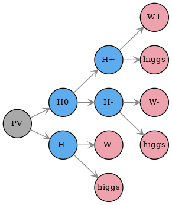
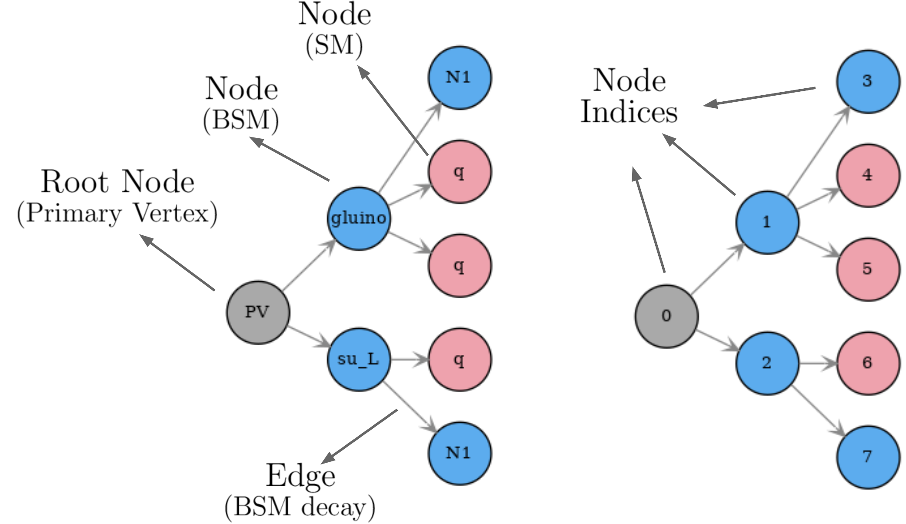

.. index:: Theory Definitions

.. |particle| replace:: :ref:`particle <particleClass>`
.. |particles| replace:: :ref:`particles <particleClass>`
.. |SMS| replace:: :ref:`SMS <SMS>`
.. |SMS topologies| replace:: :ref:`SMS topologies <SMS>`
.. |SMS topology| replace:: :ref:`SMS topology <SMS>`
.. |parameters| replace:: :ref:`parameters file <parameterFile>`

.. _theoryDefs:

Simplified Model Definitions
============================

The so-called `decomposition module <decomposition.html#decomposition>`_ contains the basic tools necessary for decomposing the input model
into simplified model topologies (|SMS|) and using the output of the decomposition
to compute the :ref:`theoretical prediction <theoryPredictions>` for a given :ref:`experimental result <ExpResult>`.

Below we describe the basic concepts and language used in SModelS
to describe the simplified model topologies.

.. _SMS:

Simplified Model Topology (SMS)
-------------------------------

A simplified model topology representing the production and decay of BSM states is called a SMS in the SModelS language.
The SMS are represented by a graph structure containing nodes and edges as shown below:

.. _smsExample:

   
   Example of a graph representation of a Simplified Model topology.

Each node (circle) represents a particle and the edges (connecting arrows) represents the particle decays. The first node ('PV') represents the primary vertex and its "daughters" are the BSM states produced in the hard scattering process. Note that the decays of SM states are not specified within the SMS, since these are assumed to be given by the SM values.

A SMS may also hold information about its corresponding
weight (cross section times branching ratio times efficiency).\ [#f1]_
The overall properties of a SMS are illustrated in the :numref:`Fig. %s <smsScheme>`:

.. _smsScheme:

   
   Illustration of the basic elements of a SMS graph: root node, SM and BSM nodes, edges and node indices.

SModelS works under the inherent assumption that, for collider purposes,
all the essential properties of a BSM model can be encapsulated by its
SMS topologies.
Such an assumption is extremely helpful to cast the theoretical predictions of a
specific BSM model in a model-independent framework, which can then be compared
against the corresponding experimental limits.
From v3.0 onwards these topologies are described by the graph structure above, with its nodes representing |particles|.

* **SMS are described by the** `TheorySMS Class <decomposition.html#decomposition.theorySMS.TheorySMS>`_ 

.. _particleClass:

Particles
^^^^^^^^^

The basic building block of a |SMS| are particles,
which can be both SM (e.g. :math:`W^+,higgs`  in :numref:`Fig. %s <smsScheme>`)
or BSM states (e.g. :math:`H^0,H^+,H^-` in :numref:`Fig. %s <smsScheme>`).
The BSM particles are defined by the input model (see :ref:`model <parameterFileModel>` in |parameters|),
while the SM particles are defined in `SMparticles.py <share.html#share.models.SMparticles>`_ .
The BSM particles are identified by setting their iSM attribute to False 
and they can have a flexible number of properties, such as mass, spin, electric charge, etc.
Two particles are considered equal if all their shared properties
are equal.

*Inclusive* or *generic* particles are introduced by leaving one or more of their properties undefined. For instance, a particle with electric charge -1, spin 1/2 but undefined mass will be matched to electrons, muons, charginos, etc. This is useful when defining simplified models used for describing experimental results in the :ref:`Database <databaseDefs>`. All *inclusive* particles
used by the :ref:`Database <databaseDefs>` are separately defined in
`databaseParticles.py <experiment.html#experiment.databaseParticles>`_ .
Examples are:

 - 'l' for electrons, and muons,
 - 'L' for electrons, muons, and taus,
 - 'q' for u-, d-, and s-quarks,
 - 'jet' for u-, d-, s-, c-quarks and gluons
 - 'anyBSM' for any BSM particle
 - 'anySM' for any SM particle

* **Particles are described by the** `Particle Class <base.html#base.particle.Particle>`_

.. _notation:

SMS Representation
^^^^^^^^^^^^^^^^^^

A given |SMS| can be represented in string format using a sequence of decay patterns of the type: ::

   X(i) > A(j),B(k),C(l)

where :math:`X` represents a BSM particle, which decays to :math:`A,B` and :math:`C`. The indices :math:`i,j,k,l` refer to the node indices (see :numref:`Fig. %s <smsScheme>`) of unstable |particles| in the |SMS| graph and are needed in order to avoid ambiguities. For instance, the SMS from :numref:`Fig. %s <smsScheme>` is represented by the string: ::

   (PV > gluino(1),su_L(2)), (gluino(1) > N1,q,q), (su_L(2) > q,N1)

.. _canonicalName:

Canonical Name
^^^^^^^^^^^^^^

It is often desirable to be able to describe the structure of a |SMS topology|
without having to specify its particle contents. This can be extremely useful when checking if distinct |SMS| are equal, since if their structure differs is not needed to compare their particle nodes.
This can be achieved using the canonial name (or canonical labeling) convention for rooted graphs, which assigns to each node a label according to the following rules:

 * each undecayed (final node) receives the label "10" 
 * each decayed node receives the label "1<sorted labels of daughter nodes>0"

where "<sorted labels of daughter nodes>" is the joint string of the daughter nodes labels, sorted by their size. Finally the label associated to the 'PV' node (root node) uniquely describes the graph structure. An example is shown in :numref:`Fig. %s <canonfig>` .

.. _canonfig:

.. figure:: images/smsCanonName.png
   :width: 40%
   :align: center
   
   Example of how the canonical name is defined for each node. The |SMS| canonical name corresponds to the label of the primary vertex node.

.. [#f1] In order to treat the UL and EM map results on the same footing,
   SModelS applies a trivial binary efficiency to |SMS| for UL-type
   results as will be explained in detail later.
