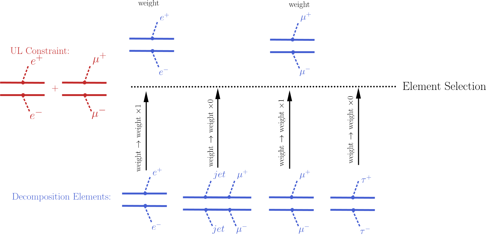
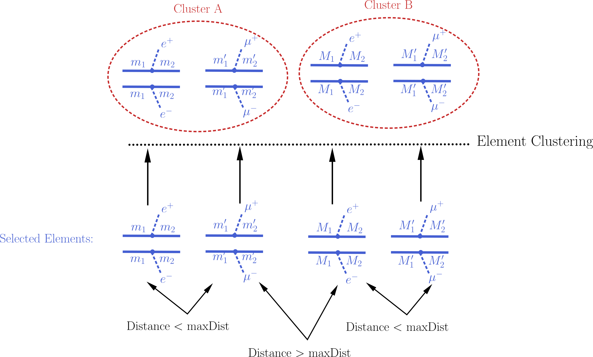
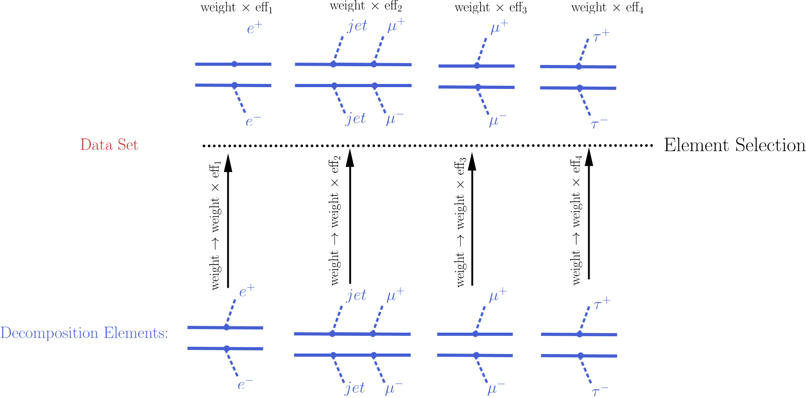

.. index:: Theory Predictions

.. |EM| replace:: :ref:`EM-type <EMtype>`
.. |UL| replace:: :ref:`UL-type <ULtype>`
.. |EMr| replace:: :ref:`EM-type result <EMtype>`
.. |ULr| replace:: :ref:`UL-type result <ULtype>`
.. |EMrs| replace:: :ref:`EM-type results <EMtype>`
.. |ULrs| replace:: :ref:`UL-type results <ULtype>`
.. |ExpRes| replace:: :ref:`Experimental Result<ExpResult>`
.. |ExpRess| replace:: :ref:`Experimental Results<ExpResult>`
.. |Dataset| replace:: :ref:`DataSet<DataSet>`
.. |Datasets| replace:: :ref:`DataSets<DataSet>`
.. |dataset| replace:: :ref:`data set<DataSet>`
.. |datasets| replace:: :ref:`data sets<DataSet>`
.. |element| replace:: :ref:`element <element>`
.. |elements| replace:: :ref:`elements <element>`
.. |topology| replace:: :ref:`topology <topology>`
.. |topologies| replace:: :ref:`topologies <topology>`
.. |sigBR| replace:: :math:`\sigma \times BR`
.. |sigBRe| replace:: :math:`\sigma \times BR \times \epsilon`
.. |ssigBRe| replace:: :math:`\sum \sigma \times BR \times \epsilon`

.. _theoryPredictions:

Theory Predictions
==================

The :doc:`decomposition <Decomposition>` of the input model as a sum of |elements|
(simplified models) is the
first step for confronting the model with the experimental limits.
The next step consists of computing the relevant signal cross sections
(or *theory predictions*) for comparison with the experimental limits. Below we describe the procedure
for the computation of the theory predictions after the model has been decomposed.

Computing Theory Predictions
----------------------------

As discussed in :doc:`Database Definitions <DatabaseDefinitions>`, the SModelS  database allows
for two types of experimental constraints: 
Upper Limit constraints   (see |ULrs|) and Efficiency Map constraints (see |EMrs|). 
Each of them requires different theoretical predictions to be compared against experimental data.

|ULrs| constrains the weight (|sigBR|) of one |element| or sum of |elements|.
Therefore SModelS must compute the theoretical value of |sigBR| summing only over the |elements|
appearing in the respective :ref:`constraint <ULconstraint>`.
This is done applying a 1 (zero) efficiency (:math:`\epsilon`) for the
elements which appear (do not appear) in the :ref:`constraint <ULconstraint>`.
Then the final theoretical prediction is the sum over all
|elements| with a non-zero value of |ssigBRe|. This value can then be compared with the
respective 95% C.L. upper limit extracted from the UL map (see |ULrs|).

On the other hand, |EMrs| constrain the total signal (|ssigBRe|) in a given signal region (|Dataset|).
Consequently, in this case SModelS must compute |sigBRe| for each |element|, using the efficiency maps for
the corresponding |Dataset|. The final theoretical prediction is the sum over all |elements|
with a non-zero value of |sigBRe|.
This value can then be compared with the signal upper limit for the respective 
signal region (|dataset|).

Although the details of the theoretical prediction computation differ depending on the type
of |ExpRes| (|ULrs| or |EMrs|), the overall procedure is common for both type of results. Below we schematically
show the main steps of the theory prediction calculation:

.. _theoPredScheme

.. image:: images/theoryPredScheme.png
   :width: 90% 

As shown above the procedure can always be divided in two main steps:
*Element Selection* and *Element Clustering*.
Once the |elements| have been selected and clustered, the theory prediction for each |Dataset| is given by
the sum of all the |element| weights (|sigBRe|) belonging to the same cluster:

.. math::
   \mbox{theory prediction } = \sum_{cluster} (\mbox{element weight}) =  \sum_{cluster} (\sigma \times BR \times \epsilon)

Below we describe in detail the *element selection* and *element clustering* 
methods for computing the theory predictions for each type
of |ExpRes| separately.

* **Theory predictions are computed using the** `theoryPredictionsFor <../../../documentation/build/html/theory.html#theory.theoryPrediction.theoryPredictionsFor>`_ **method** 

.. _thePredUL:

Theory Predictions for Upper Limit Results
------------------------------------------

Computation of the signal cross sections for a given
|ULr| takes place in two steps. First selection of the
|elements| generated by the model :doc:`decomposition <Decomposition>` and then clustering
of the selected elements according to their masses. These two steps are described below.

.. _ULselection:

Element Selection
^^^^^^^^^^^^^^^^^

An |ULr| holds upper limits for the cross sections of an |element|
or sum of |elements|. Consequently, the first step for computing the theory predictions for the corresponding
experimental result is to select the |elements| that appear in the :ref:`UL result constraint <ULconstraint>`.
This is conveniently done attributing to each |element| an efficiency equal to 1 (0) 
if the |element| appears (does not appear) in the :ref:`constraint <ULconstraint>`.
After all the |elements| weights (:math:`\sigma \times BR`) have been rescaled
by these ''trivial'' efficiencies, only the ones with non-zero weights are relevant for the signal
cross section.
The |element| selection is then trivially achieved by selecting all the |elements| with non-zero weights.

The procedure described above is illustrated graphically in the figure below for the simple example where the 
:ref:`constraint <ULconstraint>` is :math:`[[[e^+]],[[e^-]]]\,+\,[[[\mu^+]],[[\mu^-]]]`.

* **The element selection is implemented by the** `getElementsFrom <../../../documentation/build/html/theory.html#theoryPrediction._getElementsFrom>`_ **method**

.. _ULcluster:

Element Clustering
^^^^^^^^^^^^^^^^^^

Naively one would expect that after all the |elements| appearing in the :ref:`constraint <ULconstraint>`
have been selected, it is trivial to compute the theory prediction: one must simply 
sum up the weights (|sigBR|) of all the selected |elements|.
However, the selected |elements| usually differ in their masses [*]_ and the
experimental limit (see :ref:`Upper Limit constraint <ULconstraint>`) assumes that all the |elements| appearing
in the :ref:`constraint <ULconstraint>` have the same mass (or mass array).
As a result, the selected |elements| must be grouped into *clusters* of equal masses.
When grouping the |elements|, however, one must allow for small mass differences, 
since the experimental efficiencies should not be strongly sensitive to small mass
differences. For instance, assume two |elements| contain identical mass arrays, except for the parent masses
which differ by 1 MeV. In this case it is obvious that for all experimental purposes the two |elements|
have identical masses and should contribute to the same theory prediction (e.g. their weights should be
added when computing the signal cross section). 
Unfortunately there is no way to
unambiguously define ''similar masses'' and the definition should depend on the |ExpRes|, since
different results will be more or less sensitive to mass differences. SModelS uses an UL map-dependent
measure of the distance between two |element| masses, as described in :ref:`Mass Distance <massdist>`.

If two of the selected |elements| have a :ref:`mass distance <massdist>` smaller
than a maximum value (defined by `maxDist <../../../documentation/build/html/theory.html#theory.clusterTools.clusterElements>`_),
they are gouped in the same mass cluster, as illustrated by the example below:

Once all the |elements| have been clustered, their weights can finally be added together
and compared against the experimental upper limit.

* **The clustering of elements is implemented by the** `clusterElements <../../../documentation/build/html/theory.html#theory.clusterTools.clusterElements>`_  **method**.

.. _massdist:  

Mass Distance
^^^^^^^^^^^^^

As mentioned :ref:`above <ULcluster>`, in order to cluster the |elements| it is necessary
to determine whether two |elements| have similar masses (see |element| and :ref:`Bracket Notation <bracketnotation>`
for more details on |element| mass).
Since an absolute definition of ''similar masses'' is not possible and the sensitivity to mass differences
depends on the experimental result, SModelS uses an ''upper limit map-dependent'' definition. For each |element|'s mass array,
the upper limit for the corresponding mass values is obtained from the UL map (see |ULr|).
This way, each mass array is mapped to a single number (the cross section upper limit for the experimental result).
Then the distance between the two |element|'s masses is simply given by the relative difference between their respective
upper limits. More explicitly:

.. math::

   \mbox{Element } A\; (& M_A = [[M1,M2,...],[m1,m2,...]]) \rightarrow \mbox{ Upper Limit}(M_A) = x\\
   \mbox{Element } B\; (& M_B = [[M1',M2',...],[m1',m2',...]]) \rightarrow \mbox{ Upper Limit}(M_B) = y\\
                                       & \Rightarrow \mbox{mass distance}(A,B) = \frac{|x-y|}{(x+y)/2}
   
where :math:`M_A,M_B` (:math:`x,y`) are the mass arrays (upper limits) for the |elements| A and B, respectively.
If the mass distance of two |elements| is smaller than `maxDist <../../../documentation/build/html/theory.html#theory.clusterTools.clusterElements>`_,
the two masses are considered similar.

Notice that the above definition of mass distance quantifies the experimental analysis
sensitivity to mass differences, which is the relevant parameter when :ref:`clustering elements <ULcluster>`.
Also, a check is performed to ensure that masses with very distinct values but similar upper limits are not
clustered together.

* **The mass distance function is implemented by the** `distance <../../../documentation/build/html/theory.html#theory.auxiliaryFunctions.distance>`_ **method**

Theory Predictions for Efficiency Map Results
---------------------------------------------

In order to compute the signal cross sections for a given |EMr|, so it can be compared
to the signal region limits, it is first necessary to apply the efficiencies (see |EMr|) to all the |elements| generated
by the model :doc:`decomposition <Decomposition>`.
Notice that typically a single  |EMr| contains several signal regions (|Datasets|) and there will be a set of efficiencies
(or efficiency maps) for each |dataset|. As a result, several theory predictions (one for each |dataset|) will be computed.
This procedure is similar (in nature) to 
the :ref:`Element Selection<ULselection>` applied in the case of an |ULr|, except that now it must be repeated 
for several |datasets| (signal regions).

After the |element|'s weights have being rescaled by the corresponding efficiencies for the given |dataset| (signal region),
all of them can be grouped together in a single cluster, which will provide a single theory prediction (signal
cross section) for each |Dataset|. Hence the :ref:`element clustering <EMcluster>` discussed below is completely trivial.
On the other hand the :ref:`element selection <EMselection>` is slightly more involved than in the |ULr|
case and will be discussed in more detail.

.. _EMselection:

Element Selection
^^^^^^^^^^^^^^^^^

The element selection for the case of a |EMr| consists of rescaling all the |elements|
weights by their efficiencies, according to the efficiency map of the corresponding |Dataset|.
The efficiency for a given |Dataset| depends both on the |element| mass and on its topology and particle content. 
In practice the efficiencies for most of the |elements| will be extremely small (or zero), hence only a subset effectively
contributes after the element selection  [*]_.
In the figure below we illustrate the element selection for the case of  a |EMr|/|Dataset|:

.. _EMselectionfig:

If, for instance, the analysis being considered vetoes :math:`jets` and :math:`\tau`'s in the final state, 
we will have :math:`\epsilon_2,\, \epsilon_4 \simeq 0` for the example in the :ref:`figure above <EMselectionfig>`.
Nonetheless, the element selection for a  |Dataset| is usually more inclusive than
the one applied for the |ULr|, resulting in less conservative values for the theory prediction.

* **The element selection is implemented by the** `getElementsFrom <../../../documentation/build/html/theory.html#theoryPrediction._getElementsFrom>`_ **method**

.. _EMcluster:

Element Clustering
^^^^^^^^^^^^^^^^^^

Unlike the clustering required in the case of |ULr| 
(see :ref:`Element Clustering for an UL analysis <ULcluster>`), after the efficiencies have been
applied to the element's weights, there is no longer the necessity to group the |elements|
according to their masses, since the mass differences have already been accounted for by the different efficiencies.
As a result, after the :ref:`element selection <EMselection>` all elements belong to a single cluster:

.. image:: images/EMcluster.png
   :width: 80%

* **The (trivial) clustering of elements is implemented by the** `clusterElements <../../../documentation/build/html/theory.html#theory.clusterTools.clusterElements>`_  **method**.

.. [*] As discussed in :ref:`Database Definitions <databaseDefs>`,  |ULrs| have a single |Dataset|.
.. [*] When refering to an |element| mass, we mean all the :ref:`intermediate state <odd states>` masses
   appearing in the |element| (or the |element| mass array). Two |elements| are considered to have identical
   masses if their mass arrays are identical (see |element| and :ref:`Bracket Notation <bracketnotation>`
   for more details). 
.. [*] The number of |elements| passing the selection also depends on the availability of efficiency maps
   for the |elements| generated by the decomposition. Whenever there are no efficiencies available for a
   element, the efficiency is taken to be zero.

