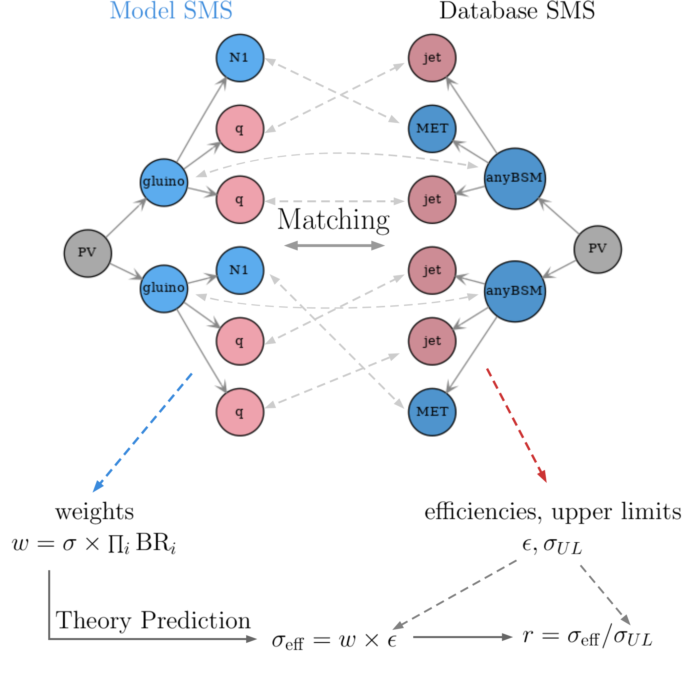

.. index:: Theory Predictions

.. |EM| replace:: :ref:`EM-type <EMtype>`
.. |UL| replace:: :ref:`UL-type <ULtype>`
.. |EMr| replace:: :ref:`EM-type result <EMtype>`
.. |ULr| replace:: :ref:`UL-type result <ULtype>`
.. |EMrs| replace:: :ref:`EM-type results <EMtype>`
.. |ULrs| replace:: :ref:`UL-type results <ULtype>`
.. |ExpRes| replace:: :ref:`Experimental Result<ExpResult>`
.. |ExpRess| replace:: :ref:`Experimental Results<ExpResult>`
.. |database| replace:: :ref:`database <databaseDefs>`
.. |Database| replace:: :ref:`Database <databaseDefs>`   
.. |Dataset| replace:: :ref:`DataSet<DataSet>`
.. |Datasets| replace:: :ref:`DataSets<DataSet>`
.. |dataset| replace:: :ref:`data set<DataSet>`
.. |datasets| replace:: :ref:`data sets<DataSet>`
.. |particle| replace:: :ref:`particle <particleClass>`
.. |particles| replace:: :ref:`particles <particleClass>`
.. |SMS| replace:: :ref:`SMS <SMS>`
.. |SMS topology| replace:: :ref:`SMS topology <SMS>`
.. |SMS topologies| replace:: :ref:`SMS topologies <SMS>`
.. |topology| replace:: :ref:`topology <SMS>`   
.. |topologies| replace:: :ref:`topologies <SMS>`
.. |decomposition| replace:: :ref:`decomposition <decomposition>`
.. |sigBR| replace:: :math:`\sigma \times BR`
.. |sigBRe| replace:: :math:`\sigma \times BR \times \epsilon`
.. |ssigBRe| replace:: :math:`\sum \sigma \times BR \times \epsilon`
.. |canonical name| replace:: :ref:`canonical name <canonicalName>`
.. |canonical names| replace:: :ref:`canonical names <canonicalName>`

.. _theoryPredictions:

SMS Matching and Theory Predictions
***********************************

After the |decomposition| of the input model into a sum of |SMS|, 
the next steps consist of *matching* the |SMS| from the decomposition to the |topologies| constrained in the database, and computing the relevant signal cross sections
(or *theory predictions*) for comparison with the experimental limits. :numref:`Fig. %s <tpA>` schematically shows these two steps.

.. _tpA:

   Schematic representation of the matching between |SMS topologies| generated by the |decomposition| (Model SMS) and the |topologies| found in the database (Database SMS), as well as the calculation of the relevant theory predictions and the comparison against the  experimental data.

Below we describe in detail the procedure
for matching the |SMS topologies| and for computing the theory predictions.

.. _matching:

Matching SMS Topologies
=======================

Once the |SMS topologies| (here called *model SMS*) representing the input BSM model are created by the |decomposition|, they have to be matched to the |topologies| constrained by the |Database| (*database topologies*).
Two topologies will match if they have the same structure and the corresponding particles appearing in each topology have matching properties (electric charge, color representation, spin,...).\ [#f3]_ 

In the graph language, two |SMS| match if their the root nodes (primary vertices) match. Any two nodes will be considered matched if:

  1. their :ref:`canonical names <canonicalName>` are equal,
  2. their |particle| attributes match and
  3. their daughter nodes match *irrespective* of their ordering

With these criteria, the |SMS topologies| are traversed following a depth-first search until all nodes have been matched (if possible). In order to illustrate this procedure it is useful to consider the example of the model and database topologies shown in :numref:`Fig. %s <matchA>`.

.. _matchA:

   Example of two topologies to be matched and the respective |canonical names| for their nodes.

The procedure compares the root nodes, which in this example have the same canonical names (this enforces that both |SMS| have the same structure) and the same particle properties (which is always assumed as true to root nodes). This is indicated by *Step 0* in :numref:`Fig. %s <matchB>`.
Hence criteria 1. and 2. for matching two nodes are satisfied. 

The next step consists in comparing the root nodes daughters *irrespective of their order*. In this example these are (gluino, N1) from the model topology and (MET,anyBSM) from the database topology, as shown by. Once again we compare their canonical names and particle properties (*Step 1* in :numref:`Fig. %s <matchB>`).
Note that although the particle properties of N1 and anyBSM match, their canonical names are different, hence we only have the following partial matches:

 * gluino :math:`\leftrightarrow` anyBSM
 * N1 :math:`\leftrightarrow` MET

In order to fully match the gluino and anyBSM nodes their daughters must also be compared (*Step 2*). Since their daughters (g,N1) and (MET,jet) are final state nodes (undecayed) the comparison procedure stops at this level and results in the following matches:

 * g :math:`\leftrightarrow` jet
 * N1 :math:`\leftrightarrow` MET

.. _matchB:

   Illustration of the procedure of matching, step by step.

This result finally means a full match for the (gluino,N1) and (anyBSM,MET) pairs, which then means that the root nodes fully match. Consequently the model and database topologies match (see :numref:`Fig. %s <matchC>`).
The procedure just described can be applied to any pair of |SMS topologies|\ [#f4]_ and can also be applied to :ref:`inclusive topologies <inclusiveSMS>` with small modifications.

.. _matchC:

   Result of the matching of the model and database topologies and the identification between |particles| (nodes).

Computing Theory Predictions
============================

Once the |SMS topologies| coming out of the |decomposition| have been matched to the database topologies,
the relevant (effective) cross-sections need to be computed and compared to the data 
from a given :ref:`experimental result <ExpResult>` (see :numref:`Fig. %s <tpA>`).
As discussed in |database|, SModelS uses two types of :ref:`experimental results <ExpResult>`: 
|ULrs| and |EMrs|. 
Each of them requires slightly different theoretical predictions to be compared against the experimental data.

.. _thePredEM:

Theory Predictions for Efficiency Map Results
---------------------------------------------

|EMrs| constrain the number of signal events (:math:`N_s^{\rm SR}`) in a given signal region  (|Dataset|). Equivalently SModelS considers the limit on the effective cross section :math:`\sigma_{\rm eff}^{\rm SR} = N_s^{\rm SR}/\mathcal{L}`, where :math:`\mathcal{L}` is the search luminosity.  
In this case the theory prediction to be computed corresponds to the effective cross section given the |decomposition| output. 
Note that a single |EMr| usually contains several signal regions (|Datasets|) and there will be a set of efficiencies
(or efficiency maps) for each |dataset|. As a result, several theory predictions (one for each |dataset|) need to be computed.

After the model |topologies| obtained by the |decomposition| have been :ref:`matched <matching>` to the database topologies, the effective cross section is simply given by the sum over the effective cross sections for each |SMS|, which corresponds to their weights multiplied by the corresponding efficiencies (see  :numref:`Fig. %s <tpEM>`). 

.. _tpEM:

   Schematic representation of how the theory prediction value (effective cross section) is computed for the case of |EMrs|.

Note that the efficiencies are computed using the efficiency maps for the corresponding |Dataset|.
Finally, :math:`\sigma_{\rm eff}^{\rm SR}` can be compared to the signal upper limit for the respective signal region (|Dataset|). Therefore it is convenient to define:

.. math::
   r \equiv \sigma_{\rm eff}^{\rm SR}/\sigma_{\rm eff,UL}^{\rm SR} = \frac{1}{\sigma_{\rm eff,UL}^{\rm SR}} \sum_a w_a \epsilon_{a}^{\rm SR} = \frac{1}{\sigma_{\rm eff,UL}^{\rm SR}} \sum_a \left(\sigma \times BR\right)_a \; \epsilon_{a}^{\rm SR}

where :math:`\sigma_{\rm eff,UL}^{\rm SR} = N_{s,{\rm UL}}^{\rm SR}/\mathcal{L}` is the 95% C.L. upper limit on the effective cross section. Hence, values of :math:`r` larger than one can mean the input model violates the 95% C.L. limit set by the corresponding |EMr|.

For |EMrs| where a covariance matrix or statistical model is available, it
is possible to combine all the signal regions (see :ref:`Combination of Signal Regions <combineSRs>`).
In this case the final theory prediction corresponds to the sum of effective cross sections over all signal regions (:math:`\sum_{\rm SR} \sigma_{\rm eff}^{\rm SR}`)
and the upper limit is computed for this sum.

.. _thePredUL:

Theory Predictions for Upper Limit Results
------------------------------------------

|ULrs| constrains the weight (|sigBR|) of a given |SMS|. Therefore the theory prediction in this case simply corresponds to the weight of the matched |topologies|.
However, a few details have to be taken into account when comparing the weights to the corresponding upper limits.

First, a given |ULr| constraint can be :ref:`inclusive <inclusiveSMS>` over final states (i.e. both electrons and muons may be allowed as final states). In this case the weights of all :ref:`matched SMS <matching>` corresponding to these final states must be included.
However, the selected |SMS| may differ in their BSM properties (such as masses and/or widths) and the
experimental limit (see :ref:`Upper Limit constraint <ULconstraint>`) assumes that all the |topologies| appearing
in the :ref:`constraint <ULconstraint>` have the same efficiency, which typically
implies that the distinct topologies have the same mass arrays and widths.
As a result, the selected |SMS| must be grouped into *clusters*
of similar efficiencies.
In the simplest case, where the upper limit result corresponds to a single signal region, one could assume that the |SMS| efficiency is inversely proportional to its upper limit: :math:`\epsilon_a \sim 1/\sigma_{UL,a}`. Hence |SMS| with similar upper limits have similar efficiencies and can be *clustered* together, as illustrated in :numref:`Fig. %s <tpUL>`.
Mode details about the clustering procedure can be found in :ref:`Clustering Topologies <cluster>`.

.. _tpUL:

   Example of how the theory prediction values (effective cross sections) are computed for the case of |ULrs|.

Once the :ref:`matched SMS <matching>` have been grouped into cluster the effective cross section can finally computed as the sum of the weights over the |topologies| within each cluster (see :numref:`Fig. %s <tpUL>`). In this case the following :math:`r`-value is defined:

.. math::
   r \equiv \sigma_{\rm eff}/\sigma_{\rm UL} = \frac{1}{\sigma_{\rm UL}} \sum_{\rm cluster} w_a  = \frac{1}{\sigma_{\rm UL}} \sum_{\rm cluster} \left(\sigma \times BR\right)_a

where :math:`\sigma_{\rm UL}` is the 95% C.L. upper limit on the effective cross section obtained from the :ref:`upper limit maps <ULtype>` and the sum is over all |SMS| belonging to the same cluster. Hence, values of :math:`r` larger than one can mean the input model violates the 95% C.L. limit set by the corresponding |ULr|.

* **Theory predictions are computed using the** `theoryPredictionsFor <matching.html#matching.theoryPrediction.theoryPredictionsFor>`_ **method** 

.. _cluster:  

Clustering Topologies
^^^^^^^^^^^^^^^^^^^^^

As discussed in :ref:`Theory Predictions for UL <thePredUL>`, in order to cluster the |topologies| it is necessary
to determine whether two |SMS| are similar for a given |ExpRes|, which usually means similar efficiencies.
Although the efficiencies are related to the cross section upper limit (:math:`\sigma_{\rm UL}`), the assumption they are inversely proportional is only valid for searches with a single signal region, which is rarely the case.
However, if two |SMS| have similar properties (i.e. BSM masses and widths) and their upper limits are nearly equal, 
it is reasonable to assume that they have similar efficiencies.
Hence, a measure of *distance* between two |SMS| can be defined using the relative difference between their upper limits:

.. math::

   \mbox{distance}(a,b) = d(a,b) = 2 \frac{|\sigma_{UL,a}-\sigma_{UL,b}|}{\sigma_{UL,a}+\sigma_{UL,b}}
   
where :math:`\sigma_{UL,a}` (:math:`\sigma_{UL,b}`) is the cross section upper limit for the |SMS| "a" ("b"). These upper limits are extracted from the :ref:`upper limit maps <ULtype>` and typically depend on the masses and widths of the BSM particles appearing in the |SMS|.
Notice that the above definition of distance quantifies the experimental analysis' 
sensitivity to changes in the |SMS| properties (masses and widths). 

However, since most |ExpRess| combine distinct signal regions, it is possible that two |SMS| have (by chance) the same upper limit value, but still have very distinct efficiencies and should not be clustered together.
One example is shown in :numref:`Fig. %s <avgSMSFig>`, where the |SMS| "a" and "b" have similar upper limits (:math:`\sigma_{\rm UL,a} \simeq \sigma_{\rm UL,b}`), but they clearly have very distinct masses and most likely different efficiencies.
In order to deal with such cases we define for each cluster of |SMS| an "average" topology, which is constructed using the average of the |SMS| properties (average masses and widths).
If the average masses are very distinct from the masses of the original |SMS|, it is likely that the upper limit for the average |SMS| will fall into another region of the upper limit map and will differ considerably from the original upper limits, as shown in :numref:`Fig. %s <avgSMSFig>`.

.. _avgSMSFig:

   Example of two |SMS| with similar upper limit, but very distinct masses. The "average" |SMS| is also shown.

Hence the distance between the |SMS| in a given cluster and the cluster average |SMS| (or centroid) can be used as a measure to determine 
whether the cluster is valid or not.
This type of clustering corresponds to the K-means clustering algorithm, which relies on the distance between the cluster elements and the cluster centroid. 
A modified version of this algorithm is then used to cluster a set of |SMS| using the distance definition given above.
The number of clusters is chosen as the smallest possible so all the |SMS| belong to one cluster and all the |SMS| within a given cluster have a distance to the cluster centroid smaller than a maximum value (defined by `maxDist <matching.html#matching.clusterTools.clusterSMS>`_).

* **The clustering of SMS is implemented by the** `clusterSMS <matching.html#matching.clusterTools.clusterSMS>`_  **method**.

.. [#f3] The comparison of the |particle| properties is done only for the properties which have been defined for both |particles|. For instance, it is often the case that the spin property is not defined for particles appearing in the database topologies, so this property will be ignored when comparing particles from the model topology and to the ones from the database topology.
.. [#f4] In order to compare two sets of daughters (mapped to a bipartite graph) irrespective of their ordering, a `maximal matching algorithm <https://en.wikipedia.org/wiki/Hopcroft%E2%80%93Karp_algorithm>`_ is used. Note that it is possible that the matching is not unique (i.e. :math:`A \leftrightarrow a, B \leftrightarrow b` and :math:`A \leftrightarrow b, B \leftrightarrow a`) and in this case the matching procedure is not deterministic.
