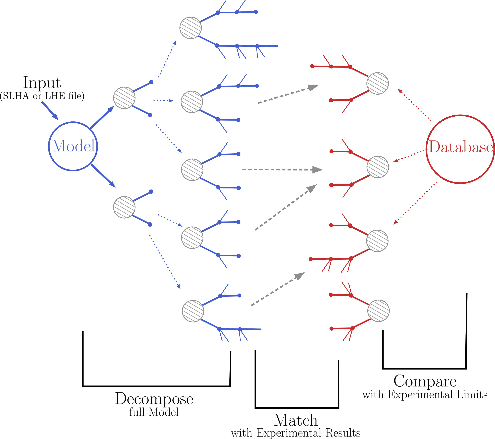

.. index:: SModelS Manual

.. SModelS Manual index file

SModelS User Manual
===================

**These pages constitute the SModelS manual.**

SModelS is an automatic, public tool for interpreting simplified-model results from the LHC.
It is based on a general procedure to decompose Beyond the Standard Model
(BSM) collider signatures presenting a Z\ :sub:`2`-like symmetry into Simplified Model
Spectrum (SMS) topologies. Our method provides a way to cast BSM predictions
for the LHC in a model independent framework, which can be directly confronted
with the relevant experimental constraints. The main SModelS ingredients are

* the decomposition of the BSM spectrum into SMS topologies
* a database of experimental SMS results
* the interface between decomposition and results database to compute limits

as illustrated in the graphics below. 

Contents
--------

.. toctree::
   :maxdepth: 1
     
   ReleaseUpdate  
   Installation
   RunningSModelS
   SModelSTools
   SModelsDocs
   Examples
   CodeDocs
   Cpp
   

Indices and tables
------------------

* :ref:`genindex`
* :ref:`search`

