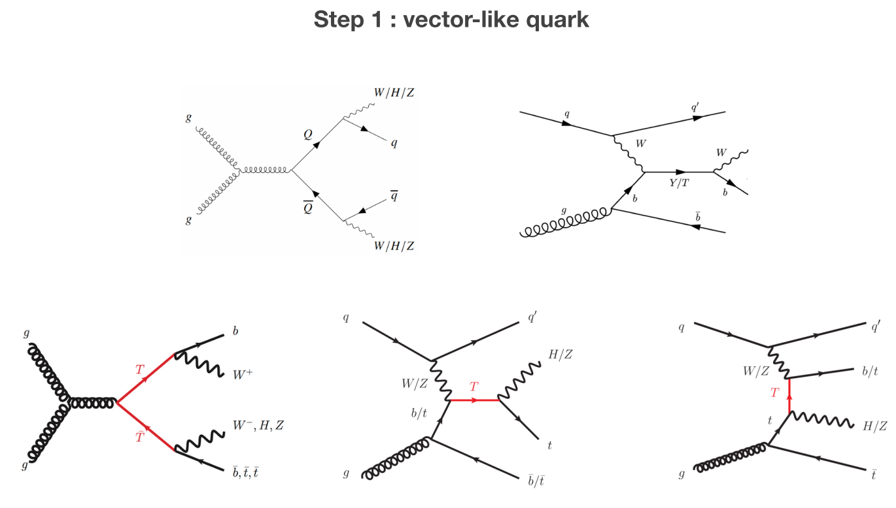

# Primary Vertex Unfolding

## Next Goals

### Step 0: Resonant Monojet

 * Implement reconstruction of 2-to-1 and 2-to-2 primary vertices
      * Add UFO parser
 * Add production diagrams to decomposition output
   * How to sort production diagrams?
 * Develop syntax for describing production diagrams in the database
 * Add production diagram to Txnames
 * Modify the CMS-EXO-20-004-eff analysis and replace TRV1 and TRS1 by qqbar > BSM anf g g > BSM

 ### Step 1: vectorlike quarks

  * Describe more complex production diagrams in the database, such as:

   

    
  

  * Include limits from vectorlike quarks to the database 

